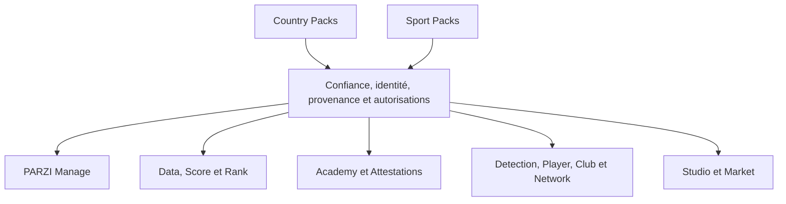
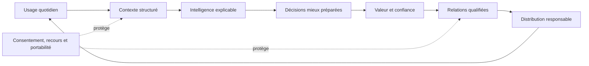

# TOME I — Constitution centrale de PARZI

## Cartouche

| Champ | Valeur |
|---|---|
| Titre long | Vision fondatrice : une infrastructure de confiance |
| Version | 1.0 |
| Date | 23 juillet 2026 |
| Nature | Synthèse constitutionnelle issue du dossier maître v0.5 |
| Statut | Validée par le fondateur ; non exécutoire applicativement |
| Décideur | Fondateur PARZI |
| Références | Dossier maître et registre TI-D001 à TI-D030 |
| Validation | Recommandations CTO approuvées par instruction « go » le 23 juillet 2026 |

## 1. Rôle de cette constitution

Le document historique autonome correspondant au Tome I n’a pas été retrouvé. Cette constitution est une reconstruction fondée sur les sources PARZI existantes et sur les décisions consignées dans le dossier maître puis statuées dans le registre autonome.

Elle fixe le cap, les principes et les limites de l’univers PARZI. Elle ne constitue :

- ni une preuve que les produits décrits existent ;
- ni une autorisation de développement ;
- ni une décision juridique ;
- ni un calendrier de lancement ;
- ni une ouverture du pilote ;
- ni un remplacement des Tomes LXXVI et LXXVII.

Le détail des raisonnements, risques et scénarios se trouve dans `TOME_I_VISION_FONDATRICE.md`. Le statut des décisions se trouve dans `TOME_I_REGISTRE_DECISIONS.md`.

## 2. Déclaration fondatrice

PARZI veut devenir une infrastructure mondiale de confiance et d’intelligence pour le sport professionnel.

La plateforme commence avec un problème concret : les agents de football travaillent avec une information fragmentée entre messageries, tableurs, documents, outils externes et mémoire individuelle. PARZI Manage doit d’abord prouver qu’il centralise le portefeuille, anticipe les échéances, structure les relations et transforme le contexte métier en actions concrètes.

L’ambition est mondiale. L’exécution commence par **PARZI Manage pour les agents de football francophones**.

Dans la présente constitution, « empire mondial PARZI » signifie un groupe technologique cohérent dont la marque, les produits, les données autorisées, les standards de confiance et les canaux de distribution se renforcent mutuellement. Il ne signifie ni domination, ni expansion incontrôlée, ni accumulation de fonctionnalités.

Le terme « empire » reste une ambition interne tant que son usage public n’a pas été validé par le Tome III et testé dans les langues et cultures concernées.

## 3. Question fondatrice

Toute capacité PARZI doit répondre à deux questions :

1. aide-t-elle l’utilisateur à prendre une meilleure décision, plus rapidement ?
2. l’information utilisée est-elle vraie, proportionnée et traçable ?

Une capacité qui échoue à la première question crée du bruit. Une capacité qui échoue à la seconde détruit la confiance.

La règle centrale est :

> Rendre la bonne décision plus évidente, sans jamais rendre une information plus certaine qu’elle ne l’est.

Une donnée sans source n’est pas affichée comme un fait. Une estimation est identifiée. Une information manquante reste manquante. Une recommandation ne devient pas une décision humaine par son seul affichage.

## 4. Mission et promesse

### Mission immédiate

Donner à l’agent un cockpit quotidien capable de :

- réunir son contexte opérationnel ;
- préparer les priorités ;
- réduire les oublis ;
- structurer les prochaines actions ;
- conserver la mémoire des décisions ;
- expliquer l’origine des informations importantes.

### Ambition stratégique

Relier les professionnels du sport par des identités précises, des données traçables, des permissions compréhensibles et des décisions explicables.

### Promesse

PARZI aide chaque utilisateur autorisé à savoir :

- ce qui mérite son attention ;
- pourquoi cette information est présentée ;
- d’où elle vient ;
- ce qui reste incertain ;
- quelle action peut être engagée ;
- qui garde la responsabilité finale.

## 5. Position stratégique

La catégorie candidate est :

> **PARZI — Trust & Intelligence Operating System for Professional Sports.**

Cette formulation reste expérimentale. Elle doit être testée avant de devenir une signature publique.

PARZI ne se réduit pas à :

- un CRM générique ;
- un fournisseur de données ;
- un réseau social ;
- un outil de scoring ;
- une enveloppe autour d’un modèle d’IA ;
- une marketplace ;
- une autorité accordant des licences professionnelles.

Sa singularité recherchée est l’orchestration entre opérations, confiance, données, intelligence et action.

## 6. Principes non négociables

### 6.1 Vérité avant prestige

Une présentation premium ne masque jamais une donnée faible, fictive ou incomplète.

### 6.2 Preuve avant promesse

Une promesse métier est reliée à une source, un calcul, une règle, un test ou un résultat observable.

### 6.3 Humain aux commandes

L’IA prépare et recommande. Les actions sensibles restent sous responsabilité humaine ou sous une règle déterministe explicitement autorisée.

### 6.4 Souveraineté des personnes

Les utilisateurs comprennent qui accède à leurs informations, pour quelle finalité et pendant combien de temps. Les droits de correction, contestation, export et retrait ne sont pas des options premium.

### 6.5 Sécurité au serveur

Une permission affichée dans l’interface ne suffit pas. Les règles métier sont appliquées au serveur et, lorsque nécessaire, dans la base.

### 6.6 Une idée, un propriétaire

Chaque capacité appartient à un produit identifié, utilise une donnée autorisée et produit un résultat distinct. Une idée qui ne satisfait pas ces conditions reste conceptuelle.

### 6.7 Architecture composable

Les produits, moteurs, fournisseurs de données et modèles d’IA doivent pouvoir évoluer sans imposer une réécriture générale.

### 6.8 Vision large, exécution étroite

PARZI conçoit un noyau mondial mais prouve chaque marché, public et sport séparément.

### 6.9 Neutralité vérifiable

Le paiement ne peut pas acheter une vérification favorable, un meilleur classement organique, une modération indulgente ou une priorité cachée.

### 6.10 Droit d’arrêt

Une fonction, intégration ou expansion peut être suspendue lorsqu’elle menace les personnes, les données, la confiance ou le noyau.

### 6.11 Histoire conservée

Une décision remplacée reste consultable avec son contexte et son motif. PARZI ne réécrit pas silencieusement son histoire.

### 6.12 Hypothèse distincte du fait

Une ambition, une intention déclarée ou une donnée de démonstration ne devient pas une preuve de marché.

## 7. Architecture de l’univers PARZI

| Couche | Fonction | Produits principaux |
|---|---|---|
| Opérations | Organiser le travail et les décisions | PARZI Manage |
| Confiance | Vérifier identité, titre, autorité et validité | PARZI ID |
| Données | Provenance, qualité et explicabilité | PARZI Data / Intelligence |
| Évaluation | Produire des signaux distincts | PARZI Score; PARZI Rank; PARZI Trophy / Badges |
| Compétences | Former et attester honnêtement | PARZI Academy; PARZI Certification / Attestations |
| Marché professionnel | Relier des acteurs selon des permissions | PARZI Detection; Player; Club; Network; Mini PARZI |
| Création et commerce | Produire et distribuer contenus et services | PARZI Studio / Creator; PARZI Market / Shop |

Cette architecture est une carte de responsabilités, pas un ordre d’implémentation.

## 8. Primitives universelles

Les produits peuvent partager sept objets conceptuels :

1. **Identity Claim** : affirmation précise sur une identité, un rôle ou un titre ;
2. **Provenance Record** : origine, droit d’usage, fraîcheur et transformation d’une donnée ;
3. **Consent Receipt** : preuve d’un consentement, de sa finalité et de son retrait éventuel ;
4. **Decision Card** : contexte, faits, incertitudes, options, action et résultat d’une décision ;
5. **Relationship Edge** : nature, origine, visibilité et propriétaire d’une relation ;
6. **Evidence Event** : événement horodaté prouvant une action ou un jalon ;
7. **Access Decision** : autorisation ou refus selon l’acteur, la ressource, l’action et la politique.

Ces primitives sont validées comme langage conceptuel commun. Elles ne sont pas des tables à créer immédiatement. Leur structure sera définie dans les tomes spécialisés et exigera une autorisation d’exécution distincte.

## 9. Moteur cumulatif

L’avantage défendable de PARZI ne doit pas dépendre d’une fonction isolée.

Les actifs recherchés sont :

- profondeur opérationnelle ;
- graphe de confiance ;
- historique longitudinal autorisé ;
- explicabilité native ;
- contenu et compétences ;
- marque cohérente ;
- distribution répétable.

Le graphe de confiance ne devient jamais un graphe de surveillance. L’historique ne devient jamais un mécanisme d’enfermement.

## 10. Expansion mondiale

PARZI développe un noyau commun et adapte les règles locales.

Les quatre axes d’expansion sont :

- géographie ;
- public ;
- produit ;
- sport.

Un seul axe majeur de marché est testé à la fois. Les fondations transversales peuvent progresser lorsqu’elles servent cet axe.

Un **Country Pack** peut décrire langues, devises, autorités, titres, consentements, obligations de données, support et procédures locales.

Un **Sport Pack** peut décrire rôles, positions, compétitions, saisons, règles de représentation, statistiques et risques propres au sport.

Une traduction ne suffit pas à ouvrir un pays. Une colonne `sport` ne suffit pas à ouvrir un sport. La légitimité exige expertise, utilisateurs, données autorisées, support et responsabilité locale.

L’ordre stratégique retenu est :

1. prouver Manage auprès des agents de football francophones ;
2. consolider ID et Data ;
3. ouvrir Player et Club dans des périmètres contrôlés ;
4. activer les effets de réseau après sécurité et modération ;
5. tester une nouvelle géographie proche ;
6. tester un deuxième sport ;
7. ouvrir l’écosystème plateforme et API.

Chaque passage dépend d’une preuve, pas d’une date arbitraire.

## 11. Contrat de confiance et neutralité

Tout produit PARZI doit respecter les règles suivantes :

1. indiquer la provenance lorsqu’elle compte pour la décision ;
2. distinguer fait, estimation, recommandation et contenu IA ;
3. ne pas certifier plus que ce qui a été contrôlé ;
4. ne pas agir extérieurement au nom d’un utilisateur sans autorité ;
5. appliquer les permissions au serveur ;
6. minimiser les données confiées aux fournisseurs ;
7. offrir une voie de correction et de contestation ;
8. protéger spécialement les mineurs ;
9. interdire le pay-to-win de réputation ou de détection ;
10. documenter les incidents importants.

PARZI sépare :

- commerce et vérification ;
- paiement et classement organique ;
- CRM privé et relation Network ;
- données d’un workspace et intérêts d’un autre acteur ;
- modération et importance commerciale du client ;
- produits PARZI et vendeurs tiers dans Market.

Les conflits d’intérêts matériels sont déclarés, traités et conservés.

## 12. Doctrine IA

L’IA est une capacité transversale, pas une autorité professionnelle.

| Niveau | Capacité | Limite |
|---|---|---|
| A0 | Règle déterministe sans IA | Fonctionnement explicite |
| A1 | Résumé, recherche ou explication | Sources et incertitudes visibles |
| A2 | Préparation d’un brouillon ou plan | Validation avant usage |
| A3 | Action externe préparée et mise en attente | Confirmation explicite |
| A4 | Automatisation interne, réversible et faible risque | Politique, journal, plafond et arrêt immédiat |

Les engagements contractuels, décisions d’accès, certifications, actions relatives aux mineurs et opérations irréversibles ne deviennent pas autonomes par défaut.

Une fonction IA précise finalité, données autorisées, modèle, rétention, sources, niveau d’autonomie, limites, coûts, procédure d’arrêt et comportement en cas d’indisponibilité.

Les données métier privées ne servent pas par défaut à entraîner un modèle général. Leur traitement ponctuel pour répondre à une demande autorisée reste soumis aux permissions, à la minimisation et aux engagements du fournisseur.

L’avantage IA PARZI vient du contexte autorisé, des primitives de confiance, des workflows et de l’évaluation de qualité, pas de l’accès exclusif à un modèle générique.

## 13. Architecture économique

PARZI facture une valeur créée ou un service rendu. PARZI ne vend pas une réputation, un accès injuste ou les données privées d’un utilisateur.

Les couches économiques possibles sont :

- abonnement Manage individuel ;
- offre agence ou entreprise ;
- intelligence Data et IA premium ;
- Academy et accompagnement ;
- services Studio ;
- Market après preuve de liquidité ;
- plateforme, API et white-label après maturité ;
- expériences Player, Club ou sport spécialisées.

Ces couches ne fixent ni prix ni calendrier.

Ne sont jamais vendus :

- meilleur Score ou Rank sans meilleure preuve ;
- badge professionnel sans vérification ;
- attestation sans réussite ;
- priorité cachée dans les recommandations ;
- accès non autorisé à des données privées ;
- suppression silencieuse d’une critique légitime ;
- promesse de résultat sportif, contractuel ou financier.

La sécurité, le consentement, la correction, le recours et l’export ne sont pas des options de luxe.

## 14. Souveraineté des données

PARZI est gardien de données pour une finalité, une durée et un périmètre. La possession technique ne signifie pas propriété morale ou droit d’exploitation illimité.

Les classes principales sont :

- données fournies par l’utilisateur ;
- données partagées pour une finalité ;
- données externes licenciées ;
- données publiques autorisées ;
- données dérivées ;
- contenus générés par IA ;
- métadonnées opérationnelles.

Les espaces de confiance sont : privé individuel, workspace, relationnel, réseau contrôlé, public et audit restreint.

Le passage d’un espace à un autre est explicite. La présence d’une donnée dans PARZI ne constitue pas une autorisation de partage plus large.

PARZI prévoit la portabilité, la restitution des documents, la révocation des accès et la suppression ou conservation selon les obligations applicables. La force de la plateforme ne dépend pas de l’impossibilité de la quitter.

## 15. Plateforme et patrimoine

PARZI devient une plateforme en interne avant d’ouvrir une API publique. Plusieurs produits doivent d’abord utiliser de manière fiable les mêmes identités, permissions, provenances, consentements, événements et services.

Une future API est authentifiée, versionnée, limitée, observable, révocable et compatible avec les licences des données.

Les formats d’export peuvent être ouverts. Les données privées restent fermées par défaut. Les détails facilitant la fraude ou les contournements peuvent rester restreints.

Le patrimoine PARZI comprend :

- marques et domaines ;
- code et bibliothèques ;
- modèles de données et primitives ;
- méthodes et moteurs ;
- jeux de données autorisés ;
- contenus Academy et Studio ;
- design system ;
- contrats, partenariats et distribution ;
- réputation de fiabilité.

Chaque actif important doit pouvoir indiquer auteur, propriétaire, licence, territoire, durée, restrictions et procédure de retrait. Toute décision juridique de protection ou de licence exige un conseil adapté.

## 16. Commandement et culture

Le fondateur possède l’ambition, la culture, la marque et les arbitrages existentiels. Le CTO protège l’intégrité de l’architecture, la sécurité, les données, l’IA, la résilience et la faisabilité.

Le pacte est :

- aucune information importante n’est cachée ;
- une urgence commerciale ne contourne pas silencieusement la sécurité ;
- une objection technique ne devient pas un refus permanent du marché ;
- un désaccord est résolu par principe, preuve, expérimentation ou décision assumée ;
- la gouvernance évolue formellement avec l’organisation.

La culture PARZI exige vérité précoce, responsabilité claire, proximité utilisateur, documentation des décisions durables, réversibilité, qualité premium et capacité à arrêter ce qui ne crée plus de valeur.

Le talent sans intégrité est incompatible avec une infrastructure de confiance.

## 17. Preuve, hypothèses et métriques

La North Star candidate est le nombre de **décisions professionnelles assistées et traçables**. Elle reste expérimentale et ne doit pas devenir une surveillance de la productivité individuelle.

PARZI mesure six capitaux séparément :

- confiance ;
- usage ;
- données ;
- distribution ;
- économie ;
- réplication.

Une croissance saine ne progresse pas sur un capital en détruisant fortement les autres.

Les hypothèses critiques non encore prouvées concernent notamment :

- usage récurrent de Manage ;
- volonté de payer ;
- temps économisé et échéances évitées ;
- accès légal et économique aux données ;
- vérification internationale de PARZI ID ;
- adoption par les joueurs et les clubs ;
- liquidité de Network ou Market ;
- Academy comme canal crédible ;
- valeur réelle de l’IA ;
- réplication dans un pays ou un sport ;
- protection de la marque ;
- capacité financière et organisationnelle.

Une hypothèse devient un fait uniquement après une preuve définie, obtenue et datée. Les résultats négatifs sont conservés.

## 18. Doctrine de crise

En crise, PARZI protège dans cet ordre : personnes, droits, confidentialité, intégrité, confinement, continuité essentielle, vérité de la communication, récupération et apprentissage.

La séquence de réponse est :

1. détecter ;
2. qualifier ;
3. contenir ;
4. désigner un responsable ;
5. préserver les preuves ;
6. protéger et informer ;
7. récupérer ;
8. vérifier avant réouverture ;
9. expliquer ;
10. apprendre.

Le fondateur et le CTO possèdent une autorité d’arrêt d’urgence. La décision est temporaire, tracée et contrôlée. Le pouvoir d’arrêt ne permet ni d’effacer les preuves ni de sanctionner arbitrairement.

## 19. Ce que le Tome I fixe

Le Tome I fixe :

- PARZI comme marque ombrelle et Manage comme premier produit ;
- l’agent de football francophone comme point d’entrée ;
- une ambition mondiale et multisport avec expansion séquencée ;
- la confiance, la vérité et la traçabilité comme fondations ;
- une responsabilité humaine finale ;
- des produits aux responsabilités distinctes ;
- des primitives partagées sans fusion des données privées ;
- la valeur individuelle avant l’effet de réseau ;
- une IA limitée par le risque et la réversibilité ;
- l’interdiction d’acheter confiance, classement ou modération ;
- la portabilité et l’absence d’entraînement privé par défaut ;
- la plateforme interne avant l’API publique ;
- le droit d’arrêt et la mémoire des décisions ;
- l’obligation de distinguer hypothèse et fait.

## 20. Ce que le Tome I ne décide pas

- la signature publique définitive ;
- les prix et offres ;
- le deuxième pays ou sport ;
- les fournisseurs définitifs ;
- les durées de conservation ;
- la structure juridique du groupe ;
- le calendrier des produits hors Manage ;
- l’ouverture de Network, Market ou Mini PARZI ;
- l’autorisation du pilote ;
- une quelconque modification applicative.

## 21. Décisions et délégations

Les trente décisions `TI-D001` à `TI-D030` sont suivies dans le registre autonome. Vingt-huit sont validées, dont huit avec exécution différée, et deux restent expérimentales : la catégorie publique TI-D002 et la North Star TI-D006.

Les sujets sont ensuite détaillés par les Tomes spécialisés :

- mission et valeur : Tome II ;
- marque : Tome III ;
- utilisateurs : Tome IV ;
- gouvernance de la vérité : Tome VIII ;
- multisport et mondialisation : Tome IX ;
- frontières des produits : Tome X ;
- sécurité, données et infrastructure : Tomes LXI à LXX ;
- gouvernance et gel : Tomes LXXI à LXXV ;
- audit et remédiation : Tomes LXXVI et LXXVII ;
- décision du pilote : Tome LXXVIII.

Une décision documentaire ne devient un backlog applicatif qu’après une autorisation d’exécution distincte.

## 22. Validation de la version 1.0

La Constitution centrale est passée en version 1.0 après vérification des conditions suivantes :

1. les trente décisions possèdent un statut fondateur ;
2. les recommandations, limites et exécutions différées sont traçables ;
3. la catégorie publique et la North Star restent explicitement expérimentales ;
4. les questions juridiques demeurent déléguées sans fausse validation ;
5. les frontières avec les autres tomes sont définies ;
6. la terminologie Score, Rank, attestation, vérification, consentement et autonomie reste cohérente ;
7. le registre maître des 78 tomes identifie le Tome I comme reconstruit et validé ;
8. aucune proposition documentaire n’est présentée comme déjà construite ;
9. le fondateur a donné l’instruction de poursuivre par « go » ;
10. aucun commit ni développement applicatif n’est autorisé par cette validation.

## 23. Serment fondateur

> PARZI construira grand sans mentir, innovera sans perdre le contrôle et grandira sans sacrifier la confiance. Chaque produit devra mériter sa place, chaque information devra pouvoir expliquer son origine et chaque décision importante restera sous responsabilité humaine. La vision est mondiale ; la preuve commence avec le premier utilisateur réellement mieux équipé.

---

**Fin de la Constitution centrale validée — version 1.0.**
