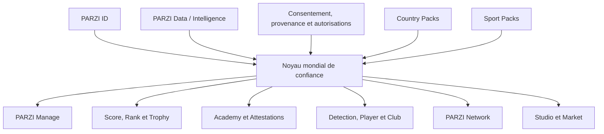
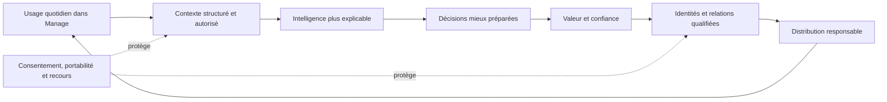
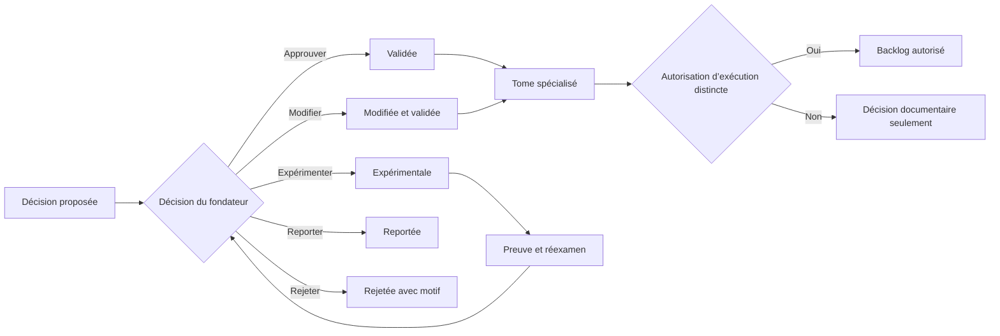

# TOME I — Vision fondatrice : une infrastructure de confiance

## Cartouche documentaire

| Champ | Valeur |
|---|---|
| Statut | Archive de raisonnement; décisions transférées au registre v1.0 |
| Version | 0.5 |
| Date | 22 juillet 2026 |
| Périmètre | Vision fondatrice de l’univers PARZI |
| Responsables | Fondateur PARZI et CTO, validation requise |
| Nature | Constitution stratégique, sans autorisation automatique de développement |
| Dépendances principales | Tomes II, III, IV, VIII, IX et X |

## 1. Note d’intégrité documentaire

Le document historique autonome correspondant au Tome I n’a pas été retrouvé dans le corpus consulté. Le présent tome est une **reconstruction structurée** fondée sur la Bible PARZI maître, la synthèse des Tomes I à LXXV, le document fondateur PARZI OS, l’arbre de l’univers PARZI, les décisions non négociables et les documents de vision disponibles.

Il ne doit pas être présenté comme une reproduction de l’original absent.

Pour préserver la vérité documentaire, quatre niveaux sont utilisés :

- **[SOURCE]** : idée explicitement retrouvée dans le corpus ;
- **[RECONSTRUCTION]** : articulation cohérente de plusieurs éléments retrouvés ;
- **[DIRECTIVE FONDATEUR]** : ambition exprimée directement par le fondateur le 22 juillet 2026 ;
- **[PROPOSITION CTO]** : recommandation nouvelle soumise à validation avant de devenir une décision PARZI.

## Synthèse exécutive — PARZI en une page

**[RECONSTRUCTION]** PARZI veut devenir une infrastructure mondiale de confiance et d’intelligence pour le sport professionnel. Son avantage ne viendra pas d’un écran isolé, mais de la continuité entre identité vérifiée, données traçables, contexte opérationnel, décision expliquée et action suivie.

Le projet part d’un problème concret : les agents de football travaillent encore avec une information fragmentée entre messageries, tableurs, documents, bases externes et mémoire individuelle. PARZI Manage doit d’abord prouver qu’il fait gagner du temps, évite des échéances manquées et améliore le suivi des actions importantes.

À partir de ce noyau, l’univers PARZI peut construire des actifs cumulatifs :

1. **une relation quotidienne** grâce au cockpit opérationnel ;
2. **un graphe de confiance** grâce aux identités, titres, autorités et preuves ;
3. **un historique propriétaire légitime** grâce aux actions saisies ou consenties par les utilisateurs ;
4. **une intelligence explicable** grâce à la provenance et aux moteurs spécialisés ;
5. **une distribution intégrée** grâce à Academy, Player, Club et Network ;
6. **une capacité de réplication** grâce à un noyau mondial et des règles locales configurables ;
7. **une marque ombrelle** capable de porter plusieurs produits sans les confondre.

PARZI commence par les agents de football francophones, puis pourra étendre un axe majeur à la fois : public, produit, géographie ou sport. Une expansion ne sera pas jugée sur le nombre de pays affichés, mais sur la profondeur d’usage, la confiance obtenue et la capacité à reproduire la valeur sans reproduire les risques.

La règle de commandement est simple :

> **Penser comme une infrastructure mondiale, exécuter comme une équipe obsédée par le premier marché, et ne jamais sacrifier la confiance pour accélérer artificiellement.**

## 2. Déclaration fondatrice

**[SOURCE]** PARZI doit devenir une infrastructure de confiance pour le football professionnel francophone, en commençant par l’agent. La plateforme ne doit être ni un CRM générique remaquillé ni une collection de gadgets. Chaque produit doit résoudre un problème distinct, partager une identité commune et reposer sur des informations vraies, explicables et traçables.

**[DIRECTIVE FONDATEUR]** L’ambition finale est de fonder un empire mondial PARZI.

**[RECONSTRUCTION]** Dans ce tome, un « empire mondial » désigne un groupe technologique cohérent dont les produits, la marque, les données, les standards de confiance et les canaux de distribution se renforcent mutuellement. Il ne désigne pas une expansion désordonnée, une accumulation de modules ou une promesse de domination sans preuve.

Le mot « empire » exprime ici l’échelle de l’ambition interne. Son usage public, commercial ou institutionnel n’est pas décidé par ce tome : le Tome III devra vérifier sa compréhension selon les langues et cultures afin d’éviter une connotation de domination incompatible avec la confiance recherchée.

PARZI a vocation à devenir la couche de confiance et de décision du sport professionnel :

- un système d’exploitation pour les professionnels qui agissent ;
- une identité vérifiée pour les personnes et organisations qui se présentent ;
- une couche de données qui explique d’où vient chaque information ;
- des moteurs d’intelligence qui assistent sans fabriquer de certitude ;
- un réseau dans lequel la réputation repose sur des preuves ;
- une plateforme mondiale adaptable aux langues, pays, règles et sports.

La vision est mondiale. L’exécution commence étroite : **PARZI Manage, pour les agents de football francophones**.

## 3. La question fondatrice

**[SOURCE]** Toute fonctionnalité doit répondre positivement à deux questions :

1. aide-t-elle l’agent à prendre une meilleure décision, plus rapidement ?
2. l’information utilisée est-elle vraie et traçable ?

Une fonctionnalité qui échoue à la première question crée du bruit. Une fonctionnalité qui échoue à la seconde détruit la confiance.

La règle fondatrice de PARZI est donc :

> Rendre la bonne décision plus évidente, sans jamais rendre une information plus certaine qu’elle ne l’est.

Conséquences :

- une donnée sans source n’est pas affichée comme un fait ;
- une estimation est identifiée comme une estimation ;
- une information manquante reste manquante ;
- une décision assistée reste sous responsabilité humaine ;
- une preuve peut être consultée, datée, corrigée et révoquée lorsque cela s’applique ;
- une interface premium ne doit jamais maquiller une faiblesse de données.

## 4. Le problème mondial que PARZI veut résoudre

**[RECONSTRUCTION]** Le sport professionnel produit énormément d’informations, mais très peu de confiance structurée. Les données, relations, documents, échéances et décisions restent dispersés entre messageries, tableurs, mémoires individuelles, bases fermées et prestataires spécialisés.

Cette fragmentation crée six pertes :

1. **perte de temps** : l’information doit être recherchée au lieu d’être préparée ;
2. **perte d’opportunités** : les signaux ne deviennent pas toujours des actions suivies ;
3. **perte de mémoire** : une relation dépend d’une personne, d’un téléphone ou d’un historique incomplet ;
4. **perte de confiance** : titres, sources et déclarations sont difficiles à vérifier ;
5. **perte de contrôle** : joueurs et organisations maîtrisent mal la circulation de leurs informations ;
6. **perte d’intelligence** : les données existent, mais ne sont ni reliées ni expliquées au moment de décider.

PARZI ne cherche pas seulement à numériser ces silos. PARZI cherche à créer une continuité entre **identité, information, décision, action et preuve**.

## 5. La catégorie que PARZI construit

**[SOURCE]** Le document fondateur qualifie PARZI de « Football Intelligence Operating System ».

**[PROPOSITION CTO]** Pour porter l’ambition mondiale sans abandonner le point d’entrée football, la catégorie stratégique peut être formulée ainsi :

> **PARZI — Trust & Intelligence Operating System for Professional Sports.**

Cette formulation est une proposition de positionnement, pas encore une signature de marque approuvée. Elle exprime trois dimensions :

- **Trust** : identité, autorité, provenance, consentement et preuve ;
- **Intelligence** : information reliée, signaux expliqués et décisions assistées ;
- **Operating System** : travail quotidien, orchestration des actions et continuité entre les produits.

PARZI ne devient pas le système d’exploitation du sport parce qu’il possède beaucoup d’écrans. Il le devient si les professionnels lui confient durablement leur contexte opérationnel et si la plateforme améliore leur capacité à agir sans compromettre leur souveraineté.

### 5.1 Ce que PARZI n’est pas

**[RECONSTRUCTION]** La catégorie devient plus claire lorsque ses frontières sont explicites.

| Modèle voisin | Fonction habituelle | Différence fondatrice de PARZI |
|---|---|---|
| CRM générique | Stocker contacts et interactions | Orchestrer des décisions propres au métier du sport |
| Fournisseur de données | Distribuer des données brutes ou enrichies | Relier provenance, contexte utilisateur et action autorisée |
| Réseau social | Maximiser interactions et temps d’attention | Produire des relations professionnelles utiles et gouvernées |
| Outil de scoring | Réduire un objet à un indice | Maintenir la séparation entre données, Score, Rank, preuves et limites |
| Assistant IA générique | Générer du contenu à partir d’un prompt | Utiliser un contexte métier autorisé dans des workflows traçables |
| Marketplace | Mettre en relation offre et demande | Construire d’abord identité, confiance, qualité et liquidité |
| Autorité de certification | Accorder un droit ou titre réglementé | Vérifier précisément un titre externe et émettre seulement des attestations internes limitées |

PARZI peut intégrer certaines capacités de ces catégories sans devenir leur copie. Sa singularité recherchée est leur orchestration autour de la confiance et de la décision.

### 5.2 Position stratégique

**[PROPOSITION CTO]** PARZI devrait occuper l’espace situé entre l’outil opérationnel, le graphe de confiance et la couche d’intelligence. Aucun de ces éléments ne suffit seul :

- sans opérations, la plateforme manque de fréquence et de contexte ;
- sans confiance, le réseau et les signaux deviennent contestables ;
- sans intelligence, les données ne réduisent pas la charge de décision ;
- sans contrôle utilisateur, la valeur accumulée devient un risque ;
- sans distribution, la meilleure architecture reste sans impact.

## 6. Mission, ambition et point d’entrée

### Mission immédiate

**[SOURCE]** Centraliser le portefeuille, anticiper les échéances, structurer les relations, transformer les données de l’agent en actions concrètes et réduire la dépendance à WhatsApp, Excel et la mémoire.

### Ambition stratégique

**[RECONSTRUCTION]** Construire l’infrastructure mondiale qui relie les professionnels du sport par des identités vérifiées, des données traçables et des décisions explicables.

### Point d’entrée

**[SOURCE]** Gagner d’abord le football professionnel francophone avec PARZI Manage et des clients actifs avant d’ouvrir un deuxième sport.

### Promesse fondatrice

PARZI aide chaque professionnel autorisé à savoir :

- ce qui mérite son attention maintenant ;
- pourquoi cette information est présentée ;
- d’où elle vient ;
- quelle action peut être engagée ;
- qui garde la responsabilité finale.

## 7. La doctrine PARZI

### 7.1 Vérité avant prestige

La confiance est l’actif premier. Un chiffre décoratif, une réputation artificielle ou une prédiction sans données peut créer un effet immédiat, mais détruit la valeur à long terme.

### 7.2 Preuve avant promesse

Chaque promesse métier doit être rattachée à une source, un calcul, une règle, un test ou une preuve opérationnelle. Une démo ne devient pas une réalité de marché par son seul affichage.

### 7.3 Humain aux commandes

L’intelligence artificielle peut rechercher, synthétiser, préparer et recommander. Elle ne doit pas engager silencieusement une personne, envoyer une communication sensible ou transformer une hypothèse en décision finale.

### 7.4 Souveraineté des personnes

Un joueur contrôle sa visibilité. Une organisation contrôle ses membres. Un utilisateur doit pouvoir comprendre, corriger, exporter ou supprimer ses données selon les règles applicables.

### 7.5 Sécurité au serveur

Une permission visible dans l’interface ne suffit pas. Les règles métier doivent être appliquées au serveur et, lorsque nécessaire, dans la base de données.

### 7.6 Architecture composable

Chaque moteur et chaque produit doit pouvoir évoluer sans imposer une réécriture générale. Les données, modèles d’IA et fournisseurs externes doivent être accessibles derrière des interfaces maîtrisées.

### 7.7 Vision large, exécution étroite

La plateforme est pensée pour plusieurs pays et plusieurs sports, mais chaque expansion doit être gagnée par la preuve, la distribution, la conformité et la qualité opérationnelle.

### 7.8 Une idée, un propriétaire

Toute capacité appartient à un produit PARZI clairement identifié. Une idée sans propriétaire, source de données ou résultat unique reste dans le backlog conceptuel.

## 8. L’architecture de l’empire PARZI

**[RECONSTRUCTION]** L’univers PARZI peut être compris comme sept couches complémentaires. Les produits demeurent séparés, mais partagent la confiance, les données et l’identité.

| Couche | Fonction stratégique | Produits propriétaires | Actif cumulatif |
|---|---|---|---|
| Opérations | Organiser le travail et les décisions quotidiennes | PARZI Manage | Workflows, contexte et habitudes |
| Confiance | Vérifier qui agit, à quel titre et avec quelle autorité | PARZI ID | Graphe d’identités et de preuves |
| Données | Ingestions, provenance, qualité et explicabilité | PARZI Data / Intelligence | Données normalisées et historique |
| Évaluation | Produire des signaux distincts et explicables | PARZI Score; PARZI Rank; PARZI Trophy / Badges | Modèles, comparaisons et jalons |
| Compétences | Former, évaluer et attester sans usurper une licence | PARZI Academy; PARZI Certification / Attestations | Contenu, progression et preuves pédagogiques |
| Marché professionnel | Relier les bons acteurs avec des permissions adaptées | PARZI Detection; PARZI Player; PARZI Club; PARZI Network; Mini PARZI | Relations et effets de réseau contrôlés |
| Création et commerce | Produire et distribuer contenus, services et produits | PARZI Studio / Creator; PARZI Market / Shop | Catalogue, marque et distribution |

Cette architecture ne constitue pas un calendrier de développement. Elle indique comment les futurs actifs peuvent se renforcer sans fusionner leurs responsabilités.

### 8.1 Les primitives universelles PARZI

**[PROPOSITION CTO]** Pour devenir une infrastructure mondiale, PARZI doit partager davantage qu’un logo ou une base de données. Tous les produits devraient s’appuyer sur un petit nombre de primitives de confiance versionnées.

Une primitive n’est pas une fonctionnalité visible. C’est un objet conceptuel stable qui permet à plusieurs produits de parler le même langage sans partager toutes leurs données.

#### Primitive 1 — Identity Claim

Une affirmation structurée sur une personne ou une organisation : identité, rôle, titre, autorité émettrice, territoire, période de validité, statut, preuve et date de dernière vérification.

Elle permet de répondre précisément à la question : **qui affirme quoi sur qui, dans quel territoire et jusqu’à quand ?**

#### Primitive 2 — Provenance Record

Un enregistrement décrivant l’origine d’une donnée : source, date d’acquisition, droit d’usage, méthode de collecte, fraîcheur, niveau de confiance, transformations subies et mécanisme de correction.

Il empêche qu’une saisie manuelle, une source officielle et une estimation IA soient présentées comme équivalentes.

#### Primitive 3 — Consent Receipt

La preuve d’un consentement : personne concernée, finalité, données, audience, durée, version du texte accepté, date, canal, retrait éventuel et représentant légal lorsque nécessaire.

Elle transforme le consentement en événement vérifiable plutôt qu’en simple case oubliée dans une interface.

#### Primitive 4 — Decision Card

Une unité de décision comprenant : contexte, question, faits disponibles, incertitudes, options, recommandation éventuelle, auteur de la décision, action choisie et résultat observé.

La Decision Card pourrait devenir le format commun entre dashboard, IA, opportunités, scouting et dossiers, sans rendre toutes les décisions publiques ni centraliser inutilement leur contenu sensible.

#### Primitive 5 — Relationship Edge

Une relation explicite entre deux acteurs ou entités : nature de la relation, origine, visibilité, propriétaire, force éventuelle, dernière interaction et permissions associées.

Elle distingue une relation déclarée, une relation observée, un contact CRM et une connexion Network.

#### Primitive 6 — Evidence Event

Un événement horodaté prouvant qu’une action ou un jalon a eu lieu : document vérifié, leçon terminée, contrôle effectué, échéance traitée, consentement retiré ou attestation révoquée.

Il peut alimenter audit, progression et réputation sans transformer automatiquement chaque action en score.

#### Primitive 7 — Access Decision

La décision d’autoriser ou refuser une opération selon l’utilisateur, son rôle, l’organisation, la ressource, l’action, le contexte, la politique appliquée et le résultat.

Elle donne une base commune à la sécurité multi-utilisateur et à l’explicabilité des refus d’accès.

### 8.2 Règles des primitives

Chaque primitive doit être :

- versionnée ;
- compréhensible indépendamment de l’interface qui l’utilise ;
- limitée aux données nécessaires ;
- compatible avec la correction, l’expiration ou la révocation ;
- sécurisée selon sa sensibilité ;
- adaptable aux règles locales sans casser le noyau mondial ;
- documentée avant d’être considérée comme un standard interne.

Ces primitives sont des propositions d’architecture conceptuelle. Elles ne sont ni des tables à créer immédiatement ni des autorisations de collecte.

### 8.3 Le noyau mondial et les extensions locales

**[PROPOSITION CTO]** Le système mondial devrait conserver un noyau commun : identités, provenance, consentements, décisions, relations, preuves et accès. Les particularités d’un pays ou d’un sport devraient être ajoutées sous forme de règles versionnées, et non copiées dans des produits séparés.

Cette séparation permettrait à PARZI de développer une intelligence mondiale tout en respectant la légitimité locale.

## 9. Le moteur de croissance cumulatif

**[PROPOSITION CTO]** Le principal avantage défendable de PARZI ne sera pas une fonctionnalité isolée. Il sera formé par une boucle cumulative :

1. PARZI Manage devient utile dans le travail quotidien ;
2. les actions structurées produisent un historique opérationnel de meilleure qualité ;
3. PARZI Data rend cet historique traçable, comparable et exploitable ;
4. les moteurs proposent des priorités et signaux mieux expliqués ;
5. l’utilisateur obtient davantage de valeur et enrichit volontairement son contexte ;
6. PARZI ID renforce la confiance entre acteurs vérifiés ;
7. Player, Club et Network peuvent ensuite créer des interactions mieux qualifiées ;
8. Academy, Studio et Market étendent la distribution sans diluer le noyau.

Cette boucle n’autorise ni la vente silencieuse de données, ni le profilage opaque, ni l’enfermement de l’utilisateur. La confiance doit augmenter en même temps que la valeur du réseau.

## 10. Les avantages défendables recherchés

### 10.1 Le graphe de confiance

Identités, titres, autorités, territoires, validités, relations et preuves forment un actif difficile à reproduire s’il est maintenu avec rigueur.

### 10.2 La profondeur opérationnelle

Un outil utilisé quotidiennement comprend mieux les décisions qu’un annuaire consulté occasionnellement. Cette profondeur vient des workflows utiles, pas de la surveillance.

### 10.3 L’historique longitudinal

Des données datées, corrigibles et sourcées permettent d’observer les trajectoires. La durée améliore l’intelligence seulement si la provenance reste intacte.

### 10.4 L’explicabilité native

Un moteur qui montre ses composants, ses données manquantes et ses limites peut devenir plus fiable qu’une boîte noire présentée comme magique.

### 10.5 La distribution par les compétences

Academy peut former une nouvelle génération d’utilisateurs avant même qu’ils disposent d’un portefeuille établi. Elle devient un canal d’entrée, à condition de rester honnête sur la valeur de ses attestations.

### 10.6 Une marque cohérente

Une identité commune peut réduire le coût de lancement des futurs produits. Cette cohérence exige que chaque expérience mérite réellement le nom PARZI.

### 10.7 Limite éthique de l’avantage défendable

Le graphe de confiance ne doit pas devenir un graphe de surveillance. La profondeur opérationnelle ne doit pas autoriser la collecte illimitée. L’historique longitudinal ne doit pas empêcher le départ d’un utilisateur. La distribution ne doit pas imposer une réputation artificielle.

**[PROPOSITION CTO]** Un avantage PARZI n’est défendable que s’il reste légitime : compréhensible, proportionné, sécurisé, compatible avec les droits des personnes et fondé sur une valeur réellement rendue.

## 11. Contrat de confiance avec l’utilisateur

**[PROPOSITION CTO]** Tout produit PARZI devrait respecter un contrat public minimal :

1. nous indiquons la provenance lorsque celle-ci compte pour la décision ;
2. nous distinguons fait, estimation, recommandation et contenu généré ;
3. nous n’attribuons pas une certification plus large que la preuve contrôlée ;
4. nous n’envoyons pas une action sensible au nom de l’utilisateur sans validation explicite ;
5. nous appliquons les permissions au serveur ;
6. nous minimisons les données confiées aux fournisseurs d’IA ;
7. nous permettons la correction et la contestation des informations importantes ;
8. nous protégeons spécialement les mineurs et les personnes vulnérables ;
9. nous ne transformons pas le paiement en avantage injuste de réputation ou de détection ;
10. nous documentons les incidents importants et les mesures correctives.

Ce contrat pourra devenir ultérieurement une charte externe. Sa publication exige une revue juridique et opérationnelle.

## 12. Stratégie d’expansion mondiale

### 12.1 Principe général

PARZI doit concevoir globalement et apprendre localement. Les structures de données, permissions, langues, fuseaux horaires, devises et autorités doivent pouvoir varier, mais la plateforme ne doit pas simuler une préparation internationale qu’elle n’a pas encore testée.

### 12.2 Les quatre axes d’expansion

| Axe | Point de départ | Extensions possibles | Condition minimale |
|---|---|---|---|
| Géographie | Football francophone | Nouveaux pays et langues | Cadre juridique, autorités, support et données locales |
| Public | Agent | Joueur, club, académie, partenaires | Permissions, proposition de valeur et gouvernance séparées |
| Produit | PARZI Manage | ID, Data, Academy, Player, Club, Network, Studio, Market | Noyau stable et propriétaire fonctionnel clair |
| Sport | Football | Basket, handball, rugby puis autres sports | Modèle configurable, expertise métier et distribution locale |

### 12.3 Règle d’un axe majeur à la fois

**[PROPOSITION CTO]** PARZI ne devrait ouvrir qu’un axe majeur d’expansion à la fois. Par exemple, lancer simultanément un nouveau pays, un nouveau sport et un nouveau public multiplierait les inconnues réglementaires, commerciales et produit.

Cette règle vise l’hypothèse de marché testée. Elle n’interdit pas de construire les fondations nécessaires — sécurité, identité, données, internationalisation ou support — lorsque celles-ci servent l’axe choisi. Elle interdit de prétendre valider plusieurs marchés nouveaux avec une seule expérimentation confuse.

Une expansion est autorisée lorsque :

- le marché précédent produit une valeur répétable ;
- un responsable possède l’expansion ;
- les règles locales sont comprises ;
- les données nécessaires sont accessibles légalement ;
- le support peut être assuré ;
- les métriques de confiance ne se dégradent pas ;
- un retour arrière ou un arrêt reste possible.

### 12.4 Ordre stratégique proposé

**[PROPOSITION CTO]** L’ordre logique, sans calendrier imposé, est :

1. prouver PARZI Manage auprès d’agents de football francophones ;
2. professionnaliser PARZI ID et PARZI Data comme fondations partagées ;
3. ouvrir des expériences Player et Club strictement contrôlées ;
4. activer les effets de réseau seulement après sécurité, consentement et modération ;
5. répliquer le modèle dans une nouvelle géographie proche ;
6. ouvrir un deuxième sport seulement après validation du modèle configurable ;
7. développer l’écosystème commercial et les API lorsque le noyau est stable.

### 12.5 Country Packs et Sport Packs

**[PROPOSITION CTO]** La réplication mondiale peut être structurée par deux familles de règles, sans créer immédiatement de nouveaux produits.

Un **Country Pack** décrit notamment :

- langues, formats, fuseaux horaires et devises ;
- autorités compétentes et titres professionnels reconnus ;
- territoires et périodes de validité ;
- règles de consentement, majorité et représentation légale ;
- exigences de conservation, hébergement ou transfert de données ;
- documents, mentions et parcours de vérification locaux ;
- canaux de support et procédures de recours.

Un **Sport Pack** décrit notamment :

- rôles, positions, compétitions et saisons ;
- règles de représentation et fenêtres de marché ;
- ontologie des statistiques et événements ;
- structures de clubs, académies et organisations ;
- risques particuliers, dont ceux concernant les mineurs ;
- sources de données et critères de qualité propres au sport.

Les packs doivent être versionnés, testés et possédés par des responsables identifiés. Leur existence ne remplace pas une validation juridique ni l’expertise du terrain.

### 12.6 Principe de légitimité locale

PARZI ne doit pas entrer dans un pays uniquement parce que l’interface a été traduite. La légitimité locale exige :

- des utilisateurs réels ayant participé à la découverte ;
- une compréhension des autorités et pratiques professionnelles ;
- des sources de données utilisables légalement ;
- un support capable de répondre dans la langue et le contexte ;
- un responsable clairement identifiable ;
- une procédure de correction et d’escalade locale.

**[PROPOSITION CTO]** Une expansion peut être techniquement prête et rester commercialement interdite tant que cette légitimité n’est pas établie.

## 13. Système de décision stratégique

### 13.1 Filtre d’entrée d’une idée

**[PROPOSITION CTO]** Avant d’entrer dans une roadmap, une idée doit répondre aux questions suivantes :

1. quelle décision ou action améliore-t-elle ?
2. quel produit PARZI en est propriétaire ?
3. quelle donnée source utilise-t-elle et avec quels droits ?
4. quel résultat unique produit-elle ?
5. comment prouve-t-on sa valeur et sa sécurité ?
6. renforce-t-elle un actif mondial réutilisable ?

Les questions 2, 3 et 5 sont éliminatoires. Une idée qui échoue reste conceptuelle, même si elle paraît innovante.

### 13.2 Innovation utile

PARZI considère comme innovante une capacité qui améliore simultanément au moins deux dimensions parmi :

- qualité de décision ;
- vitesse d’exécution ;
- niveau de confiance ;
- contrôle de l’utilisateur ;
- réutilisation internationale ;
- avantage cumulatif de données ou de distribution.

L’originalité visuelle seule ne suffit pas. L’usage d’une IA seule ne suffit pas. L’innovation doit produire une différence observable.

### 13.3 Arbitrages fondateurs

**[PROPOSITION CTO]** Les choix suivants doivent rester explicites, car tenter de poursuivre les deux extrêmes simultanément créerait un produit incohérent.

| Tension stratégique | Position PARZI proposée |
|---|---|
| Largeur de vision ou profondeur d’exécution | Vision mondiale, exécution profonde sur un marché à la fois |
| Automatisation ou responsabilité | Automatiser la préparation; conserver l’autorité humaine sur les actions sensibles |
| Croissance ou confiance | Refuser une croissance qui exige de masquer la provenance ou de relâcher la sécurité |
| Plateforme ouverte ou contrôle | Ouvrir progressivement par des contrats et permissions explicites |
| Données propriétaires ou données partenaires | Posséder le contexte consenti; licencier les données externes nécessaires |
| Standard mondial ou adaptation locale | Noyau commun; règles pays et sport versionnées |
| Réseau ou outil métier | Prouver l’outil métier avant de rechercher l’effet de réseau |
| Premium ou accessibilité | Expérience premium; vérité, accès essentiel et équité non réservés au prix le plus élevé |
| Vitesse ou réversibilité | Avancer vite sur des changements observables et réversibles; ralentir sur l’irréversible |

Ces positions orientent la stratégie. Les Tomes spécialisés devront préciser leurs conséquences produit, juridiques et économiques.

## 14. Mesurer la vision sans la réduire

### 14.1 North Star proposée

**[PROPOSITION CTO]** La métrique stratégique candidate est le nombre de **décisions professionnelles assistées et traçables** par période.

Une décision n’est comptée que si :

- elle correspond à une action métier identifiée ;
- l’utilisateur a consulté ou utilisé le contexte proposé ;
- la source ou la règle principale est connue ;
- l’utilisateur reste l’auteur de la décision ;
- l’événement est mesuré sans exposer inutilement son contenu privé.

Cette métrique doit être testée avant adoption. Elle ne doit pas devenir un mécanisme de surveillance.

### 14.2 Indicateurs de valeur

- agents actifs et rétention des cohortes ;
- échéances importantes non manquées ;
- actions prioritaires terminées ;
- temps déclaré ou mesuré économisé ;
- complétude des dossiers et des dates ;
- opportunités réellement qualifiées et suivies ;
- part des recommandations accompagnées d’une explication ;
- satisfaction des utilisateurs par rôle.

### 14.3 Indicateurs de confiance

- part des données importantes disposant d’une provenance ;
- incidents d’isolation ou d’autorisation ;
- corrections et contestations traitées ;
- consentements valides pour les partages ;
- titres professionnels vérifiés, expirés ou révoqués correctement ;
- sorties IA signalées comme non fiables ou corrigées ;
- temps de restauration et résultats des tests de sauvegarde.

### 14.4 Indicateurs commerciaux

- conversion du pilote vers une offre payante ;
- revenu récurrent par segment ;
- coût d’acquisition et délai de récupération ;
- marge après licences de données et coûts IA ;
- expansion au sein d’une agence ;
- volonté de payer par bénéfice réellement prouvé.

Les métriques commerciales ne doivent pas masquer une dégradation de la confiance.

### 14.5 Tableau de bord de construction de l’empire

**[PROPOSITION CTO]** La progression mondiale devrait être évaluée sur six capitaux, sans les réduire à une note unique :

| Capital | Question de direction | Signal sain |
|---|---|---|
| Confiance | Les acteurs croient-ils les informations et contrôlent-ils leurs données ? | Provenance, consentement et incidents maîtrisés |
| Usage | PARZI améliore-t-il réellement le travail récurrent ? | Rétention, actions utiles et temps économisé |
| Données | Le contexte devient-il plus complet et plus explicable ? | Couverture, fraîcheur et corrections suivies |
| Distribution | PARZI sait-il atteindre les bons utilisateurs de manière répétable ? | Acquisition par canal et recommandations qualifiées |
| Économie | La valeur finance-t-elle durablement le service et les licences ? | Marge, conversion et rétention payante |
| Réplication | Le modèle peut-il changer de pays ou de sport sans réécriture ? | Packs versionnés, temps d’adaptation et qualité stable |

Une expansion est fragile si elle progresse sur un seul capital en détériorant fortement les autres. Cette lecture multidimensionnelle empêche qu’un chiffre de croissance masque une dette de confiance ou d’exploitation.

## 15. Les horizons de construction

Ces horizons décrivent une logique de maturité, pas des dates promises.

### Horizon A — Noyau fiable

PARZI Manage devient un cockpit honnête, sécurisé et utile pour un pilote fermé. Les fondations d’identité, de données et d’autorisation sont crédibles.

### Horizon B — Intelligence branchée

Les fournisseurs licenciés enrichissent les données. Les signaux deviennent plus complets, restent expliqués et servent des décisions vérifiables.

### Horizon C — Réseau de confiance

Player, Club et Network relient des acteurs selon des permissions, consentements et règles de modération éprouvés.

### Horizon D — Plateforme et écosystème

Academy, Studio, Market, API et offres entreprise étendent la distribution et les revenus sans compromettre le noyau.

### Horizon E — Réplication internationale et multisport

Le modèle est adapté pays par pays et sport par sport, avec des règles, autorités, données et partenaires locaux.

### 15.1 Portes entre les horizons

**[PROPOSITION CTO]** Le passage d’un horizon au suivant doit reposer sur une preuve, pas sur une date de calendrier.

| Passage | Preuve minimale recherchée |
|---|---|
| A vers B | Usage récurrent, isolation et autorisations solides, données opérationnelles structurées, valeur pilote démontrée |
| B vers C | Sources licenciées, signaux expliqués, qualité mesurée, consentements et PARZI ID suffisamment crédibles |
| C vers D | Permissions multi-acteurs, modération, recours, liquidité minimale et incidents maîtrisés |
| D vers E | Modèle économique durable, noyau configurable, responsables locaux et capacité de support |

Le franchissement d’une porte autorise l’étude de l’horizon suivant. Il n’impose ni son financement ni son lancement.

## 16. Risques existentiels

| Risque | Conséquence | Réponse fondatrice |
|---|---|---|
| Surconstruction | Capital et attention dispersés | Vision large, backlog étroit, portes d’entrée strictes |
| Faux signal ou faux score | Perte durable de confiance | Provenance, explicabilité, données manquantes visibles |
| Expansion trop rapide | Dette réglementaire et produit | Un axe majeur d’expansion à la fois |
| Dépendance à un fournisseur | Rupture ou marge dégradée | Couche d’abstraction et alternatives documentées |
| Effet réseau sans gouvernance | Abus, harcèlement, réputation injuste | Autorisation, consentement, modération et recours avant ouverture |
| Incident de données | Préjudice humain et réputationnel | Moindre privilège, isolation, sauvegardes et réponse aux incidents |
| IA autonome non maîtrisée | Actions erronées au nom d’un utilisateur | Validation humaine permanente pour les actions sensibles |
| Protection insuffisante des mineurs | Risque juridique et humain majeur | Gel des fonctions concernées avant gouvernance et validation juridique |
| Absence de distribution | Produit techniquement fort mais inutilisé | Pilotes, retours terrain et preuve de valeur avant expansion |
| Marque diluée | Produits incohérents et confiance affaiblie | Standard PARZI commun et droit de refus d’un lancement |

### 16.1 Tests de résistance stratégiques

**[PROPOSITION CTO]** Toute architecture majeure devrait pouvoir expliquer sa réaction aux scénarios suivants :

- le fournisseur de données principal disparaît ou modifie sa licence ;
- un modèle d’IA devient indisponible ou produit une réponse dangereusement fausse ;
- une autorité révoque le titre professionnel d’un utilisateur ;
- un utilisateur retire son consentement ou quitte PARZI ;
- une erreur d’autorisation expose une ressource au mauvais compte ;
- une marketplace ne possède pas assez d’offre ou de demande ;
- un pays impose une règle incompatible avec le modèle courant ;
- un sport utilise une ontologie impossible à représenter proprement ;
- une forte croissance dépasse la capacité de support et de modération ;
- un produit PARZI ne crée plus de valeur mais reste coûteux à maintenir.

Une réponse crédible doit identifier : détection, responsabilité, confinement, communication, correction, retour arrière et apprentissage.

### 16.2 Droit d’arrêt

La grandeur de la vision ne doit pas rendre chaque initiative irréversible. PARZI doit pouvoir suspendre un pays, un sport, un fournisseur, un moteur ou un produit si :

- la sécurité ne peut plus être garantie ;
- les droits d’usage des données deviennent incertains ;
- la valeur n’est pas démontrée après une expérimentation définie ;
- le coût de support détruit la qualité du noyau ;
- la confiance des utilisateurs se dégrade ;
- la gouvernance locale n’est pas suffisante.

Le droit d’arrêt protège l’empire contre sa propre expansion.

## 17. Modèle opératoire de l’empire PARZI

**[PROPOSITION CTO]** À maturité, PARZI devrait centraliser les standards qui créent la confiance et décentraliser l’expertise qui crée la pertinence locale.

### 17.1 Ce qui doit rester commun

- la marque mère et ses règles d’utilisation ;
- les primitives de confiance ;
- les standards de sécurité et de confidentialité ;
- l’architecture des identités, permissions et preuves ;
- la gouvernance des données et des modèles IA ;
- le design system et les exigences d’accessibilité ;
- la mesure de la qualité et des incidents ;
- les mécanismes de version, migration et retrait.

### 17.2 Ce qui doit devenir local

- expertise métier du pays et du sport ;
- autorités, titres et procédures de vérification ;
- acquisition, partenariats et support ;
- contenu pédagogique et exemples ;
- conformité et contrats adaptés ;
- sources de données spécifiques ;
- priorités commerciales fondées sur le terrain.

### 17.3 Responsabilités de direction proposées

| Autorité | Responsabilité non délégable |
|---|---|
| Fondateur | Vision, ambition, culture, marque et arbitrages existentiels |
| Direction technologique | Architecture, sécurité, données, IA, résilience et dette technique |
| Direction produit | Valeur utilisateur, cohérence des parcours et mesure des résultats |
| Responsables de produit | Propriétaire fonctionnel, périmètre, qualité et cycle de vie de leur produit |
| Responsables pays ou sport | Légitimité locale, expertise, support et remontée des risques |
| Confiance et sécurité | Politiques, modération, incidents, recours et protection des personnes |
| Juridique et confidentialité | Cadres applicables, contrats, droits et décisions réglementaires |

Ces responsabilités décrivent un modèle futur. Elles ne prétendent pas que toutes ces fonctions existent déjà dans l’organisation.

### 17.4 Constitution d’un produit PARZI

Avant de recevoir le nom PARZI, un produit devrait posséder :

1. un utilisateur principal clairement défini ;
2. un problème important et répété ;
3. un propriétaire fonctionnel unique ;
4. une source de données et des droits documentés ;
5. un résultat distinct des autres produits ;
6. un contrat de confiance adapté ;
7. une métrique de valeur et une métrique de risque ;
8. une stratégie de distribution ;
9. un modèle économique ou une justification stratégique ;
10. une procédure de suspension, migration ou retrait.

Un prototype peut exister avant de satisfaire ces exigences. Un lancement officiel sous la marque PARZI ne devrait pas.

## 18. Distribution et liquidité du réseau

**[SOURCE]** Le document fondateur identifie la distribution comme le chantier prioritaire tant que le produit ne dispose pas d’agents actifs en nombre suffisant.

### 18.1 Le point d’entrée commercial

PARZI Manage doit résoudre un problème suffisamment fréquent pour devenir une habitude. La première distribution repose sur la proximité avec les agents, les démonstrations guidées, l’accompagnement et la preuve de bénéfices concrets.

### 18.2 Les moteurs de distribution futurs

**[RECONSTRUCTION]** Plusieurs produits peuvent ensuite devenir des canaux d’entrée distincts :

- Academy attire et forme les aspirants ;
- PARZI ID donne une raison de maintenir une identité professionnelle exacte ;
- Player permet au joueur de contrôler et enrichir son dossier ;
- Club structure les besoins et relations côté recruteur ;
- Studio rend visibles les résultats créatifs ;
- Network facilite les relations vérifiées ;
- les API et offres entreprise distribuent les standards PARZI dans d’autres organisations.

Chaque canal doit créer une valeur autonome avant de servir l’acquisition d’un autre produit.

### 18.3 Liquidité avant effet de réseau

**[PROPOSITION CTO]** Un réseau n’existe pas parce qu’une fonction « communauté » est publiée. Il existe lorsqu’un nombre suffisant d’acteurs pertinents peut obtenir une réponse, une relation ou un résultat de qualité dans un délai acceptable.

Avant d’ouvrir une place de marché ou un réseau, PARZI devrait mesurer :

- la densité d’acteurs vérifiés par segment ;
- la qualité des profils et besoins ;
- le délai jusqu’à une interaction utile ;
- le taux de réponse ;
- la part d’interactions signalées ou contestées ;
- l’équilibre entre offre et demande ;
- la rétention après la première interaction.

### 18.4 Boucle de distribution responsable

Une boucle saine suit l’ordre : **valeur individuelle → preuve → recommandation → densité → valeur de réseau**.

PARZI ne doit pas inverser cette boucle en important artificiellement des profils, en simulant de l’activité ou en transformant des données de démonstration en preuve de marché.

## 19. Doctrine d’intelligence artificielle

### 19.1 Position fondatrice

L’IA est une capacité transversale, pas un produit souverain. Elle augmente l’attention, la mémoire et la vitesse de préparation, mais ne possède ni mandat professionnel ni responsabilité juridique.

### 19.2 Échelle d’autonomie proposée

**[PROPOSITION CTO]** Les capacités IA peuvent être classées selon cinq niveaux :

| Niveau | Capacité | Exemple | Règle |
|---|---|---|---|
| A0 | Aucun traitement IA | Donnée ou règle déterministe | Fonctionnement explicite |
| A1 | Assistance informative | Résumé, recherche ou explication | Source et incertitude visibles |
| A2 | Préparation | Brouillon de message, dossier ou plan | Validation humaine avant usage |
| A3 | Action mise en attente | Relance ou tâche préparée avec destinataire | Confirmation explicite avant exécution externe |
| A4 | Automatisation limitée | Opération interne réversible et à faible risque | Politique, journal, plafond et arrêt immédiat |

Les communications externes sensibles, engagements contractuels, décisions d’accès, certifications, actions concernant des mineurs et opérations irréversibles restent soumises à une validation humaine ou à une règle déterministe autorisée. Aucun niveau supérieur implicite n’est reconnu par ce tome.

### 19.3 Exigences communes

Toute fonction IA devrait préciser :

- finalité et utilisateur responsable ;
- données autorisées et données interdites ;
- fournisseur, modèle et possibilité de remplacement ;
- durée de conservation et politique d’entraînement applicable ;
- sources utilisées et distinction entre récupération et génération ;
- niveau d’autonomie ;
- limites, quotas, timeout et coûts ;
- procédure de signalement, correction et arrêt ;
- comportement en cas d’indisponibilité du modèle.

### 19.4 Avantage IA recherché

PARZI ne gagnera pas durablement par l’accès à un modèle accessible à tous. L’avantage viendra de la combinaison entre contexte autorisé, primitives de confiance, workflows métier, historique longitudinal et évaluation systématique de la qualité.

## 20. Discipline d’investissement et de concentration

**[PROPOSITION CTO]** L’ordre d’investissement doit protéger les fondations avant de financer les extensions visibles.

### 20.1 Séquence de capital recommandée

1. sécurité, sauvegarde, conformité et fiabilité du noyau ;
2. valeur quotidienne de PARZI Manage ;
3. distribution et apprentissage auprès des utilisateurs ;
4. structuration des données et licences réellement nécessaires ;
5. primitives partagées et produits adjacents justifiés ;
6. réseau et marketplace après preuve de liquidité ;
7. expansion géographique ou sportive après réplication démontrée.

### 20.2 Test avant investissement majeur

Un investissement important devrait identifier :

- l’hypothèse précise testée ;
- la preuve attendue ;
- le budget et le coût d’opportunité ;
- le responsable ;
- la durée de l’expérimentation ;
- le seuil de poursuite, correction ou arrêt ;
- les actifs réutilisables même si l’hypothèse échoue.

### 20.3 Dette d’ambition

**[PROPOSITION CTO]** La « dette d’ambition » apparaît lorsque la marque promet davantage de pays, de données, d’intelligence ou d’autonomie que l’organisation ne peut en exploiter correctement.

Elle doit être suivie comme une dette réelle : promesse concernée, écart observé, risque, responsable et décision de corriger, reporter ou retirer.

## 21. Expérience cible de l’univers PARZI

**[RECONSTRUCTION]** L’empire PARZI doit être perçu comme une continuité d’expérience, pas comme une collection de comptes séparés. Chaque acteur voit un produit adapté à son rôle, tandis que les identités, preuves et consentements restent cohérents.

Cette section décrit une direction, pas les parcours détaillés réservés aux Tomes IV et suivants.

### 21.1 L’agent

L’agent ouvre PARZI Manage et comprend immédiatement :

- ce qui exige son attention ;
- quelles échéances approchent ;
- quelles relations doivent être entretenues ;
- quelles informations manquent dans ses dossiers ;
- quelles pistes méritent une action ;
- pourquoi chaque recommandation lui est présentée.

Il peut approfondir la source, corriger le contexte, choisir une action et conserver la trace de sa décision. PARZI réduit la charge mentale sans prendre possession de la relation professionnelle.

### 21.2 L’aspirant agent

L’aspirant entre par Academy. Il obtient une progression exigeante, des contenus versionnés, des cas pratiques et des évaluations honnêtes. Son activité pédagogique peut enrichir son profil PARZI ID, mais ne lui attribue jamais automatiquement un droit d’exercer.

Le passage de l’apprentissage à Manage doit dépendre de son besoin réel et de son statut, pas d’une mise en scène de professionnalisation.

### 21.3 Le joueur

Le joueur contrôle un espace dans lequel il peut :

- vérifier les informations qui le concernent ;
- choisir ce qui est visible et par qui ;
- partager un dossier ou un document pour une finalité donnée ;
- suivre ses objectifs et interactions autorisées ;
- retirer un consentement ou demander une correction ;
- comprendre la différence entre donnée officielle, saisie, estimation et contenu IA.

La valeur pour l’écosystème ne doit jamais supprimer son contrôle individuel.

### 21.4 Le club

Le club exprime des besoins structurés, gère ses représentants et contrôle l’accès à ses informations. Il reçoit des dossiers compatibles avec ses critères et peut comprendre l’origine des informations importantes.

PARZI Club ne doit pas permettre à un club de parcourir sans limite des données privées de joueurs ou d’agents.

### 21.5 Le vérificateur et l’administrateur

Le vérificateur traite une affirmation précise avec sa source, son territoire, sa validité et son historique. L’administrateur agit selon un rôle limité, une justification et un journal d’audit.

Le pouvoir administratif doit être visible, révocable et contrôlable. Il ne dépend pas d’une adresse e-mail cachée dans le code.

### 21.6 L’expérience commune

**[PROPOSITION CTO]** Tout utilisateur PARZI devrait retrouver sept repères :

1. une identité et un rôle compréhensibles ;
2. un espace de travail clairement délimité ;
3. la provenance des informations importantes ;
4. une action principale adaptée à son contexte ;
5. des permissions et consentements consultables ;
6. un moyen de corriger, contester ou signaler ;
7. une continuité visuelle et terminologique entre les produits.

## 22. Architecture économique de l’empire PARZI

### 22.1 Principe économique

**[SOURCE]** Les canaux envisagés incluent abonnements agents et agences, options IA et data, Academy, accès clubs, Studio, marketplace, services premium, white-label et API. Ils restent des hypothèses tant que le pilote ne prouve pas la valeur et la volonté de payer.

**[RECONSTRUCTION]** L’économie PARZI doit financer la qualité, la sécurité, les licences de données et l’expansion sans vendre la confiance de l’utilisateur.

La règle économique fondatrice est :

> PARZI facture une valeur créée ou un service rendu ; PARZI ne vend pas une réputation, un accès injuste ou la faiblesse informationnelle d’un utilisateur.

### 22.2 Les couches économiques

| Couche | Valeur facturable potentielle | Condition d’existence |
|---|---|---|
| Noyau SaaS | Organisation, cockpit, workflows et collaboration | Valeur quotidienne et fiabilité démontrées |
| Intelligence premium | Analyses, capacité IA et données enrichies | Sources licenciées, coûts maîtrisés et explications |
| Entreprise | Rôles, agences, gouvernance, audit, intégrations et support | Isolation, RBAC, SLA et exploitation mature |
| Academy | Contenu avancé, préparation, accompagnement et évaluation | Contenu substantiel et réussite non achetable |
| Studio | Création, production et services professionnels | Droits média, qualité et livraison contrôlés |
| Market | Mise en relation de produits et services | Liquidité, paiement, responsabilité et modération |
| Plateforme | API, white-label et standards intégrés | Noyau stable, contrats, sécurité et support développeurs |
| Expériences spécialisées | Services Player, Club ou sport spécifiques | Valeur et gouvernance propres au segment |

Cette architecture ne fixe ni prix ni calendrier.

### 22.3 Ce qui ne doit jamais être vendu

- un meilleur Rank sans meilleure preuve ;
- un badge professionnel sans vérification ;
- une attestation sans réussite ;
- une priorité artificielle dans les recommandations ;
- l’accès à des données privées sans autorisation ;
- une note positive ou la suppression silencieuse d’une critique légitime ;
- des données personnelles brutes comme produit publicitaire ;
- une promesse de résultat sportif, contractuel ou financier ;
- une automatisation dangereuse présentée comme gain de temps.

### 22.3.1 Séparation entre confiance et commerce

**[PROPOSITION CTO]** Une personne ou organisation qui paie PARZI ne doit pas pouvoir acheter une vérification favorable, une modération indulgente, un meilleur Score, un meilleur Rank ou une priorité cachée.

Les fonctions commerciales et les fonctions de confiance doivent suivre des règles séparées :

- critères de vérification indépendants du plan acheté ;
- décisions importantes justifiées et auditables ;
- sponsoring et placement payant identifiés comme tels ;
- aucune influence commerciale secrète dans un classement organique ;
- recours disponible indépendamment du niveau d’abonnement ;
- conflits d’intérêts déclarés et traités ;
- accès commercial sans pouvoir de modifier une preuve ou un historique d’audit.

À mesure que PARZI grandit, une séparation organisationnelle ou des contrôles indépendants pourront devenir nécessaires. Le modèle précis reste à définir.

### 22.4 Subvention croisée légitime

**[PROPOSITION CTO]** Certains produits peuvent financer des fondations communes, mais la relation doit rester transparente. Un abonnement Manage peut contribuer à PARZI ID ou à la sécurité partagée. Une activité Studio peut financer des outils créatifs communs. Une offre entreprise peut financer l’infrastructure plateforme.

En revanche, un produit ne doit pas être volontairement affaibli pour forcer l’achat d’un autre. Les fonctions de sécurité, consentement, correction et export ne doivent pas devenir des options de luxe.

### 22.5 Économie des fournisseurs

La marge réelle doit intégrer :

- licences de données ;
- appels aux modèles IA ;
- stockage et bande passante ;
- e-mails, médias et génération de documents ;
- vérification humaine ;
- support et modération ;
- conformité et gestion des incidents ;
- coût de vente et d’accompagnement.

Une fonctionnalité peut créer de la valeur et rester économiquement dangereuse si son coût croît plus vite que son usage facturable.

### 22.6 Discipline de tarification

**[PROPOSITION CTO]** La tarification future devrait suivre cinq règles :

1. facturer selon une valeur compréhensible, pas selon une complexité cachée ;
2. éviter les quotas qui empêchent une action critique de sécurité ou de conformité ;
3. rendre les dépassements et coûts IA prévisibles ;
4. maintenir une frontière claire entre essai, démonstration et service professionnel ;
5. tester la volonté de payer avant de construire une gamme complexe.

Les Tomes LI à LX devront détailler ces modèles.

## 23. Souveraineté des données et du savoir

### 23.1 Principe de souveraineté

PARZI ne possède pas moralement toutes les informations qui transitent dans ses systèmes. Il en devient le gardien pour une finalité, une durée et un périmètre déterminés.

**[PROPOSITION CTO]** La stratégie de données doit distinguer possession technique, droits contractuels, contrôle utilisateur et capacité d’exploitation. Ces quatre dimensions ne sont pas interchangeables.

### 23.2 Classes de données

| Classe | Exemple | Autorité principale | Exigence fondatrice |
|---|---|---|---|
| Donnée fournie par l’utilisateur | Note, contact, objectif, document | Utilisateur ou organisation selon le contexte | Finalité, contrôle et export |
| Donnée partagée | Dossier transmis à un club | Émetteur et destinataire selon les droits accordés | Audience, durée et révocation |
| Donnée externe licenciée | Statistique ou information de compétition | Fournisseur et contrat de licence | Provenance et respect des droits |
| Donnée publique autorisée | Information officielle accessible | Source et droit applicable | Date, source et limites de réutilisation |
| Donnée dérivée | Signal, Score ou recommandation | PARZI selon les droits sur les entrées | Méthode, explication et contestation |
| Donnée générée par IA | Résumé ou brouillon | Utilisateur et PARZI selon la finalité | Marquage, validation et rétention |
| Métadonnée opérationnelle | Connexion, journal ou événement technique | PARZI pour sécurité et exploitation | Minimisation, accès et durée |

### 23.3 Espaces de confiance

**[PROPOSITION CTO]** Une même information peut appartenir à différents espaces :

- **privé individuel** : visible uniquement par la personne ;
- **workspace** : partagé avec une organisation selon un rôle ;
- **relationnel** : partagé entre parties pour une finalité précise ;
- **réseau contrôlé** : visible par une audience choisie ;
- **public** : publié volontairement ou exigé par la fonction ;
- **audit restreint** : accessible uniquement aux personnes autorisées à contrôler un événement.

Le passage d’un espace à un autre doit être explicite. La présence de la donnée dans PARZI ne constitue pas un consentement à l’élargissement de son audience.

### 23.4 Graphe de connaissance

Le futur Knowledge Graph relie joueurs, clubs, contacts, événements, documents, besoins et décisions. Il doit rester un modèle de relations avant de devenir une technologie complexe.

Chaque relation importante devrait préciser :

- son origine ;
- son propriétaire ;
- son niveau de visibilité ;
- sa date de création et de dernière confirmation ;
- sa durée ou condition d’expiration ;
- son niveau de confiance ;
- les conséquences autorisées.

### 23.5 Données et entraînement des modèles

**[PROPOSITION CTO]** Les données métier privées ne doivent pas être utilisées par défaut pour entraîner un modèle général PARZI ou tiers. Toute utilisation d’apprentissage exige une finalité séparée, une base juridique ou contractuelle, une minimisation, une documentation et, lorsque nécessaire, un consentement explicite.

Le traitement ponctuel d’un contexte privé pour produire une réponse demandée par l’utilisateur n’est pas équivalent à l’entraînement d’un modèle. Il reste néanmoins soumis aux permissions, à la minimisation, aux engagements du fournisseur, à la rétention et au niveau d’autonomie autorisé. Cette distinction doit être visible dans les documents de confidentialité et les contrats.

L’amélioration du produit peut s’appuyer en priorité sur :

- évaluations de sorties ;
- signaux d’erreur et corrections ;
- données synthétiques contrôlées ;
- exemples autorisés et anonymisés lorsque cela est réellement possible ;
- jeux de tests versionnés ;
- statistiques agrégées respectant les droits applicables.

### 23.6 Portabilité et départ

La force d’une plateforme mondiale ne doit pas dépendre de l’impossibilité de la quitter. PARZI devrait prévoir :

- export compréhensible ;
- restitution des documents ;
- suppression ou anonymisation selon les obligations ;
- transfert des responsabilités d’un workspace ;
- révocation des accès et intégrations ;
- conservation limitée des preuves nécessaires ;
- explication des éléments impossibles à supprimer légalement.

Les formats, durées et décisions juridiques seront définis dans les tomes spécialisés.

## 24. Stratégie plateforme, standards et API

### 24.1 Plateforme interne avant API publique

**[SOURCE]** L’API publique appartient à un horizon plateforme ultérieur. Le produit actuel doit d’abord stabiliser son noyau.

**[PROPOSITION CTO]** PARZI devient une plateforme d’abord en interne : plusieurs produits utilisent les mêmes primitives, politiques et services de manière fiable. L’ouverture externe ne doit intervenir qu’après cette preuve.

### 24.2 Capacités communes candidates

- identité et vérification ;
- permissions et décisions d’accès ;
- provenance et qualité des données ;
- consentements et partage ;
- événements et audit ;
- documents et médias ;
- notifications et préférences ;
- orchestration IA ;
- facturation et droits d’offre ;
- internationalisation et règles pays ou sport.

Cette liste est conceptuelle. Elle ne constitue pas un plan de microservices.

### 24.3 Principes d’une future API

Une API PARZI devrait être :

- authentifiée et limitée au strict périmètre autorisé ;
- versionnée avec une politique de compatibilité ;
- documentée par cas d’usage et risque ;
- observable sans journaliser inutilement les données privées ;
- protégée par quotas, limites et détection d’abus ;
- idempotente pour les mutations qui l’exigent ;
- accompagnée de webhooks signés lorsque nécessaire ;
- testable dans un environnement sans données de production ;
- révocable par client, utilisateur et intégration ;
- conforme aux licences des données redistribuées.

### 24.4 Ouverture sélective

**[PROPOSITION CTO]** PARZI ne doit ouvrir que ce qui augmente la valeur de l’écosystème sans céder le contrôle de la confiance.

| Élément | Orientation proposée |
|---|---|
| Formats d’export utilisateur | Ouverts et documentés |
| Primitives conceptuelles | Documentables comme standards PARZI |
| Données privées métier | Fermées par défaut; partage autorisé au cas par cas |
| Données de fournisseurs | Selon licences; aucune redistribution implicite |
| Méthodes sensibles de fraude ou sécurité | Accès restreint |
| Modèles et pondérations stratégiques | Transparence suffisante pour expliquer; protection du savoir-faire légitime |
| Extensions partenaires | Contrats, scopes, certification et audit |

### 24.5 Écosystème développeurs

Un futur écosystème ne doit pas être mesuré seulement par le nombre de clés API créées. Les indicateurs utiles comprennent :

- intégrations actives apportant une valeur vérifiée ;
- taux d’erreur et stabilité des versions ;
- délai d’intégration ;
- incidents de permissions ;
- satisfaction développeurs et utilisateurs finaux ;
- revenus et coûts de support par intégration ;
- respect des règles de marque et de données.

### 24.6 PARZI comme standard de confiance

**[PROPOSITION CTO]** À long terme, les primitives Identity Claim, Provenance Record, Consent Receipt et Decision Card pourraient devenir un langage de référence pour les échanges professionnels sportifs.

Cette ambition ne doit pas commencer par proclamer un standard. Elle commence par l’utiliser correctement dans les produits PARZI, publier des spécifications stables, démontrer l’interopérabilité et obtenir l’adoption volontaire de partenaires.

## 25. Patrimoine intellectuel et actifs stratégiques

### 25.1 Principe

Un empire technologique durable protège ce qu’il crée, respecte ce qu’il utilise et sait précisément ce qu’il peut licencier.

Cette section définit une stratégie de patrimoine, pas un avis juridique. Toute action de dépôt, licence, brevet ou contrat exige une validation professionnelle adaptée.

### 25.2 Cartographie des actifs

| Actif | Exemples PARZI | Protection ou gouvernance candidate |
|---|---|---|
| Marque | PARZI et noms de produits | Marques, règles d’usage et surveillance |
| Domaines et identifiants | Domaines web, comptes et handles | Inventaire, renouvellement et contrôle d’accès |
| Code | Applications, moteurs et bibliothèques | Droit d’auteur, dépôts privés, licences et traçabilité |
| Modèles de données | Primitives, ontologies et relations | Documentation, secret ou publication sélective |
| Méthodologies | Scores, contrôles et processus | Versionnement, explicabilité et savoir-faire |
| Données | Jeux autorisés, historiques et annotations | Droits contractuels, provenance et gouvernance |
| Contenus | Academy, rapports, templates et médias | Droit d’auteur, licences et gestion des contributeurs |
| Design | Identité, composants et expériences | Design system, droits et cohérence de marque |
| Réseau | Relations, partenaires et distribution | Contrats, qualité et confiance entretenue |
| Réputation | Historique de fiabilité et de sécurité | Transparence, incidents maîtrisés et cohérence |

### 25.3 Registre des droits

**[PROPOSITION CTO]** PARZI devrait maintenir un registre indiquant pour chaque actif important : auteur ou fournisseur, propriétaire, licence, territoire, durée, restrictions, preuve contractuelle, produits utilisateurs et procédure de retrait.

Ce registre est aussi important pour une levée, une acquisition, un partenariat ou une expansion internationale que pour la conformité quotidienne.

### 25.4 Stratégie de publication

Tout ne doit être ni fermé ni ouvert par réflexe.

- ouvrir les formats qui renforcent la confiance et la portabilité ;
- protéger les secrets dont la divulgation faciliterait la fraude ou détruirait un avantage légitime ;
- publier les principes nécessaires à l’explicabilité ;
- licencier clairement les contenus et SDK ;
- conserver la preuve des contributions externes ;
- éviter toute dépendance à un actif dont les droits sont incertains.

### 25.5 Diligence permanente

Avant un lancement majeur, PARZI doit pouvoir démontrer :

- qu’il possède ou licence les actifs nécessaires ;
- que les contributeurs ont cédé ou accordé les droits attendus ;
- que les données peuvent être utilisées pour la finalité annoncée ;
- que les marques et noms ne créent pas un risque évident ;
- que les composants tiers et modèles respectent leurs licences ;
- que le retrait d’un fournisseur n’effondre pas la totalité du produit.

## 26. Culture, commandement et cadence

### 26.1 Culture recherchée

**[PROPOSITION CTO]** La culture PARZI doit combiner ambition extrême et discipline factuelle.

Ses lois internes proposées sont :

1. dire la vérité tôt ;
2. préférer une preuve inconfortable à une présentation rassurante ;
3. protéger l’utilisateur même lorsque personne ne regarde ;
4. donner un propriétaire à chaque décision ;
5. documenter ce qui engage durablement l’entreprise ;
6. rendre les décisions réversibles lorsque cela est possible ;
7. rester proche du terrain et des utilisateurs ;
8. viser une qualité premium sans confondre luxe et complexité ;
9. traiter la sécurité et la confidentialité comme des qualités produit ;
10. arrêter ce qui ne crée plus de valeur.

### 26.2 Pacte Fondateur–CTO

**[PROPOSITION CTO]** Pour protéger la vision et l’exécution :

- le fondateur possède le pourquoi, l’ambition, la culture, la marque et les arbitrages de risque existentiel ;
- le CTO possède l’intégrité de l’architecture, la sécurité, la qualité technique, la gouvernance des données et la faisabilité ;
- le produit traduit la stratégie en valeur observable pour l’utilisateur ;
- aucun rôle ne masque une information importante aux autres ;
- un désaccord est résolu par les principes, les preuves, une expérimentation ou une décision explicitement assumée ;
- une urgence commerciale n’autorise pas silencieusement un risque de sécurité ou une fausse promesse ;
- une objection technique ne doit pas devenir un prétexte permanent pour éviter le marché.

### 26.3 Niveaux de décision

| Type | Exemple | Mode proposé |
|---|---|---|
| Réversible et local | Texte, ordre d’un écran, petite expérimentation | Décider vite, mesurer et corriger |
| Réversible mais transversal | Composant partagé ou règle de produit | Revue du propriétaire et documentation |
| Difficilement réversible | Modèle de données central ou contrat API | Revue architecture, migration et rollback |
| Sensible | Données privées, IA, mineurs ou réputation | Sécurité, confiance et validation adaptée |
| Existentiel | Nouveau pays, sport, acquisition ou changement de marque | Décision fondateur avec dossier de preuve |

### 26.4 Cadence de commandement proposée

La cadence doit rester légère au début puis se renforcer avec l’organisation.

- **revue hebdomadaire de vérité** : utilisateurs, incidents, promesses, blocages et prochaine preuve ;
- **revue mensuelle de produit et d’économie** : valeur, rétention, coûts variables, distribution et dette d’ambition ;
- **revue trimestrielle d’horizon** : portes franchies, investissements, arrêts et expansions possibles ;
- **revue immédiate d’incident majeur** : protection des personnes, confinement et décision de communication ;
- **revue annuelle de constitution** : cohérence des Tomes fondateurs avec la réalité et décisions de révision explicites.

### 26.5 Mémoire de décision

Les décisions structurantes devraient conserver : contexte, options, critères, décideur, date, risques, hypothèses, preuve attendue et condition de réexamen.

Une décision révisée n’est pas un échec si les nouvelles preuves sont documentées. Réécrire silencieusement son origine détruit la mémoire institutionnelle.

### 26.6 Exigence de recrutement

**[PROPOSITION CTO]** Les futurs responsables PARZI doivent démontrer :

- excellence dans leur domaine ;
- capacité à expliquer simplement ;
- respect des utilisateurs et de la confidentialité ;
- confort avec la contradiction factuelle ;
- sens du propriétaire et du résultat ;
- capacité à travailler dans un cadre international ;
- refus des métriques ou présentations trompeuses.

Le talent sans intégrité est incompatible avec une infrastructure de confiance.

## 27. Doctrine de crise et continuité

### 27.1 Ordre de priorité

En cas de crise, PARZI doit protéger dans cet ordre :

1. les personnes et leurs droits ;
2. la confidentialité et l’intégrité des données ;
3. la capacité à contenir l’incident ;
4. la continuité des opérations essentielles ;
5. la vérité de la communication ;
6. la récupération et la preuve ;
7. l’apprentissage et la prévention de la répétition.

La réputation de court terme ne doit jamais passer avant la protection des personnes.

### 27.2 Familles de crise

- accès non autorisé ou fuite de données ;
- indisponibilité majeure ;
- corruption ou perte de données ;
- décision IA dangereuse ou communication erronée ;
- fraude sur une identité, un titre ou une attestation ;
- incident concernant un mineur ;
- campagne d’abus, harcèlement ou réputation injuste ;
- rupture d’un fournisseur essentiel ;
- contestation juridique ou réglementaire ;
- crise de marque provoquée par une promesse fausse.

### 27.3 Séquence de réponse

**[PROPOSITION CTO]** Toute crise majeure suit une séquence commune :

1. **détecter** et horodater le signal ;
2. **qualifier** la gravité sans minimiser ;
3. **contenir** avec le périmètre le plus sûr ;
4. **désigner** un responsable d’incident et les autorités de décision ;
5. **préserver** les preuves et journaux nécessaires ;
6. **protéger** et informer les personnes selon les obligations ;
7. **récupérer** à partir de procédures testées ;
8. **vérifier** l’intégrité avant réouverture ;
9. **expliquer** ce qui est connu, inconnu et corrigé ;
10. **apprendre** par une revue sans complaisance.

### 27.4 Communication de crise

La communication doit distinguer : fait confirmé, hypothèse, périmètre connu, actions prises, impact possible et prochaine mise à jour. Elle ne doit ni spéculer ni déclarer l’incident clos avant vérification.

### 27.5 Continuité minimale

Chaque capacité critique devra définir ultérieurement :

- propriétaire et suppléant ;
- dépendances ;
- sauvegarde et restauration ;
- mode dégradé ;
- objectifs de reprise et de perte de données acceptables ;
- procédure manuelle temporaire ;
- critères de fermeture et de réouverture ;
- communication interne et externe.

Le présent tome ne fixe pas arbitrairement les objectifs chiffrés de reprise. Ils devront être décidés selon le risque et testés.

### 27.6 Autorité d’arrêt d’urgence

**[PROPOSITION CTO]** Le fondateur et le CTO doivent disposer d’une autorité claire pour suspendre immédiatement une fonction, une intégration, une automatisation ou une expansion lorsqu’un risque grave est plausible. La suspension est journalisée, réévaluée rapidement et ne peut être levée sans preuve suffisante.

Lorsque l’urgence le permet, la levée d’une suspension majeure exige un second regard indépendant de la personne qui a demandé la réouverture. Si une seule personne doit agir pour protéger les utilisateurs, sa décision reste temporaire, tracée et soumise à une revue a posteriori. Le pouvoir d’arrêt ne doit jamais devenir un pouvoir d’effacement des preuves ou de sanction arbitraire.

## 28. Hypothèses critiques et preuves manquantes

### 28.1 Principe de lucidité

Une ambition n’est pas une preuve de marché. Le corpus disponible décrit une vision riche et un produit en construction, mais il ne démontre pas encore la répétabilité commerciale, la liquidité d’un réseau mondial ni la faisabilité juridique de chaque pays et sport.

**[PROPOSITION CTO]** Les hypothèses fondatrices doivent être conservées dans un registre vivant. Une hypothèse devient une décision seulement après définition du niveau de preuve attendu. Elle devient un fait seulement lorsque la preuve est obtenue et datée.

### 28.2 Registre initial

| Hypothèse | État de preuve actuel | Prochaine preuve recherchée | Réponse si invalidée |
|---|---|---|---|
| Les agents utilisent régulièrement un cockpit unique | Produit et démonstration disponibles; usage actif encore insuffisant | Pilote avec rétention et actions récurrentes | Réduire le périmètre au problème le plus fréquent |
| Les agents paient pour les bénéfices annoncés | Canaux de revenus envisagés; volonté de payer non prouvée | Entretiens, offre test et conversion réelle | Revoir segment, valeur ou coût de service |
| Manage fait gagner du temps et évite des échéances | Proposition de valeur claire; mesure à établir | Mesure avant/après et retours documentés | Corriger workflows et métriques |
| Les données sportives nécessaires sont licenciables à un coût soutenable | Fournisseurs candidats identifiés | Diligence licence, qualité, couverture et coût | Réduire la promesse ou changer de source |
| PARZI ID peut vérifier des titres dans plusieurs territoires | Modèle conceptuel et besoin identifiés | Cartographie d’autorités et prototype manuel par pays | Limiter les territoires couverts |
| Les joueurs accepteront un profil contrôlé dans PARZI | Vision opt-in documentée | Recherche utilisateur et pilote consenti | Recentrer sur outils privés ou partenaires |
| Les clubs exprimeront des besoins structurés dans PARZI | Cas d’usage décrit | Entretiens clubs et expérimentation limitée | Conserver l’information côté agent |
| Un réseau PARZI peut atteindre une liquidité utile | Effet de réseau théorique | Cohorte dense sur un segment et délai de réponse | Reporter Network et renforcer l’outil individuel |
| Academy peut devenir un canal de distribution crédible | Système conceptuel riche; contenu réel limité | Parcours substantiel, complétion et conversion | Simplifier Academy autour de l’apprentissage essentiel |
| L’IA améliore la décision sans dégrader la confiance | Capacités existantes; qualité à évaluer systématiquement | Jeux de tests, évaluations humaines et incidents suivis | Réduire l’autonomie ou revenir à des règles déterministes |
| Le modèle peut être répliqué dans un autre pays | Architecture adaptable proposée | Country Pack pilote et utilisateurs locaux | Rester concentré sur le marché initial |
| Le modèle peut représenter un deuxième sport sans réécriture | Vision multisport; validation métier absente | Prototype de Sport Pack sur un domaine limité | Reporter le multisport ou isoler les différences |
| La marque PARZI est protégeable sur les territoires visés | Identité et domaines envisagés | Recherche et conseil propriété intellectuelle | Adapter noms, classes ou territoires |
| L’organisation peut financer et exploiter plusieurs produits | Architecture d’empire définie; capacité future inconnue | Budget, responsables, coûts complets et portes franchies | Geler les extensions et protéger Manage |

### 28.3 Règles du registre d’hypothèses

- aucune hypothèse ne doit disparaître parce qu’elle devient inconfortable ;
- la preuve attendue est définie avant l’expérimentation ;
- les résultats négatifs sont conservés ;
- une preuve locale ne devient pas automatiquement une preuve mondiale ;
- une forte intention déclarée ne remplace pas un usage répété ou un paiement réel ;
- les données de démonstration ne valident jamais une hypothèse de marché ;
- chaque hypothèse possède un responsable et une date de réexamen lorsqu’elle entre en exécution ;
- l’invalidation doit déclencher une correction, un repositionnement ou un arrêt explicite.

### 28.4 Inconnues réservées aux études spécialisées

Le présent tome ne prétend pas connaître :

- la taille vérifiée de chaque marché ;
- le nombre d’utilisateurs accessibles par canal ;
- le prix optimal ;
- la réglementation complète de chaque juridiction ;
- la disponibilité contractuelle de toutes les sources ;
- la structure de coûts à grande échelle ;
- le calendrier réaliste d’expansion ;
- les besoins exacts du deuxième sport ;
- la forme juridique et fiscale du groupe mondial.

Ces sujets exigent recherches, données, partenaires et validations propres. Les chiffrer sans étude créerait une illusion de précision.

## 29. Contre-audit stratégique du CTO

### 29.1 Méthode

**[PROPOSITION CTO]** La vision a été relue comme si elle devait être attaquée par un concurrent, un régulateur, un client mécontent, un investisseur sceptique et un utilisateur dont les données ont été mal utilisées.

Chaque composante doit répondre à cinq questions :

1. qui gagne du pouvoir ?
2. qui supporte le risque ?
3. comment le système peut-il être manipulé ?
4. quelle promesse devient fausse si une dépendance échoue ?
5. quel recours possède la personne affectée ?

### 29.2 Tensions constitutionnelles

| Tension | Échec possible | Réponse constitutionnelle proposée | Tome délégué |
|---|---|---|---|
| Empire mondial vs confiance | Discours perçu comme domination | Ambition interne; langage public validé par marché et culture | III |
| Agent client vs intérêt du joueur | Optimisation commerciale contraire au contrôle du joueur | Consentement, espaces séparés et droits du joueur | VI, XLIII–XLIV |
| Club client vs neutralité | Accès privilégié ou pression sur les dossiers | Permissions séparées, besoins structurés et transparence | VII, XLIX |
| Opérateur de marketplace vs moteur de classement | PARZI favorise ses revenus dans les résultats | Pare-feu de neutralité et placement payant identifié | XXIII–XXX, LVI |
| Abonnement vs vérification | Un client payant obtient un badge favorable | Critères indépendants du plan et audit des décisions | XLI–XLII, LII–LIII |
| Network vs secret professionnel | Relations CRM exposées comme connexions sociales | Relationship Edge typée, visibilité privée par défaut | XVI, XLV–XLVI |
| Graphe de données vs souveraineté | Avantage concurrentiel fondé sur l’enfermement | Portabilité, finalité, révocation et avantage par qualité de service | LXIV |
| Noyau mondial vs droit local | Une règle commune viole une obligation locale | Socle mondial minimal et Country Pack validé localement | IX, LXIV |
| PARZI ID vs autorité publique | Badge compris comme licence accordée par PARZI | Claim précis, source externe, territoire, validité et limites | XLI–XLII |
| Score vs biais | Classement auto-renforçant ou discriminatoire | Données minimales, explication, tests, contestation et retrait | XXIII–XXV |
| IA personnalisée vs confidentialité | Trop de données privées envoyées au modèle | Minimisation, permissions, fournisseurs encadrés et niveaux d’autonomie | XX, LXV |
| Autonomie vs responsabilité | Action erronée sans auteur identifiable | Validation humaine, journal et responsable désigné | XIX, LXV |
| Academy canal d’entrée vs gatekeeping | PARZI devient arbitre autoproclamé du métier | Attestation interne limitée; aucune licence vendue | XXXI–XL |
| Standard ouvert vs sécurité | Spécification exploitée pour contourner les contrôles | Ouverture sélective; détails anti-fraude restreints | LXII, LXVIII |
| Fournisseur externe vs continuité | Arrêt brutal d’une capacité critique | Abstraction, mode dégradé, export et plan de remplacement | XXII, LXIX |
| Croissance réseau vs modération | Abus plus rapides que la capacité de réponse | Porte de capacité, limitation ou fermeture temporaire | XLV–L |
| Pouvoir fondateur vs gouvernance future | Décisions sans contradiction ni contrôle | Mémoire de décision et gouvernance formelle à mesure de la croissance | LXXI–LXXV |
| Pouvoir d’arrêt vs arbitraire | Suspension utilisée pour effacer ou punir | Journal, temporalité, second regard et revue a posteriori | LXVIII–LXIX |
| Multisport vs précision métier | Modèle générique faux pour un sport | Sport Pack, expert responsable et expérimentation limitée | IX |
| Vitesse vs preuve | Lancement fondé sur une présentation plutôt que sur la réalité | Portes de preuve, hypothèses datées et droit d’arrêt | VIII, LXXI–LXXV |

### 29.3 Pare-feu de neutralité

**[PROPOSITION CTO]** Tant que PARZI combine plusieurs rôles, les frontières suivantes doivent être constitutionnelles :

1. **Vérification** : une équipe commerciale ne modifie pas les critères ou résultats d’une vérification individuelle.
2. **Classement** : un paiement ne change pas un Score ou Rank organique. Tout contenu sponsorisé est séparé et identifié.
3. **Modération** : un client important ne bénéficie pas d’une immunité secrète.
4. **Données** : les données d’un workspace ne servent pas un autre acteur sans base autorisée.
5. **Marketplace** : PARZI déclare lorsqu’il vend lui-même un produit qu’il référence.
6. **IA** : un modèle ne révèle pas le contexte privé d’un utilisateur à un autre.
7. **Administration** : toute intervention sensible conserve auteur, motif, date et résultat.
8. **Partenariats** : un fournisseur ou partenaire n’obtient pas un droit caché sur les recommandations.

La séparation peut être technique, procédurale, contractuelle ou organisationnelle selon le niveau de maturité. Elle doit toujours être vérifiable.

### 29.4 Registre des conflits d’intérêts

Tout conflit matériel devrait consigner :

- parties concernées ;
- intérêt direct ou indirect ;
- décision ou fonction affectée ;
- personne responsable du traitement ;
- mesures de séparation ;
- information donnée aux parties ;
- risque résiduel ;
- décision finale et réviseur.

Un conflit déclaré n’est pas automatiquement acceptable. La mesure doit être proportionnée à son impact.

### 29.5 Tests adversariaux obligatoires

Avant ouverture des capacités concernées, PARZI devra savoir répondre aux scénarios suivants :

1. un club payant demande d’apparaître en priorité dans des recommandations prétendument neutres ;
2. un agent ajoute un joueur qui n’a jamais consenti à être visible ;
3. un utilisateur tente de consulter le dossier privé d’un autre compte ;
4. un administrateur modifie le statut professionnel d’un proche ;
5. un titre vérifié expire alors que son badge reste visible ;
6. une donnée fournisseur est corrigée après avoir influencé un Score ;
7. un modèle IA reprend une note confidentielle dans un message externe ;
8. une famille conteste une information concernant un mineur ;
9. un vendeur de Market dénonce le favoritisme d’un produit PARZI ;
10. un utilisateur quitte la plateforme mais une autre partie doit conserver une preuve contractuelle ;
11. une règle locale interdit un traitement autorisé dans le noyau mondial ;
12. un partenaire demande un accès plus large que celui compris par l’utilisateur.

Pour chaque scénario, le test doit couvrir prévention, détection, blocage, recours, correction et preuve.

### 29.6 Résolutions constitutionnelles issues du contre-audit

Sous réserve de validation :

- aucune donnée privée n’est mutualisée entre acteurs par simple appartenance à l’univers PARZI ;
- aucune contrepartie commerciale ne modifie silencieusement une fonction de confiance ;
- toute décision automatisée ayant un effet important possède une raison consultable et une voie de contestation adaptée ;
- les scores et classements importants sont surveillés pour détecter données manquantes, dérive et effets auto-renforçants ;
- les claims PARZI ID restent précis et ne deviennent pas une approbation générale de la personne ;
- Academy n’établit pas un monopole de légitimité professionnelle ;
- l’avantage concurrentiel PARZI doit venir de la qualité, du workflow, de la confiance et du service, pas de l’enfermement ;
- l’autorité d’urgence protège les preuves et fait l’objet d’un contrôle ;
- une obligation locale peut bloquer une expansion malgré la compatibilité technique ;
- une fonction réseau ne s’ouvre pas si modération, recours ou liquidité sont insuffisants.

### 29.7 Choix encore ouverts après le contre-audit

- faut-il créer à terme une fonction indépendante « Trust & Safety » ?
- à quel niveau de maturité une revue externe des scores devient-elle obligatoire ?
- quels conflits exigent une information publique et lesquels restent confidentiels ?
- faut-il séparer juridiquement certaines activités de marketplace, vérification ou données ?
- quel organe tranche un recours contre une décision de PARZI ID ?
- comment mesurer l’équité sans collecter des données disproportionnées ?
- quelle gouvernance appliquer lorsque le fondateur et le CTO sont eux-mêmes parties au conflit ?

Ces choix nécessitent maturité organisationnelle, conseil juridique et conception détaillée. Le Tome I ne doit pas prétendre les résoudre seul.

## 30. Gouvernance et amendement de la constitution PARZI

### 30.1 Constitution vivante, histoire immuable

Le Tome I doit pouvoir évoluer lorsque des preuves nouvelles apparaissent. Cette évolution ne doit jamais effacer ce qui avait été décidé auparavant.

**[PROPOSITION CTO]** Une nouvelle version remplace la version active pour l’avenir, mais l’historique des décisions, motifs et conséquences reste consultable.

### 30.2 Catégories de changement

| Catégorie | Exemple | Autorité minimale proposée |
|---|---|---|
| Éditorial | Correction sans changement de sens | Propriétaire documentaire |
| Clarification | Précision d’une règle existante | Fondateur ou CTO selon le domaine, avec trace |
| Stratégique | Nouvelle doctrine, produit, pays ou pouvoir | Validation fondateur et revue CTO |
| Technique structurante | Changement affectant sécurité, données ou interopérabilité | Validation CTO et analyse de migration |
| Sensible | Mineurs, réputation, données, vérification ou IA à fort impact | Revues confiance, juridique et métier adaptées |
| Urgence | Suspension ou règle temporaire de protection | Autorité d’arrêt, durée limitée et revue obligatoire |

Les organes cités peuvent ne pas encore exister. La catégorie indique le niveau de contrôle attendu à maturité.

### 30.3 Procédure d’amendement

Une proposition d’amendement comprend :

1. règle actuelle ;
2. changement proposé ;
3. raison et nouvelles preuves ;
4. utilisateurs et produits affectés ;
5. contradictions avec les autres tomes ;
6. impacts sécurité, données, juridiques, économiques et de marque ;
7. décision et personnes consultées ;
8. date d’effet ;
9. plan de migration ou de communication ;
10. condition de réexamen ou de retour arrière.

### 30.4 Statuts d’une décision

Une décision constitutionnelle possède un statut explicite :

- **proposée** : écrite mais non acceptée ;
- **validée** : acceptée par l’autorité compétente ;
- **expérimentale** : acceptée pour un périmètre et une durée limités ;
- **suspendue** : temporairement inactive ;
- **remplacée** : une nouvelle décision s’applique et référence l’ancienne ;
- **rejetée** : examinée puis refusée avec motif.

### 30.5 Journal des versions du Tome I

| Version | Date | Nature du travail | Statut |
|---|---|---|---|
| 0.1 | 22 juillet 2026 | Première reconstruction fondatrice | Brouillon remplacé |
| 0.2 | 22 juillet 2026 | Primitives, expansion, IA, distribution et modèle opératoire | Brouillon remplacé |
| 0.3 | 23 juillet 2026 | Économie, données, plateforme, patrimoine, culture, crise et hypothèses | Brouillon remplacé |
| 0.4 | 23 juillet 2026 | Contre-audit, neutralité, conflits d’intérêts et amendements | Brouillon remplacé |
| 0.5 | 23 juillet 2026 | Registre décisionnel, recommandations CTO et critères de validation | Brouillon actif à valider |

Ce journal décrit l’évolution locale du brouillon. Il ne remplace pas l’historique Git et ne prétend pas que ces versions ont été publiées ou validées.

### 30.6 Relation avec les autres sources de vérité

- le Tome I définit l’ambition et les principes fondateurs ;
- les Tomes spécialisés détaillent leur domaine sans contredire silencieusement le Tome I ;
- le code approuvé et l’état réel décrivent ce qui existe effectivement ;
- les Tomes LXXVI–LXXVII gouvernent l’audit et la remédiation courante ;
- une modification documentaire n’autorise pas automatiquement une modification applicative ;
- une contradiction découverte déclenche une décision documentée, pas une réécriture opportuniste.

### 30.7 Amendements d’urgence

Un amendement d’urgence doit être limité à la protection immédiate. Il indique sa durée, son responsable, son périmètre et la condition de sortie. Il devient caduc s’il n’est pas confirmé ou remplacé après la revue prévue.

Une urgence ne peut pas être utilisée pour rendre permanente une nouvelle stratégie commerciale sans étude ni validation.

## 31. Ce que le Tome I fixe

Sous réserve de validation du présent brouillon, les décisions suivantes deviennent fondatrices :

1. PARZI est la marque ombrelle ; PARZI Manage est le premier produit.
2. Le point d’entrée est l’agent de football professionnel francophone.
3. L’ambition est mondiale et multisport, mais l’exécution reste séquencée.
4. La confiance, la vérité et la traçabilité priment sur l’apparence et la vitesse.
5. PARZI assiste la décision ; l’utilisateur conserve la responsabilité finale.
6. Chaque produit possède une fonction distincte dans l’univers PARZI.
7. Les données, identités et preuves sont des fondations partagées, pas des accessoires.
8. Aucun concept long terme n’entre automatiquement dans la roadmap applicative.
9. La croissance ne doit jamais dépendre d’une réputation artificielle, d’un faux score ou d’un pay-to-win.
10. L’empire PARZI sera construit par des actifs cumulatifs et une confiance méritée.
11. Les produits partagent des primitives de confiance sans fusionner leurs responsabilités.
12. Le noyau mondial doit rester stable tandis que les règles pays et sport sont versionnées localement.
13. La distribution commence par une valeur individuelle prouvée avant tout effet de réseau.
14. L’autonomie IA est limitée par le risque, la réversibilité et la validation humaine.
15. PARZI conserve un droit d’arrêt sur toute expansion qui menace le noyau ou la confiance.
16. La sécurité, le consentement, la correction et l’export ne sont pas des privilèges premium.
17. Les données privées sont gardées pour une finalité ; elles ne deviennent pas une marchandise par défaut.
18. La plateforme interne doit être prouvée avant l’ouverture d’une API publique.
19. PARZI protège et documente son patrimoine tout en respectant les droits de ses fournisseurs et utilisateurs.
20. Le commandement repose sur une séparation claire entre vision, architecture, produit et légitimité locale.
21. En crise, la protection des personnes et la vérité priment sur la réputation immédiate.
22. Une hypothèse reste distincte d’un fait jusqu’à obtention d’une preuve datée.
23. Le commerce ne peut pas acheter une décision de confiance, de classement ou de modération.
24. Les conflits d’intérêts importants sont déclarés, traités et conservés dans un registre.
25. La constitution évolue par amendement versionné; son histoire ne peut pas être réécrite silencieusement.

## 32. Ce que le Tome I ne décide pas encore

- la signature de marque publique définitive ;
- le deuxième pays ou la deuxième langue ;
- le deuxième sport ;
- les tarifs et modèles contractuels ;
- les fournisseurs de données définitifs ;
- le calendrier de lancement des produits hors Manage ;
- les durées de conservation et décisions juridiques locales ;
- la forme juridique et l’organisation définitive du futur groupe mondial ;
- l’ouverture d’un réseau, d’une marketplace ou d’un programme concernant des mineurs ;
- le passage au pilote réel, qui demeure conditionné par les Tomes LXXVI à LXXVIII.

## 33. Frontières avec les tomes suivants

| Tome | Responsabilité |
|---|---|
| Tome II | Transformer la vision en mission produit et en décisions améliorées |
| Tome III | Définir l’identité, le récit et le système de marque PARZI |
| Tome IV | Définir précisément les utilisateurs, leurs besoins et responsabilités |
| Tome VIII | Transformer les valeurs de vérité et de preuve en gouvernance opérable |
| Tome IX | Définir l’architecture football-first et multisport |
| Tome X | Fixer les frontières et propriétaires de chaque produit PARZI |
| Tome LXXVI | Décrire la vérité auditée du produit réel |
| Tome LXXVII | Gouverner la remédiation R-001 à R-030 |
| Tome LXXVIII | Décider le Go/No-Go du pilote après preuves |

Le Tome I ne remplace aucun de ces documents.

## 34. Matrice de traçabilité

| Élément du Tome I | Origine | Niveau |
|---|---|---|
| Infrastructure de confiance pour le football francophone | Bible PARZI maître | SOURCE |
| Meilleure décision, plus rapidement | PARZI OS — Document fondateur | SOURCE |
| Information vraie et traçable | PARZI OS; décisions non négociables | SOURCE |
| PARZI marque ombrelle; Manage premier produit | Marque PARZI & multi-sports | SOURCE |
| Vision multisport et exécution football d’abord | Marque PARZI & multi-sports; Plan directeur CTO | SOURCE |
| Produits et frontières de l’univers | Arbre de l’univers PARZI | SOURCE |
| Empire mondial PARZI | Directive du fondateur du 22 juillet 2026 | DIRECTIVE FONDATEUR |
| Définition de l’empire comme portefeuille d’actifs cumulatifs | Présent Tome I | RECONSTRUCTION |
| Catégorie Trust & Intelligence Operating System | Présent Tome I | PROPOSITION CTO |
| Boucle cumulative de croissance | Présent Tome I, fondée sur l’arbre produit | PROPOSITION CTO |
| Contrat de confiance en dix points | Présent Tome I, fondé sur les règles existantes | PROPOSITION CTO |
| Règle d’un axe majeur d’expansion à la fois | Présent Tome I | PROPOSITION CTO |
| Décisions professionnelles assistées et traçables comme North Star | Présent Tome I | PROPOSITION CTO |
| Sept primitives universelles de confiance | Présent Tome I, fondées sur l’arbre produit et les règles de gouvernance | PROPOSITION CTO |
| Country Packs et Sport Packs | Présent Tome I, fondés sur la vision multisport | PROPOSITION CTO |
| Tableau des six capitaux de l’empire | Présent Tome I | PROPOSITION CTO |
| Portes de preuve entre horizons | Présent Tome I, cohérentes avec la logique Go/No-Go | PROPOSITION CTO |
| Modèle commun mondial et expertise locale | Présent Tome I | PROPOSITION CTO |
| Liquidité avant effet de réseau | Présent Tome I, fondée sur la priorité à la distribution | PROPOSITION CTO |
| Échelle d’autonomie IA A0 à A4 | Présent Tome I, fondée sur la validation humaine existante | PROPOSITION CTO |
| Séquence d’investissement et dette d’ambition | Présent Tome I | PROPOSITION CTO |
| Architecture économique en couches | Bible maître, Playbook et synthèse LI–LX | RECONSTRUCTION |
| Interdictions de monétisation | Présent Tome I, fondées sur vérité, équité et consentement | PROPOSITION CTO |
| Classes de données et espaces de confiance | Présent Tome I, fondés sur la gouvernance existante | PROPOSITION CTO |
| Absence d’entraînement IA privé par défaut | Présent Tome I, fondée sur minimisation et confidentialité | PROPOSITION CTO |
| Plateforme interne avant API publique | Roadmap complète et présent Tome I | RECONSTRUCTION |
| Ouverture sélective des standards | Présent Tome I | PROPOSITION CTO |
| Cartographie du patrimoine intellectuel | Présent Tome I, fondée sur les actifs du corpus | PROPOSITION CTO |
| Pacte Fondateur–CTO et cadence de direction | Présent Tome I | PROPOSITION CTO |
| Doctrine de crise et autorité d’arrêt | Présent Tome I, cohérente avec rollback et preuve | PROPOSITION CTO |
| Registre des hypothèses critiques | Présent Tome I, fondé sur les écarts identifiés dans la Bible maître | PROPOSITION CTO |
| Pare-feu de neutralité et registre des conflits | Présent Tome I, issu du contre-audit | PROPOSITION CTO |
| Tests adversariaux multi-acteurs | Présent Tome I, issus du contre-audit | PROPOSITION CTO |
| Gouvernance des amendements | Présent Tome I, cohérente avec la hiérarchie des sources | PROPOSITION CTO |
| Registre TI-D001 à TI-D030 et recommandations CTO | Présent Tome I, synthèse des propositions précédentes | PROPOSITION CTO |

## 35. Décisions soumises au fondateur

> État historique du dossier maître v0.5 : les décisions étaient encore proposées à ce stade. Leurs statuts actifs, après validation du 23 juillet 2026, sont exclusivement tenus dans `TOME_I_REGISTRE_DECISIONS.md`.

### 35.1 Registre décisionnel

| ID | Décision proposée | Recommandation CTO | Condition ou limite | Délégation principale |
|---|---|---|---|---|
| TI-D001 | Définir l’empire mondial comme groupe d’actifs cumulatifs fondé sur la confiance | Approuver | Ne pas confondre ambition et expansion non prouvée | II, III |
| TI-D002 | Positionner PARZI comme Trust & Intelligence Operating System for Professional Sports | Expérimenter | Tester compréhension, différenciation et traduction avant signature publique | III |
| TI-D003 | Adopter la boucle cumulative comme modèle stratégique | Approuver | Mesurer chaque passage et empêcher l’usage non autorisé des données | II, X |
| TI-D004 | Utiliser le contrat de confiance comme base d’une future charte | Approuver le principe | Revue juridique et preuve opérationnelle avant publication | VIII, LXIV |
| TI-D005 | N’ouvrir qu’un axe majeur d’expansion de marché à la fois | Approuver | Les fondations transversales peuvent progresser si elles servent l’axe choisi | IX, LXXII |
| TI-D006 | Tester les décisions assistées et traçables comme North Star | Expérimenter | Éviter surveillance, inflation artificielle et métrique de productivité individuelle | II, XII |
| TI-D007 | Adopter les sept primitives comme langage conceptuel commun | Approuver le principe | Ne créer aucun schéma ou service avant spécification spécialisée | X, LXI–LXV |
| TI-D008 | Préparer Country Packs et Sport Packs | Approuver le principe | Aucun développement avant sélection d’un axe d’expansion réel | IX |
| TI-D009 | Gouverner les horizons par des portes de preuve | Approuver | Une porte franchie autorise l’étude, pas automatiquement le financement | LXXIII–LXXV |
| TI-D010 | Centraliser les standards et décentraliser l’expertise locale | Approuver | Maintenir responsabilité, support et validation locale | IX, X |
| TI-D011 | Prouver la valeur individuelle avant l’effet de réseau | Approuver comme règle forte | Ne pas simuler la liquidité ou importer une activité fictive | XLV, LII |
| TI-D012 | Adopter l’échelle d’autonomie IA A0 à A4 | Approuver | Toute montée de niveau exige risque, journal, limites et retour arrière | XX, LXV |
| TI-D013 | Adopter la séquence d’investissement et suivre la dette d’ambition | Approuver | Revue régulière avec coûts complets et coût d’opportunité | LI–LX, LXXII |
| TI-D014 | Conserver un droit d’arrêt sur les fonctions risquées | Approuver | Décision tracée, temporaire et second regard avant réouverture majeure | LXVIII–LXIX |
| TI-D015 | Adopter l’architecture économique en couches | Approuver comme orientation | Ne fixe ni offre, ni prix, ni calendrier | LI–LX |
| TI-D016 | Interdire pay-to-win, vente des données privées et confiance achetable | Approuver comme règle non négociable | Toute exception future exige amendement sensible explicite | LI–LX |
| TI-D017 | Adopter les classes de données, espaces de confiance et principe de portabilité | Approuver le principe | Détails soumis au droit, aux contrats et aux obligations de preuve | LXI–LXIV |
| TI-D018 | Interdire par défaut l’entraînement sur les données métier privées | Approuver comme règle non négociable | Distinguer clairement entraînement et traitement demandé à l’inférence | LXV |
| TI-D019 | Prouver la plateforme en interne avant d’ouvrir une API publique | Approuver | Exiger stabilité, contrats, scopes, support et observabilité | LIX, LXVIII |
| TI-D020 | Préparer un registre des actifs et des droits | Approuver la préparation | Validation juridique avant décisions de protection ou de licence | XXII, LIX, LXXI |
| TI-D021 | Adopter le pacte Fondateur–CTO | Approuver | Le faire évoluer avec la gouvernance formelle de l’entreprise | LXXI |
| TI-D022 | Adopter la cadence de commandement | Approuver avec adaptation | Garder une cadence légère et proportionnée à la taille | LXXI |
| TI-D023 | Adopter la doctrine de crise et l’autorité d’arrêt | Approuver comme règle non négociable | Définir ensuite rôles, objectifs de reprise et obligations locales | LXIX |
| TI-D024 | Maintenir le registre des hypothèses et les résultats négatifs | Approuver | Attribuer responsable et preuve avant chaque expérimentation | LXXI–LXXV |
| TI-D025 | Garder « empire » comme ambition interne jusqu’à revue de marque | Approuver | Toute utilisation publique relève du Tome III et des marchés concernés | III |
| TI-D026 | Séparer commerce, vérification, classement, modération et données privées | Approuver comme règle non négociable | Contrôles vérifiables et adaptés au niveau de maturité | XXIII–XXX, XLI–LX |
| TI-D027 | Maintenir un registre des conflits d’intérêts matériels | Approuver le principe | Le format et l’organe de revue évolueront avec l’organisation | LXXI |
| TI-D028 | Imposer des tests adversariaux avant les fonctions multi-acteurs | Approuver | Couvrir prévention, détection, recours, correction et preuve | XLV–L, LXII |
| TI-D029 | Adopter les statuts et la procédure d’amendement | Approuver | Toute modification sensible conserve impact, décideur et date d’effet | LXXI |
| TI-D030 | Interdire l’effacement silencieux de l’historique décisionnel | Approuver comme règle non négociable | Une décision remplacée reste consultable avec son motif | LXXI |

### 35.2 Position globale du CTO

Je recommande :

- l’approbation constitutionnelle de TI-D001, TI-D003, TI-D005, TI-D009 à TI-D014, TI-D016, TI-D018 à TI-D019, TI-D021, TI-D023 à TI-D026 et TI-D028 à TI-D030 ;
- l’approbation du principe avec exécution différée pour TI-D004, TI-D007 à TI-D008, TI-D015, TI-D017, TI-D020, TI-D022 et TI-D027 ;
- l’expérimentation avant formulation définitive pour TI-D002 et TI-D006 ;
- le rejet d’aucune décision à ce stade, sous réserve des limites indiquées.

Cette recommandation n’équivaut pas à la décision du fondateur.

### 35.3 Protocole de décision

Le fondateur peut :

- approuver l’ensemble selon les recommandations CTO ;
- approuver l’ensemble sauf une liste d’identifiants ;
- modifier une décision en citant son identifiant ;
- reporter une décision ;
- rejeter une décision avec son motif.

Chaque réponse sera inscrite dans le registre sans effacer la formulation proposée.

### 35.4 Définition de terminé pour la version 1.0

Le Tome I pourra passer en version 1.0 lorsque :

1. les trente décisions possèdent un statut fondateur explicite ;
2. les éventuelles modifications sont intégrées et traçables ;
3. la catégorie publique et la North Star restent expérimentales ou sont formulées définitivement ;
4. les décisions juridiques ouvertes sont clairement déléguées, sans fausse validation ;
5. les frontières avec les Tomes II à X et LXXI sont confirmées ;
6. les termes Score, Rank, attestation, vérification, consentement et autonomie restent cohérents ;
7. le registre maître est mis à jour avec le statut réel du Tome I ;
8. une relecture finale vérifie qu’aucune décision documentaire n’est présentée comme une fonction déjà construite ;
9. le fondateur autorise explicitement le passage en version 1.0 ;
10. le commit éventuel fait l’objet d’une autorisation séparée.

## 36. Serment fondateur

**[PROPOSITION CTO]**

> PARZI construira grand sans mentir, innovera sans perdre le contrôle et grandira sans sacrifier la confiance. Chaque produit devra mériter sa place, chaque information devra pouvoir expliquer son origine et chaque décision importante restera sous responsabilité humaine. La vision est mondiale ; la preuve commence avec le premier utilisateur réellement mieux équipé.

---

**Fin du dossier maître détaillé — Tome I, version 0.5.**

Ce dossier conserve le raisonnement ayant conduit à la Constitution centrale version 1.0. La version active se trouve dans `TOME_I_CONSTITUTION_CENTRALE.md`. La présence de ces documents n’autorise aucune nouvelle fonctionnalité, migration, collecte de données, ouverture de marché ou modification de production.
