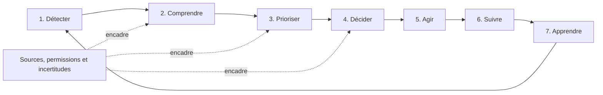

# TOME II — Mission produit : mieux décider, plus vite

## Cartouche documentaire

| Champ | Valeur |
|---|---|
| Statut | Dossier maître archivé après validation constitutionnelle |
| Version | 0.2 |
| Date | 23 juillet 2026 |
| Périmètre | Doctrine de décision et mission produit de PARZI |
| Produit d’entrée | PARZI Manage |
| Dépendance fondatrice | Tome I — Constitution centrale v1.0 |
| Autorité active | Tome II — Constitution centrale et registre des décisions v1.0 |
| Validation fondatrice | Recommandations CTO approuvées le 23 juillet 2026 |
| Effet applicatif | Aucun sans autorisation séparée |

## 1. Note d’intégrité

Le document historique autonome correspondant au Tome II n’a pas été retrouvé. Le présent tome est une reconstruction fondée sur :

- la Constitution centrale du Tome I ;
- le dossier maître du Tome I ;
- la Bible PARZI maître ;
- le document fondateur PARZI OS ;
- le Playbook PARZI Manage ;
- le Plan directeur CTO ;
- les décisions non négociables ;
- les constats des Tomes LXXVI et LXXVII.

Quatre niveaux de contenu sont distingués :

- **[SOURCE]** : contenu explicitement retrouvé ;
- **[DÉCISION TOME I]** : règle déjà validée dans la Constitution centrale ;
- **[RECONSTRUCTION]** : articulation de sources cohérentes ;
- **[PROPOSITION CTO]** : recommandation nouvelle soumise au fondateur.

Ce tome définit la doctrine produit. Il ne prétend pas que les capacités décrites sont déjà construites.

## 2. Rôle du Tome II

Le Tome I répond à la question : **pourquoi PARZI doit-il exister ?**

Le Tome II répond à la question : **quelle amélioration concrète PARZI doit-il produire dans la vie de l’utilisateur ?**

Sa fonction est de transformer la vision d’infrastructure mondiale en mission produit mesurable :

> **Aider l’utilisateur autorisé à comprendre une situation, choisir une priorité et engager la prochaine action utile avec moins de temps perdu, moins d’angles morts et davantage de confiance.**

Le Tome II ne spécifie pas encore chaque écran, module, formule ou source de données. Il fixe la mécanique commune de décision que les produits spécialisés devront respecter.

## 3. Mission historique et formulation retenue

**[SOURCE]** Le Playbook donne à PARZI Manage la mission de permettre à un agent de gérer davantage de joueurs, prendre de meilleures décisions, gagner du temps et développer son activité.

**[SOURCE]** Le document PARZI OS pose la question fondatrice : « Est-ce que cela aide l’agent à prendre une meilleure décision, plus rapidement ? »

**[DÉCISION TOME I]** L’information doit également être vraie, proportionnée et traçable.

**[RECONSTRUCTION]** La mission produit retenue est donc :

> **PARZI transforme un contexte professionnel dispersé en décisions compréhensibles et en actions suivies, sans dépasser la preuve disponible ni retirer la responsabilité à l’utilisateur.**

La formule courte est :

> **Mieux décider. Plus vite. Avec preuve.**

Cette formule est une proposition de doctrine interne. Son usage marketing relève du Tome III.

## 4. Ce que signifie « mieux décider »

Une meilleure décision n’est pas nécessairement une décision dont le résultat final est positif. Dans le sport professionnel, le résultat dépend aussi d’acteurs externes, du marché, du calendrier, de la négociation et de l’incertitude.

**[PROPOSITION CTO]** La qualité d’une décision doit être évaluée au moment où elle est prise selon sept dimensions :

1. **Pertinence** : la décision répond au bon problème ;
2. **Contexte** : les faits utiles sont réunis sans surcharge ;
3. **Fraîcheur** : les informations importantes sont suffisamment récentes ;
4. **Provenance** : les sources et transformations sont compréhensibles ;
5. **Incertitude** : les limites et données manquantes sont visibles ;
6. **Responsabilité** : l’auteur et la prochaine action sont identifiables ;
7. **Réversibilité** : les conséquences et possibilités de correction sont connues.

Une décision peut être raisonnable et produire un mauvais résultat. Une décision peut aussi produire un bon résultat par hasard tout en ayant été mal préparée. PARZI doit apprendre des deux sans réécrire l’histoire.

## 5. Ce que signifie « plus vite »

« Plus vite » ne signifie pas pousser l’utilisateur à agir avant d’avoir compris.

**[PROPOSITION CTO]** La vitesse utile se décompose en quatre délais :

- **temps jusqu’au contexte** : délai pour réunir les informations pertinentes ;
- **temps jusqu’à la priorité** : délai pour savoir ce qui mérite l’attention ;
- **temps jusqu’à la décision** : délai pour choisir une orientation ;
- **temps jusqu’à l’action** : délai pour engager la prochaine étape.

PARZI réduit les recherches, répétitions et oublis. Il ne réduit pas artificiellement le temps nécessaire à une décision contractuelle, juridique ou humaine complexe.

Le produit doit savoir ralentir lorsque :

- une information déterminante manque ;
- les sources se contredisent ;
- l’action est difficilement réversible ;
- un mineur est concerné ;
- une permission ou un consentement est incertain ;
- l’IA ne peut pas expliquer suffisamment sa proposition ;
- une validation professionnelle externe est nécessaire.

## 6. L’utilisateur principal et le contrat de mission

**[SOURCE]** Le point d’entrée est l’agent de football professionnel francophone.

Le contrat de mission de PARZI Manage est :

- l’agent apporte ou autorise son contexte ;
- PARZI structure ce contexte ;
- PARZI signale les informations manquantes ;
- PARZI prépare des priorités et options ;
- l’agent choisit et reste responsable ;
- PARZI aide à suivre l’action et son résultat ;
- l’historique permet d’améliorer le processus sans surveiller la personne.

Les futurs produits Player, Club, Academy et Network appliqueront la même doctrine à des décisions différentes. Ils ne doivent pas copier le cockpit agent sans redéfinir le rôle, les données et la responsabilité.

## 7. Les grandes familles de décisions

**[RECONSTRUCTION]** PARZI Manage peut soutenir huit familles principales.

| Famille | Question type | Exemple d’action | Risque dominant |
|---|---|---|---|
| Portefeuille | Quel joueur exige mon attention ? | Compléter un dossier ou organiser un échange | Négliger un cas moins visible |
| Mandats et contrats | Quelle échéance peut créer un risque ? | Vérifier, renouveler ou préparer une démarche | Date fausse ou conséquence juridique mal comprise |
| Relations | Qui dois-je contacter et pourquoi ? | Relancer un contact avec contexte | Transformer la relation en score simpliste |
| Clubs | Quel besoin est réel et à jour ? | Qualifier une piste ou demander confirmation | Présenter une inférence comme besoin déclaré |
| Scouting | Quel profil mérite une observation ? | Créer un rapport ou une watchlist | Confondre détection et opportunité |
| Opportunités | Quelle piste est qualifiée et actionnable ? | Définir étape, responsable et prochaine action | Présenter une donnée seed comme marché réel |
| Organisation | Que dois-je faire aujourd’hui ? | Prioriser une tâche ou une échéance | Fausse urgence et surcharge de notifications |
| Apprentissage | Quelle compétence dois-je renforcer ? | Suivre un contenu ou un cas pratique | Confondre progression et compétence professionnelle |

Ces familles ne donnent pas automatiquement naissance à huit moteurs de scoring. Une règle, une liste ou une explication peut être meilleure qu’un score.

## 8. La boucle de décision PARZI

**[PROPOSITION CTO]** Toute assistance produit doit pouvoir se situer dans une boucle commune :

### 8.1 Détecter

Identifier un changement, une échéance, un manque, une demande ou un signal sans encore conclure.

### 8.2 Comprendre

Réunir le contexte, les sources, les relations, les données manquantes et les contradictions.

### 8.3 Prioriser

Comparer les sujets selon leur urgence, impact, confiance, effort, réversibilité et responsabilité.

### 8.4 Décider

Présenter les options et laisser l’utilisateur choisir ou confirmer la règle applicable.

### 8.5 Agir

Transformer la décision en prochaine action avec propriétaire, échéance et moyen d’exécution.

### 8.6 Suivre

Conserver l’état, les relances, les obstacles et la preuve de complétion.

### 8.7 Apprendre

Comparer décision, hypothèses et résultat afin d’améliorer le processus, pas de noter arbitrairement l’utilisateur.

Une fonction qui ne sait pas quelle étape elle améliore doit être refusée ou redéfinie.

## 9. La Decision Card

**[DÉCISION TOME I]** La Decision Card est validée comme primitive conceptuelle.

**[PROPOSITION CTO]** Une Decision Card peut contenir :

| Élément | Question |
|---|---|
| Sujet | Quelle décision doit être prise ? |
| Objet métier | Joueur, club, mandat, relation, tâche ou autre entité concernée |
| Déclencheur | Quel événement ou besoin a ouvert la décision ? |
| Faits | Quelles informations sont suffisamment établies ? |
| Sources | D’où viennent les faits importants ? |
| Incertitudes | Qu’est-ce qui manque ou reste contestable ? |
| Options | Quelles orientations sont réellement possibles ? |
| Recommandation | Quelle option PARZI propose-t-il, le cas échéant, et pourquoi ? |
| Risque | Quelle conséquence importante doit être comprise ? |
| Auteur | Qui possède la décision ? |
| Action | Quelle est la prochaine étape concrète ? |
| Échéance | Quand l’action doit-elle être revue ou terminée ? |
| Résultat | Qu’est-il arrivé après la décision ? |
| Statut | Ouverte, décidée, en action, terminée, abandonnée ou réouverte |

Toutes les décisions ne nécessitent pas une carte persistante. Le produit doit éviter de transformer chaque clic en processus administratif.

Les Decision Cards sensibles sont privées par défaut. Leur partage suit les espaces de confiance du Tome I.

## 10. Contrat d’entrée de l’information

Une information utilisée pour assister une décision doit pouvoir indiquer :

- sa source ;
- son auteur ou fournisseur ;
- sa date ;
- sa fraîcheur attendue ;
- son droit d’usage ;
- son périmètre de visibilité ;
- son type : fait, déclaration, estimation, inférence ou génération IA ;
- son niveau de confiance lorsque cela est pertinent ;
- les transformations importantes ;
- sa procédure de correction.

**[PROPOSITION CTO]** Le produit doit représenter au moins cinq états :

1. **confirmée** : source jugée suffisante pour l’usage défini ;
2. **déclarée** : saisie par un acteur identifié mais non contrôlée extérieurement ;
3. **estimée** : calcul ou appréciation avec hypothèses ;
4. **contestée** : contradiction ou recours en cours ;
5. **manquante** : nécessaire ou utile mais non disponible.

Un état « confirmé » ne signifie pas vérité éternelle. Il reste daté et lié à une source.

## 11. Contrat de sortie d’une recommandation

Toute recommandation ayant un effet métier important devrait afficher :

- ce qui est proposé ;
- pourquoi maintenant ;
- les facteurs principaux ;
- la source des facteurs importants ;
- les données manquantes ;
- le niveau d’incertitude ;
- le risque ou l’effet possible ;
- l’action suivante ;
- la personne qui doit valider ;
- la date de réexamen ;
- un moyen de corriger ou contester.

Une recommandation qui ne peut pas expliquer son « pourquoi maintenant » ne mérite pas une priorité élevée.

## 12. Priorisation multi-critères

**[SOURCE]** La vision historique propose cinq actions maximum, classées notamment par impact financier, temps et probabilité.

**[PROPOSITION CTO]** L’impact financier ne doit pas être le seul principe de classement. La priorité doit pouvoir considérer :

- urgence réelle ;
- impact sur le joueur ou l’organisation ;
- risque de ne rien faire ;
- confiance dans les données ;
- effort estimé ;
- réversibilité ;
- dépendances ;
- engagement déjà pris ;
- obligation contractuelle ou réglementaire ;
- préférence explicite de l’utilisateur.

La formule exacte ne doit pas être fixée avant tests. Les pondérations cachées créent une autorité artificielle.

### 12.1 Règles de priorité

- une échéance confirmée peut dépasser une opportunité estimée ;
- une action concernant la sécurité ou les droits peut dépasser un gain commercial ;
- une information peu fiable réduit la force de la recommandation ;
- un conflit de données peut déclencher une vérification plutôt qu’une action ;
- une tâche ancienne n’est pas automatiquement importante ;
- une action rentable ne devient pas prioritaire si elle viole une permission ou un consentement ;
- l’utilisateur peut corriger une priorité et expliquer pourquoi.

### 12.2 Budget d’attention

**[PROPOSITION CTO]** Le cockpit quotidien affiche au maximum cinq priorités principales. Les autres sujets restent accessibles dans des vues secondaires.

Ce plafond protège l’attention, mais ne doit pas masquer une alerte critique. Les alertes critiques utilisent une voie distincte, rare et documentée.

## 13. Le cockpit en moins de trente secondes

**[SOURCE]** Le Playbook fixe l’objectif d’une vue claire de la journée en moins de trente secondes.

L’expérience cible doit permettre de répondre rapidement à cinq questions :

1. que s’est-il passé depuis ma dernière visite ?
2. qu’est-ce qui exige mon attention maintenant ?
3. pourquoi est-ce important ?
4. quelle est la prochaine action ?
5. quelles informations dois-je vérifier avant d’agir ?

Le cockpit ne doit pas :

- multiplier les graphiques sans décision associée ;
- afficher des nombres décoratifs ;
- transformer chaque actualité en alerte ;
- présenter des opportunités simulées comme réelles ;
- cacher les éléments non calculables ;
- imposer le même ordre à tous les utilisateurs ;
- utiliser la peur de manquer comme mécanisme d’engagement.

## 14. Niveaux d’assistance produit

**[PROPOSITION CTO]** Les fonctions peuvent être classées selon six niveaux d’assistance :

| Niveau | Rôle produit | Exemple |
|---|---|---|
| P0 — Enregistrer | Conserver une information structurée | Fiche, note, document ou date |
| P1 — Rappeler | Signaler une échéance ou un élément choisi | Rappel d’un mandat |
| P2 — Synthétiser | Réunir et résumer un contexte | Résumé d’un club ou dossier |
| P3 — Prioriser | Ordonner plusieurs sujets selon des critères | Cinq actions du jour |
| P4 — Recommander | Proposer une option expliquée | Suggérer une vérification ou relance |
| P5 — Préparer l’action | Produire un brouillon ou une étape prête à confirmer | E-mail, brief ou tâche préparée |

Ces niveaux décrivent l’aide produit. Ils sont distincts des niveaux d’autonomie IA A0 à A4 du Tome I.

Un produit peut utiliser une règle déterministe au niveau P4. Une fonction IA peut rester au niveau P2. Assistance et technologie ne sont pas synonymes.

## 15. Répartition entre règle, donnée et IA

PARZI choisit l’outil le plus simple capable de produire une aide fiable.

### Règle déterministe

Adaptée aux dates, permissions, statuts, obligations et calculs reproductibles.

### Donnée ou requête

Adaptée aux listes, filtres, historiques, relations et comparaisons factuelles.

### Modèle statistique

Adapté aux probabilités ou tendances lorsque les données, biais et intervalles sont compris.

### IA générative

Adaptée à la synthèse, la reformulation, la préparation de scénarios et la génération de brouillons.

L’IA générative ne doit pas être utilisée pour simuler une précision qu’une règle ou une donnée ne peut pas fournir.

## 16. Autorité humaine et actions externes

**[DÉCISION TOME I]** Les actions sensibles restent sous responsabilité humaine.

Une action externe comprend notamment :

- envoyer un e-mail ou message ;
- partager un dossier ;
- modifier une visibilité ;
- engager une relation ;
- confirmer une opportunité ;
- valider une attestation ;
- changer un statut professionnel ;
- signer ou accepter un document ;
- supprimer ou archiver une donnée importante.

**[PROPOSITION CTO]** Avant confirmation, PARZI montre destinataire, contenu, données partagées, conséquence et possibilité d’annulation.

Une validation générale donnée à l’inscription ne vaut pas validation permanente pour toutes les actions futures.

## 17. Temporalité de la décision

Les décisions professionnelles vivent dans le temps.

Une assistance peut être :

- **événementielle** : ouverte par un changement ;
- **planifiée** : ouverte par une date ou un rendez-vous ;
- **récurrente** : revue quotidienne, hebdomadaire ou saisonnière ;
- **conditionnelle** : ouverte lorsqu’un seuil ou état est atteint ;
- **manuelle** : créée explicitement par l’utilisateur.

Chaque signal doit posséder une règle d’expiration. Une actualité ancienne, un besoin club non confirmé ou une estimation obsolète ne doit pas rester prioritaire indéfiniment.

Le produit doit savoir fermer, abandonner, reporter et réouvrir une décision sans perdre son histoire.

## 18. Notifications et économie de l’attention

Une notification demande un morceau d’attention. Elle doit donc produire une valeur supérieure à l’interruption créée.

**[PROPOSITION CTO]** Chaque catégorie de notification précise :

- événement déclencheur ;
- destinataire ;
- canal ;
- urgence ;
- fréquence maximale ;
- regroupement possible ;
- préférence utilisateur ;
- durée de validité ;
- action proposée ;
- mesure de qualité.

Règles :

- les e-mails restent en opt-in ;
- les doublons multi-canaux sont évités ;
- une actualité générale n’interrompt pas une échéance confirmée ;
- les résumés regroupent les signaux faibles ;
- l’utilisateur peut réduire, suspendre ou désactiver les catégories non essentielles ;
- une alerte critique est rare et justifiée ;
- le taux de clic n’est pas la seule mesure de succès.

## 19. Mode quotidien, hebdomadaire et Mercato

### Revue quotidienne

Priorités, échéances proches, changements importants et actions en attente.

### Revue hebdomadaire

Décisions non terminées, relations à entretenir, qualité des dossiers, apprentissages et points de blocage.

### Mode Mercato

**[RECONSTRUCTION]** Une intensification temporaire peut adapter fréquence, vues et priorités pendant une fenêtre de marché.

Elle ne doit pas :

- transformer les rumeurs en faits ;
- multiplier les notifications sans contrôle ;
- masquer les obligations hors mercato ;
- favoriser les clients payants dans les recommandations organiques ;
- accélérer une action sensible sans validation.

## 20. Mémoire et apprentissage du système

PARZI peut apprendre de l’usage sans créer une note secrète de l’utilisateur.

Les événements utiles incluent :

- recommandation consultée ;
- priorité acceptée, corrigée ou ignorée ;
- action engagée ;
- délai de complétion ;
- information corrigée ;
- décision abandonnée avec motif ;
- résultat déclaré ;
- source devenue obsolète.

**[PROPOSITION CTO]** Les motifs de correction ou d’ignorance sont facultatifs, courts et orientés amélioration : mauvais timing, information incorrecte, déjà traité, non pertinent, autre priorité ou préférence personnelle.

Le système ne doit pas pénaliser l’utilisateur pour avoir refusé une recommandation.

## 21. Mesurer une meilleure décision

**[DÉCISION TOME I]** La North Star « décisions professionnelles assistées et traçables » reste expérimentale.

### 21.1 Métriques de valeur

- temps jusqu’au contexte ;
- temps jusqu’à la prochaine action ;
- échéances confirmées traitées à temps ;
- décisions suivies d’une action ;
- dossiers complétés avant un besoin ;
- priorités jugées utiles ;
- réduction déclarée de la charge mentale ;
- rétention des utilisateurs actifs.

### 21.2 Métriques de confiance

- part des recommandations expliquées ;
- part des facteurs importants avec provenance ;
- fréquence des corrections ;
- taux de recommandations contestées ;
- fausses urgences ;
- actions externes bloquées avant erreur ;
- incidents de permissions ;
- temps de traitement des recours.

### 21.3 Métriques de santé du système

- fraîcheur des données critiques ;
- recommandations expirées retirées ;
- coût par assistance ;
- latence ;
- disponibilité des dépendances ;
- taux de retour au mode dégradé ;
- dérive des priorités ;
- concentration excessive sur certains joueurs ou clubs.

### 21.4 Ce qui ne doit pas être mesuré comme performance humaine

- nombre brut de clics ;
- temps passé dans l’application ;
- volume de messages envoyés ;
- vitesse de réponse sans contexte ;
- nombre de joueurs gérés sans qualité ;
- acceptation aveugle des recommandations ;
- présence quotidienne forcée.

## 22. La métrique de décision assistée

**[PROPOSITION CTO]** Une décision assistée et traçable peut être comptée si :

1. une question ou priorité métier est identifiée ;
2. PARZI a fourni un contexte, une alerte, une synthèse ou une recommandation ;
3. la source ou la règle principale est connue ;
4. l’utilisateur a choisi ou confirmé une orientation ;
5. une action ou décision de ne pas agir est enregistrée de manière proportionnée ;
6. aucune donnée privée inutile n’est copiée dans la mesure analytics.

La métrique ne doit pas exiger de conserver tout le contenu de la décision. Un événement pseudonymisé peut suffire.

Elle reste expérimentale jusqu’à preuve qu’elle reflète réellement la valeur et ne crée pas de comportement artificiel.

## 23. Contrôle utilisateur

L’utilisateur doit pouvoir :

- corriger une information ;
- modifier une priorité ;
- masquer ou reporter un sujet ;
- indiquer qu’une action est déjà traitée ;
- demander l’origine d’une recommandation ;
- réduire certaines catégories de notifications ;
- choisir le niveau d’assistance ;
- refuser un brouillon IA ;
- contester une décision automatisée importante ;
- exporter les éléments qui lui appartiennent.

Le contrôle utilisateur ne permet pas de modifier une preuve d’audit ou l’information appartenant légitimement à une autre partie.

## 24. Équité et angles morts

Un moteur de priorité peut créer des effets auto-renforçants : les joueurs déjà visibles reçoivent plus d’attention, produisent plus de données et deviennent encore plus visibles.

**[PROPOSITION CTO]** Les contrôles doivent rechercher :

- concentration répétée sur les mêmes entités ;
- absence de données interprétée comme mauvaise qualité ;
- avantage indu pour les utilisateurs les plus riches ;
- poids excessif des signaux médiatiques ;
- géographies ou compétitions sous-représentées ;
- recommandations identiques envoyées à trop d’agents ;
- différence entre intérêt utilisateur et intérêt commercial de PARZI.

Les corrections possibles incluent transparence, exploration contrôlée, diversité des sources, limites de répétition et revue humaine.

L’équité ne signifie pas distribuer artificiellement les mêmes opportunités. Elle signifie éviter qu’un mécanisme opaque transforme un manque de données ou un paiement en exclusion définitive.

## 25. Démarrage à froid et données de démonstration

Le produit peut manquer de données au début. Il doit rester utile sans inventer.

### Mode données insuffisantes

- afficher ce qui est réellement disponible ;
- demander la donnée minimale suivante ;
- utiliser des règles simples et explicites ;
- montrer « en attente de données » ;
- proposer une action de structuration plutôt qu’une fausse prédiction.

### Mode démonstration

- identifier clairement les données fictives ;
- isoler la démonstration des données professionnelles ;
- ne pas envoyer de notifications externes réelles ;
- ne pas compter les résultats seed comme preuves de marché ;
- permettre une remise à zéro contrôlée ;
- ne jamais entraîner un modèle ou une métrique commerciale avec le seed comme vérité.

## 26. Réalité du produit et frontière de vérité

**[SOURCE]** Le corpus historique décrit un Command Center, des scores, un Ghost Agent, une veille, des dossiers et des automatisations.

**[SOURCE]** L’audit consolidé a ensuite constaté que certaines promesses dépassaient les données disponibles : opportunités issues du seed, tâches sans dates machines suffisantes, Score non sportif, Agency Health non prouvé et données externes encore limitées.

La doctrine du Tome II impose donc :

- ne pas utiliser une description historique comme preuve de fonctionnement courant ;
- tester le produit réel avant de promettre un bénéfice ;
- renommer ou masquer les signaux non prouvés ;
- distinguer démo, pilote et production ;
- conserver la cible sans falsifier l’état présent.

## 27. Modes de défaillance

| Défaillance | Effet | Réponse attendue |
|---|---|---|
| Fausse urgence | Perte de confiance et fatigue | Réduire le poids, corriger la source et suivre le taux d’erreur |
| Donnée périmée | Mauvaise priorité | Expiration, fraîcheur visible et demande de confirmation |
| Explication générique | Autorité artificielle | Montrer facteurs spécifiques ou retirer la recommandation |
| Trop de priorités | Paralysie | Budget d’attention et regroupement |
| Recommandation répétitive | Biais de concentration | Limites, diversité et revue |
| IA confiante mais fausse | Action dangereuse | Sources, avertissement, validation et arrêt |
| Permission incorrecte | Exposition de données | Blocage serveur, incident et test A/B |
| Action externe involontaire | Préjudice relationnel | Confirmation explicite et aperçu final |
| Utilisateur dépendant du système | Perte de jugement | Options, explications et droit de désaccord |
| Métrique détournée | Optimisation du chiffre plutôt que de la valeur | Mesures multiples et revue qualitative |

## 28. Test d’entrée d’une fonctionnalité

**[PROPOSITION CTO]** Une fonctionnalité ne doit pas entrer dans un backlog produit tant qu’elle ne précise pas :

1. utilisateur principal ;
2. famille de décision ;
3. étape de la boucle améliorée ;
4. problème répété ;
5. données nécessaires et provenance ;
6. permission et consentement ;
7. sortie produite ;
8. prochaine action ;
9. niveau d’assistance P0 à P5 ;
10. niveau d’autonomie IA A0 à A4 ;
11. métrique de valeur ;
12. métrique de confiance ;
13. principal mode de défaillance ;
14. mode dégradé ;
15. propriétaire fonctionnel ;
16. condition de retrait.

Une idée séduisante mais incapable de répondre à ces questions reste conceptuelle.

## 29. Mission de chaque produit dans la décision

| Produit | Contribution à la décision | Ce qu’il ne doit pas devenir |
|---|---|---|
| PARZI Manage | Organiser le contexte, les priorités et les actions de l’agent | Réseau social générique |
| PARZI ID | Établir des claims précis sur identité et titre | Approbation générale d’une personne |
| PARZI Data / Intelligence | Fournir provenance, qualité et données exploitables | Score opaque |
| PARZI Score | Évaluer selon des données et une méthode définies | Rank ou verdict absolu |
| PARZI Rank | Comparer dans un périmètre et une période | Note universelle |
| PARZI Trophy / Badges | Reconnaître un jalon vérifiable | Licence ou valeur marché |
| PARZI Academy | Soutenir des décisions d’apprentissage | Autorité professionnelle réglementaire |
| PARZI Detection | Aider à découvrir et suivre un profil | Opportunité commerciale automatique |
| PARZI Player | Donner contrôle et contexte au joueur | Dossier interne de l’agent rendu public |
| PARZI Club | Structurer les besoins et interactions du club | Accès illimité aux données joueurs |
| PARZI Network | Aider à construire des relations professionnelles | CRM privé exposé |
| PARZI Studio / Creator | Préparer un contenu ou support | Moteur de réputation ou de Score |
| PARZI Market / Shop | Faciliter un échange commercial transparent | Classement payant caché |

## 30. Hypothèses critiques du Tome II

| Hypothèse | Preuve attendue | Réponse si invalidée |
|---|---|---|
| Les agents veulent un cockpit quotidien | Usage répété et retour qualitatif | Recentrer sur un rythme hebdomadaire ou événementiel |
| Cinq priorités réduisent la charge mentale | Comparaison avec d’autres densités | Adapter le plafond sans supprimer le budget d’attention |
| Les explications augmentent la confiance | Compréhension et correction mesurées | Simplifier le langage et les facteurs |
| Les recommandations mènent à des actions utiles | Taux d’action et qualité déclarée | Réduire P4/P5 et renforcer P0–P3 |
| La Decision Card apporte plus de valeur que de friction | Usage volontaire sur décisions importantes | La réserver à certains domaines |
| La North Star reflète la valeur | Corrélation avec rétention et bénéfices déclarés | Changer ou abandonner la métrique |
| La priorisation peut rester équitable | Audits de concentration et retours utilisateurs | Introduire contrôles, limites ou revue humaine |
| L’IA réduit le temps sans augmenter les erreurs | Tests comparatifs et incidents | Réduire l’usage IA ou revenir aux règles |

## 31. Responsabilité et collaboration autour d’une décision

### 31.1 Un propriétaire explicite

Dans une agence, plusieurs personnes peuvent contribuer à une décision. Cette collaboration ne doit pas rendre la responsabilité anonyme.

**[PROPOSITION CTO]** Une décision partagée peut distinguer :

- **propriétaire** : responsable de la décision et de sa clôture ;
- **contributeur** : apporte une information ou une analyse ;
- **approbateur** : doit autoriser une étape selon le rôle ou le risque ;
- **exécutant** : réalise la prochaine action ;
- **observateur** : suit sans pouvoir modifier.

Une même personne peut cumuler plusieurs rôles. Le propriétaire reste unique à un instant donné.

### 31.2 Classes de risque décisionnel

**[PROPOSITION CTO]** Le niveau de contrôle doit dépendre de l’impact et de la réversibilité.

| Classe | Nature | Exemple | Contrôle minimal |
|---|---|---|---|
| D0 — Routine | Faible impact, facilement réversible | Reporter une tâche personnelle | Action directe et historique proportionné |
| D1 — Coordonnée | Affecte une autre personne ou un workflow | Attribuer une tâche ou demander une information | Destinataire et conséquence visibles |
| D2 — Conséquente | Effet professionnel ou relationnel important | Partager un dossier ou envoyer une proposition | Confirmation, permission et preuve du contexte |
| D3 — Protégée | Juridique, réputation, identité, mineur ou accès sensible | Modifier un statut vérifié ou engager un partage protégé | Autorité explicite, second contrôle et audit |

La classe ne dépend pas du prestige de l’utilisateur. Elle dépend de l’action.

### 31.3 Matrice confiance–impact

| Confiance dans l’information | Impact faible | Impact élevé |
|---|---|---|
| Élevée | Agir ou préparer selon le niveau autorisé | Confirmer les conséquences puis agir |
| Moyenne | Proposer avec limites visibles | Vérifier une donnée déterminante avant action |
| Faible | Collecter ou clarifier | Bloquer la recommandation forte et demander une preuve |
| Contradictoire | Signaler la contradiction | Escalader et empêcher l’automatisation |

Cette matrice n’est pas un score chiffré. Elle décrit un principe de prudence.

### 31.4 Escalade

Une décision doit pouvoir être escaladée lorsqu’elle présente :

- conflit entre sources ;
- compétence ou autorité manquante ;
- désaccord entre membres ;
- risque juridique ou contractuel ;
- joueur mineur ;
- impact réputationnel important ;
- conflit d’intérêts ;
- action irréversible ;
- doute sur une permission ;
- erreur possible du système.

L’escalade n’est pas un échec. Elle est une action possible de la boucle de décision.

### 31.5 Désaccord et décision minoritaire

PARZI ne doit pas fabriquer un consensus artificiel. Les collaborateurs autorisés peuvent :

- proposer une option différente ;
- joindre un fait ou une source ;
- signaler un risque ;
- demander un second regard ;
- enregistrer une réserve ;
- refuser une exécution qui dépasse leur autorité.

La décision finale conserve, lorsque nécessaire, les objections importantes sans exposer inutilement des notes privées.

### 31.6 Transfert de responsabilité

Un transfert de propriétaire doit indiquer : auteur, destinataire, contexte, éléments ouverts, échéance et acceptation. Une simple attribution silencieuse ne suffit pas pour une décision importante.

En cas de départ d’un membre, le workspace doit permettre de réattribuer les décisions sans lui conserver un accès indu.

## 32. Biais cognitifs et design d’influence

Une interface de priorité influence nécessairement l’attention. PARZI doit traiter cette influence comme un pouvoir à gouverner.

### 32.1 Biais principaux

| Biais | Risque produit | Réponse possible |
|---|---|---|
| Automatisation | Accepter parce que PARZI recommande | Montrer limites, options et désaccord possible |
| Récence | Surévaluer le dernier événement | Afficher historique et période de comparaison |
| Disponibilité | Confondre information visible et importance | Montrer données manquantes et sujets moins visibles |
| Confirmation | Sélectionner seulement les signaux attendus | Présenter contradictions et alternatives |
| Ancrage | Rester fixé sur une première valeur | Montrer source, date et plage lorsque justifiée |
| Popularité | Favoriser joueurs, clubs ou contacts déjà visibles | Contrôler concentration et exploration |
| Urgence | Agir sous pression artificielle | Justifier date, conséquence et degré d’urgence |
| Financier | Prioriser seulement le revenu immédiat | Intégrer droits, risque, relation et obligations |
| Survivant | Copier uniquement les cas de réussite | Conserver échecs, abandons et résultats négatifs |
| Autorité | Croire une source sans examiner sa portée | Afficher autorité, territoire, date et limites |

### 32.2 Personnalisation légitime

La personnalisation peut utiliser :

- portefeuille et rôles autorisés ;
- préférences explicites ;
- échéances et tâches ;
- historique de corrections ;
- contexte de marché autorisé ;
- disponibilité et charge de travail déclarées.

Elle ne doit pas :

- exploiter une vulnérabilité émotionnelle ;
- cacher une option pour augmenter un revenu PARZI ;
- rendre difficile le refus ;
- transformer le temps passé en objectif ;
- créer une peur artificielle de manquer ;
- pénaliser l’utilisateur qui réduit les notifications ;
- déduire des attributs sensibles inutiles.

### 32.3 Interdiction des dark patterns

**[PROPOSITION CTO]** Sont interdits dans une expérience de décision :

- compte à rebours sans échéance réelle ;
- urgence fondée sur une donnée non confirmée ;
- option recommandée visuellement dominante sans justification ;
- refus ou désabonnement volontairement caché ;
- confirmation précochée pour une action sensible ;
- formulation culpabilisante après un refus ;
- preuve sociale fictive ;
- nombre de personnes intéressées inventé ;
- recommandation commerciale présentée comme neutre.

### 32.4 Exploration contrôlée

Pour réduire la concentration, le système peut proposer ponctuellement un sujet moins visible. Cette exploration doit :

- être identifiée comme découverte ;
- rester compatible avec les critères de l’utilisateur ;
- ne pas prétendre être la meilleure option ;
- respecter les règles anti-collision ;
- être mesurée séparément de la priorité organique.

## 33. Standard d’explication et d’incertitude

### 33.1 Explication en trois couches

**[PROPOSITION CTO]** Une recommandation importante doit pouvoir se lire à trois profondeurs :

1. **Résumé** : pourquoi maintenant, en une phrase ;
2. **Facteurs** : éléments principaux, données manquantes et risque ;
3. **Piste de preuve** : sources, dates, transformations et historique utile.

L’utilisateur ne doit pas ouvrir un rapport complet pour comprendre le motif principal. Il doit pouvoir approfondir sans recevoir une fausse simplicité.

### 33.2 Langage d’incertitude

Une recommandation peut utiliser des formulations comme :

- **établie pour cet usage** : source suffisante et fraîche selon la règle définie ;
- **soutenue** : plusieurs éléments cohérents mais limites restantes ;
- **incertaine** : éléments incomplets ou hypothèse dominante ;
- **contradictoire** : sources importantes en désaccord ;
- **insuffisante** : impossible de recommander honnêtement.

Ces termes ne remplacent pas la source. Ils évitent les pourcentages décoratifs.

### 33.3 Pourcentages et calibration

Un pourcentage de confiance n’est autorisé que si :

- l’événement prédit est défini ;
- la population et la période sont connues ;
- la méthode est testée ;
- la calibration est mesurée ;
- l’intervalle ou l’incertitude est compréhensible ;
- le résultat peut être réévalué.

Sinon, PARZI utilise une formulation qualitative et montre les facteurs.

### 33.4 Raisons de priorité

**[PROPOSITION CTO]** Les raisons principales peuvent appartenir à une taxonomie limitée :

- échéance confirmée ;
- risque de ne rien faire ;
- engagement pris ;
- changement récent ;
- information manquante ;
- relation à entretenir ;
- opportunité qualifiée ;
- vérification requise ;
- action bloquante ;
- préférence utilisateur.

Un libellé générique « recommandé pour vous » ne suffit pas.

### 33.5 Explication d’une absence de recommandation

Le produit doit parfois dire pourquoi il ne recommande pas : données insuffisantes, source expirée, permission absente, conflit non résolu ou risque trop élevé.

L’absence honnête est un résultat utile.

## 34. Dette de décision et boucles ouvertes

### 34.1 Définition

**[PROPOSITION CTO]** La dette de décision est l’accumulation de sujets ouverts dont le contexte, le propriétaire, l’échéance ou la prochaine action n’est plus suffisamment clair.

Elle ne mesure pas la valeur professionnelle de l’agent. Elle décrit l’état du système de travail.

### 34.2 Formes de dette

- décision sans propriétaire ;
- sujet reporté sans date de réexamen ;
- action décidée mais non suivie ;
- source devenue obsolète ;
- contradiction jamais résolue ;
- attente externe sans relance prévue ;
- brouillon IA jamais confirmé ni supprimé ;
- opportunité sans étape ;
- tâche sans date exploitable ;
- dossier partagé sans état de retour ;
- décision clôturée sans résultat lorsque celui-ci est nécessaire.

### 34.3 Signaux de dette

- reports répétés ;
- décisions ouvertes au-delà de leur fenêtre utile ;
- changements fréquents de propriétaire ;
- action bloquée par une même donnée ;
- accumulation de recommandations ignorées ;
- priorités qui réapparaissent sans nouveau signal ;
- grand nombre d’éléments « en attente » sans raison.

### 34.4 Traitement

Le produit peut proposer :

- compléter le contexte ;
- attribuer un propriétaire ;
- définir une date de réexamen ;
- demander une confirmation externe ;
- fermer comme abandonnée avec motif ;
- fusionner les doublons ;
- archiver une donnée obsolète ;
- escalader un blocage ;
- supprimer un brouillon inutile.

### 34.5 Indicateur honnête

La dette de décision ne doit pas devenir un « score de performance agent ». Le cockpit peut montrer des catégories et volumes opérationnels, avec leur définition, plutôt qu’une note morale unique.

## 35. Contre-audit et tests adversariaux

### 35.1 Scénarios

| Scénario | Échec recherché | Réponse attendue |
|---|---|---|
| Une fausse date de fin de mandat déclenche une alerte critique | Autorité injustifiée de la base | Source, correction rapide et révision des décisions affectées |
| Un club payant veut remonter dans les recommandations | Capture commerciale | Refus ou placement sponsorisé séparé et visible |
| Cinq priorités masquent une urgence rare | Limite du budget d’attention | Canal critique distinct et test de non-omission |
| Une note privée réapparaît dans un e-mail IA | Fuite contextuelle | Filtrage, aperçu, blocage et incident |
| Deux membres se croient propriétaires de la même décision | Ambiguïté de responsabilité | Propriétaire unique et transfert accepté |
| Un utilisateur accepte systématiquement les recommandations | Automation bias | Rappels de responsabilité, options et contrôles de qualité |
| Une opportunité seed apparaît dans la vue réelle | Fausse preuve de marché | Isolation et marquage de démonstration |
| Un besoin club n’a plus été confirmé depuis des mois | Obsolescence | Expiration et demande de reconfirmation |
| Une donnée manque pour un jeune joueur peu médiatisé | Biais de visibilité | État manquant, exploration et absence de pénalité automatique |
| Une recommandation change après correction d’une source | Histoire réécrite | Version, motif et décisions affectées consultables |
| Un membre quitte une agence avec des décisions ouvertes | Rupture de continuité | Révocation d’accès et transfert contrôlé |
| Un signal urgent est traduit de manière ambiguë | Risque international | Langage source, validation locale et mode prudent |
| Le fournisseur IA devient indisponible | Dépendance | Mode P0–P3 déterministe ou manuel |
| La North Star augmente mais les utilisateurs se sentent surveillés | Métrique toxique | Réduire collecte, revoir définition ou abandonner |
| Une action D3 est confirmée sur mobile par erreur | Interaction sensible | Confirmation renforcée et résumé des conséquences |

### 35.2 Questions de contre-audit

Avant lancement, l’équipe doit demander :

1. quelle erreur est la plus probable ?
2. quelle erreur est la plus grave ?
3. qui peut être lésé sans être utilisateur direct ?
4. quel acteur peut manipuler le signal ?
5. quelle donnée peut devenir obsolète ?
6. comment l’utilisateur conteste-t-il ?
7. comment revient-on en arrière ?
8. quelle preuve permet de rouvrir après suspension ?

## 36. Gouvernance et versions du Tome II

### 36.1 Hiérarchie

- le Tome I fixe la constitution fondatrice ;
- le Tome II fixe la mission produit et la doctrine de décision ;
- les Tomes XI à XXX détaillent domaines et moteurs ;
- les Tomes LXI à LXX imposent sécurité, données et production ;
- les Tomes LXXVI et LXXVII gouvernent la vérité auditée et la remédiation ;
- le code approuvé prouve ce qui existe.

### 36.2 Modification

Une modification structurante du Tome II indique : décision concernée, nouvelle preuve, effet sur les métriques, risque utilisateur, délégations touchées et statut fondateur.

### 36.3 Journal local

| Version | Date | Travail | Statut |
|---|---|---|---|
| 0.1 | 23 juillet 2026 | Mission, boucle de décision, assistance, métriques et vingt-cinq décisions | Brouillon remplacé |
| 0.2 | 23 juillet 2026 | Collaboration, biais, incertitude, dette de décision et contre-audit | Archive de raisonnement ; Constitution et registre v1.0 validés |

Cette archive locale n’a pas été commitée. La Constitution centrale et le registre des décisions version 1.0 portent désormais l’autorité documentaire active du Tome II.

## 37. Décisions proposées du Tome II

Ce tableau conserve les recommandations telles qu’elles ont été soumises au fondateur. Leur statut après validation se trouve exclusivement dans `TOME_II_REGISTRE_DECISIONS.md`.

| ID | Décision | Avis CTO | Délégation principale |
|---|---|---|---|
| TII-D001 | Adopter « transformer le contexte dispersé en décisions et actions suivies » comme mission produit | Approuver | XI–XX |
| TII-D002 | Utiliser « Mieux décider. Plus vite. Avec preuve. » comme doctrine interne | Approuver le principe | III |
| TII-D003 | Définir « mieux » par sept dimensions de qualité au moment de la décision | Approuver | VIII, XXI–XXX |
| TII-D004 | Définir « plus vite » par quatre délais sans accélération artificielle | Approuver | XII, XVIII |
| TII-D005 | Conserver l’agent de football francophone comme utilisateur d’entrée | Approuver | IV, XI |
| TII-D006 | Adopter les huit familles de décisions comme taxonomie initiale | Approuver comme hypothèse | XI–XX |
| TII-D007 | Adopter la boucle Détecter–Comprendre–Prioriser–Décider–Agir–Suivre–Apprendre | Approuver | Tous les produits |
| TII-D008 | Définir la Decision Card sans imposer sa persistance à chaque décision | Approuver | XII, XIX–XX |
| TII-D009 | Adopter les cinq états d’information confirmée, déclarée, estimée, contestée et manquante | Approuver | XXI–XXII, LXI–LXIV |
| TII-D010 | Imposer un contrat d’explication aux recommandations importantes | Approuver, non négociable | XXI–XXX |
| TII-D011 | Adopter une priorisation multi-critères sans formule définitive avant tests | Approuver | XII, XVIII |
| TII-D012 | Limiter le cockpit à cinq priorités principales et séparer les alertes critiques | Approuver comme expérimentation | XII |
| TII-D013 | Adopter les niveaux d’assistance P0 à P5 distincts des niveaux IA A0 à A4 | Approuver | XI–XX |
| TII-D014 | Utiliser règle, donnée, modèle ou IA selon le besoin le plus simple et fiable | Approuver | XX, XXI |
| TII-D015 | Exiger une confirmation explicite avant toute action externe sensible | Approuver, non négociable | XX, LXV |
| TII-D016 | Attribuer une expiration à tout signal ou recommandation temporelle | Approuver | XII, XVII–XVIII |
| TII-D017 | Instaurer un budget de notification par catégorie et utilisateur | Approuver le principe | XVIII, LXVII |
| TII-D018 | Conserver l’historique des corrections sans pénaliser le refus d’une recommandation | Approuver | LXVI, LXXI |
| TII-D019 | Maintenir la North Star en expérimentation avec mesure pseudonymisée | Approuver | XII, LXVI |
| TII-D020 | Interdire les métriques de vanité comme preuve de meilleure décision | Approuver | VIII, LXVI |
| TII-D021 | Donner à l’utilisateur des contrôles de correction, report, origine et niveau d’assistance | Approuver | XI–XX, LXIV |
| TII-D022 | Surveiller concentration, manque de données et intérêt commercial dans la priorisation | Approuver | XXI–XXX |
| TII-D023 | Isoler strictement le mode démonstration et ne pas le compter comme preuve marché | Approuver, non négociable | XXI, LXXIII–LXXV |
| TII-D024 | Imposer le test d’entrée en seize points avant backlog produit | Approuver le principe | VIII, X, LXXII |
| TII-D025 | Conserver des contributions distinctes par produit à la décision | Approuver | X |
| TII-D026 | Attribuer un propriétaire unique à chaque décision partagée et distinguer les rôles de collaboration | Approuver | IV, XI–XX |
| TII-D027 | Classer les décisions de D0 à D3 selon leur impact et leur réversibilité | Approuver le principe | VIII, XX, LXI–LXV |
| TII-D028 | Reconnaître l’escalade comme une action valide lorsque preuve, autorité ou permission manque | Approuver | IV, VIII, XX |
| TII-D029 | Intégrer des protections explicites contre les biais cognitifs dans la priorisation | Approuver | XII, XXI–XXX |
| TII-D030 | Interdire les dark patterns, la fausse urgence et les recommandations commerciales déguisées | Approuver, non négociable | III, VIII, XII, LIV |
| TII-D031 | Expliquer toute recommandation importante en trois couches : résumé, facteurs et piste de preuve | Approuver | XX–XXII, LXIV |
| TII-D032 | Interdire les pourcentages de confiance non définis, non testés ou non calibrés | Approuver, non négociable | XXI–XXX, LXVI |
| TII-D033 | Définir et suivre la dette de décision sans la transformer en score de performance de l’agent | Approuver le principe; différer tout score | XII, XVIII, XXIX |
| TII-D034 | Conserver les objections importantes et rendre explicite tout transfert de responsabilité | Approuver | IV, XI–XX, LXIV |
| TII-D035 | Exiger des tests adversariaux avant toute fonctionnalité de décision à impact élevé | Approuver | VIII, XX, LXI–LXXII |
| TII-D036 | Gouverner toute modification structurante du Tome II par décision, preuve, impact et version | Approuver | I, VIII, LXXI–LXXV |

## 38. Recommandation du CTO

Je recommande :

- l’approbation de TII-D001 et TII-D003 à TII-D011 ;
- l’expérimentation contrôlée de TII-D012 ;
- l’approbation de TII-D013 à TII-D016 ;
- l’approbation du principe de TII-D017 avant définition technique ;
- l’approbation de TII-D018 à TII-D025 ;
- l’approbation de TII-D026 à TII-D029 ;
- le caractère non négociable de TII-D030 ;
- l’approbation de TII-D031 et TII-D032 ;
- l’approbation du principe de TII-D033, sans créer de score avant preuve d’utilité et d’innocuité ;
- l’approbation de TII-D034 à TII-D036 ;
- l’usage interne de TII-D002, sans décision marketing publique avant le Tome III.

Aucune de ces décisions n’autorise la construction d’un nouveau moteur, score, schéma ou automatisation.

## 39. Frontières avec les tomes suivants

| Tome | Responsabilité déléguée |
|---|---|
| Tome III | Formulation publique et marque |
| Tome IV | Utilisateurs, rôles et besoins |
| Tome VIII | Gouvernance de la vérité produit |
| Tome XI | Mission détaillée de PARZI Manage |
| Tome XII | Dashboard et cockpit quotidien |
| Tomes XIII–XX | Décisions par domaine Manage |
| Tomes XXI–XXX | Données, scores, classement et priorisation |
| Tomes LXI–LXX | Sécurité, confidentialité, analytics et production |
| Tomes LXXI–LXXV | Gouvernance des preuves et du backlog |

## 40. Conditions ayant permis le passage en version 1.0

Le passage constitutionnel en version 1.0 a été autorisé le 23 juillet 2026 après vérification des conditions suivantes :

1. les trente-six décisions possèdent un statut fondateur dans le registre v1.0 ;
2. la mission courte est validée comme doctrine interne et son usage public est délégué au Tome III ;
3. les huit familles de décisions sont validées comme taxonomie initiale modifiable ;
4. la boucle de décision et les niveaux P0 à P5 sont validés ;
5. le plafond des cinq priorités et la North Star restent explicitement expérimentaux ;
6. les rôles collaboratifs et les classes D0 à D3 sont validés avec contrôles spécialisés différés ;
7. le standard d’explication, le langage d’incertitude et les interdictions de manipulation sont validés ;
8. la dette de décision est acceptée sans score individuel ;
9. les tests adversariaux sont retenus pour les capacités à impact élevé ;
10. aucune capacité cible n’est présentée comme existante sans preuve ;
11. la Constitution, le registre des décisions, le registre maître et le plan sont synchronisés ;
12. le fondateur a approuvé explicitement les recommandations CTO.

## 41. Serment produit proposé

> PARZI n’ajoutera pas du bruit au bruit. Il réunira le contexte utile, montrera ce qu’il sait et ce qu’il ignore, proposera la prochaine action avec une raison compréhensible et laissera l’utilisateur décider. La vitesse servira la clarté ; jamais la précipitation.

---

**Fin du dossier maître archivé — Tome II, version 0.2 ; Constitution active version 1.0.**
