# Tome III — Cahier de recherche du nouveau logo PARZI

## Cartouche

| Champ | Valeur |
|---|---|
| Version | 0.9 |
| Date | 23 juillet 2026 |
| Statut | Recherche exploratoire ; protocole d'impression prêt, aucun résultat physique ni logo final sélectionné |
| Décision source | TIII-D020 modifiée et validée |
| Objet | Rechercher le futur logo principal de PARZI |
| Effet applicatif | Aucun déploiement ou remplacement autorisé |

## 1. Décision fondatrice

La hache est écartée du logo principal. PARZI doit rechercher un nouvel emblème central.

La hache peut rester un motif secondaire sur certains vêtements, collections ou activations, sous réserve des droits, de l’absence de confusion avec le logo institutionnel et d’une validation séparée.

Le visuel actuellement déployé n’est pas modifié par ce cahier.

## 2. Problème à résoudre

Le futur logo doit rendre PARZI identifiable comme une marque mondiale de confiance, de décision et d’action pour le sport professionnel, sans l’enfermer dans :

- un sport unique ;
- une technologie momentanée ;
- un imaginaire de guerre ou de conquête ;
- un club, une fédération ou une agence ;
- une esthétique de jeu vidéo, crypto ou paris sportifs ;
- une promesse de vérification ou certification automatique.

## 3. Idée que le logo doit porter

Le logo ne doit pas raconter toute la Bible PARZI. Il doit concentrer une idée mémorisable :

> **Des informations dispersées convergent vers une direction claire et une action assumée.**

Les associations recherchées sont : clarté, mouvement, confiance, précision, ambition, continuité et chance préparée.

## 4. Exigences non négociables

- originalité et silhouette reconnaissable ;
- neutralité sportive au niveau de la marque mère ;
- lisibilité de 16 pixels à une enseigne ;
- fonctionnement en une seule couleur ;
- compatibilité fond clair et fond sombre ;
- absence de détail décoratif nécessaire à la reconnaissance ;
- accessibilité et contraste ;
- prononciation du nom indépendante du symbole ;
- système complet : symbole, wordmark, lockup et favicon ;
- possibilité d’endosser les produits `PARZI + descripteur` ;
- droits, auteur et fichiers sources documentés ;
- tests culturels et recherche de similarité avant sélection.

## 5. Éléments à éviter

- hache, épée, lance ou arme dans le logo principal ;
- ballon de football ou terrain littéral ;
- bouclier ou blason sportif générique ;
- couronne, Graal ou chevalier littéral ;
- globe terrestre générique ;
- cerveau, circuit imprimé ou étincelle IA générique ;
- coche qui pourrait suggérer une certification universelle ;
- monogramme `P` isolé trop proche de l’icône actuelle ;
- animal mascotte sans justification ;
- dégradé indispensable à la forme ;
- 3D, métal, ombre ou mockup dans la phase de sélection du symbole ;
- ressemblance avec club, équipementier, fintech, crypto ou société de paris.

## 6. Territoires créatifs à explorer

### A. Le prisme de décision

Plusieurs traits entrent dans une forme compacte et ressortent dans une direction unique. Il symbolise le passage du contexte dispersé à l’action claire.

Forces : fidèle à la mission, sport-neutre, dynamique.

Risque : devenir une flèche ou un pictogramme logiciel générique.

### B. Le monogramme de passage `PZ`

Un trait continu ou un jeu d’espace négatif réunit `P` et `Z` dans une forme propriétaire. Le mouvement intérieur suggère un chemin plutôt qu’une arme.

Forces : directement attribuable au nom, compact, adapté au favicon.

Risque : illisibilité ou esthétique trop fintech.

### C. Le nœud contexte–preuve–action

Trois éléments s’assemblent en une seule figure équilibrée. Chaque partie reste visible, mais aucune ne domine.

Forces : porte la doctrine des Tomes I et II, extensible aux produits.

Risque : ressembler à un réseau, une fleur ou une marque de conseil générique.

### D. Le repère de quête

Un signe directionnel abstrait inspiré d’un point de repère ou d’une étoile de navigation, sans couronne, Graal, arme ou boussole littérale.

Forces : ambition, orientation, mémorisation internationale.

Risque : proximité avec des étoiles existantes ou lecture luxe générique.

## 7. Direction recommandée pour la première exploration

Le CTO recommande d’explorer d’abord **le prisme de décision** et **le monogramme de passage PZ**.

Le prisme traduit mieux la mission. Le monogramme crée potentiellement un actif plus propriétaire. Une synthèse des deux peut être étudiée uniquement si elle reste simple et lisible.

## 8. Wordmark

Le mot `PARZI` doit être rendu exactement, sans lettre ajoutée ni symbole remplaçant une lettre au point de nuire à la lecture.

Le wordmark recherché est :

- contemporain sans suivre une mode éphémère ;
- solide sans agressivité ;
- précis sans froideur ;
- premium sans luxe ostentatoire ;
- distinctif par le dessin des lettres plutôt que par des effets.

Le symbole et le wordmark doivent pouvoir vivre séparément après acquisition suffisante de la marque.

## 9. Couleur de travail

La première comparaison des formes se fait en noir sur blanc et blanc sur noir.

Une exploration noir, ivoire et or peut ensuite tester le territoire institutionnel TIII-D024. Manage, Academy et les autres produits conservent leurs territoires tant qu’une future charte n’en décide pas autrement.

La couleur ne doit pas sauver un symbole faible.

## 10. Place de la hache dans les vêtements

La hache peut devenir un motif d’archive, de collection ou d’illustration textile. Elle ne doit pas :

- remplacer le nouveau logo principal ;
- apparaître comme sceau de vérification ;
- être utilisée dans une communication de conquête ou de violence ;
- être imprimée avant contrôle des droits ;
- créer une sous-marque non autorisée ;
- être appliquée à tous les produits par défaut.

Un vêtement peut porter le nouveau logo comme endossement discret et la hache comme création graphique secondaire.

## 11. Grille de sélection sur 100

| Critère | Points |
|---|---:|
| Distinction et mémorisation | 20 |
| Lisibilité et force de silhouette | 15 |
| Fidélité à contexte–preuve–action | 15 |
| Capacité à endosser tout l’univers PARZI | 15 |
| Robustesse culturelle et absence de violence | 10 |
| Accessibilité et fonctionnement monochrome | 10 |
| Originalité juridique potentielle | 10 |
| Capacité à former un système de variantes | 5 |
| **Total** | **100** |

Un concept obtenant moins de 8/10 sur robustesse culturelle, accessibilité ou originalité potentielle est éliminé même si son total est élevé.

## 12. Processus de recherche

1. produire une planche exploratoire de territoires, sans la traiter comme logo final ;
2. retenir au maximum trois directions ;
3. redessiner les formes en géométrie vectorielle originale ;
4. tester silhouette, favicon, monochrome et wordmark ;
5. effectuer recherche de similarité et revue juridique ;
6. tester compréhension et attribution auprès de publics distincts ;
7. sélectionner ou rejeter avec la grille ;
8. documenter auteur, droits, fichiers et versions ;
9. produire la charte et les variantes ;
10. demander une autorisation séparée avant tout remplacement applicatif.

## 13. Livrables attendus avant sélection finale

- planche des concepts explorés ;
- trois directions maximum avec justification ;
- symbole seul en noir et blanc ;
- wordmark `PARZI` ;
- lockups horizontal et vertical ;
- tests 16, 24, 32 et 64 pixels ;
- tests sur fonds clair et sombre ;
- simulation d’endossement `PARZI Manage` et `PARZI Academy` ;
- note culturelle ;
- note de similarité et propriété intellectuelle ;
- grille de score signée ;
- décision fondatrice finale.

## 14. Statut actuel

Aucun concept n’est sélectionné. Toute image issue de l’exploration est un brouillon visuel et ne peut être utilisée comme logo, favicon, vêtement, marque déposée ou actif public sans décision séparée.

## 15. Première exploration visuelle

Les deux planches ont été générées par un outil d’image à partir du présent cahier. Elles constituent des supports synthétiques de recherche, pas des fichiers vectoriels, des preuves d’originalité ou des actifs dont les droits sont déjà contrôlés.

### Planche 1 — Quatre territoires

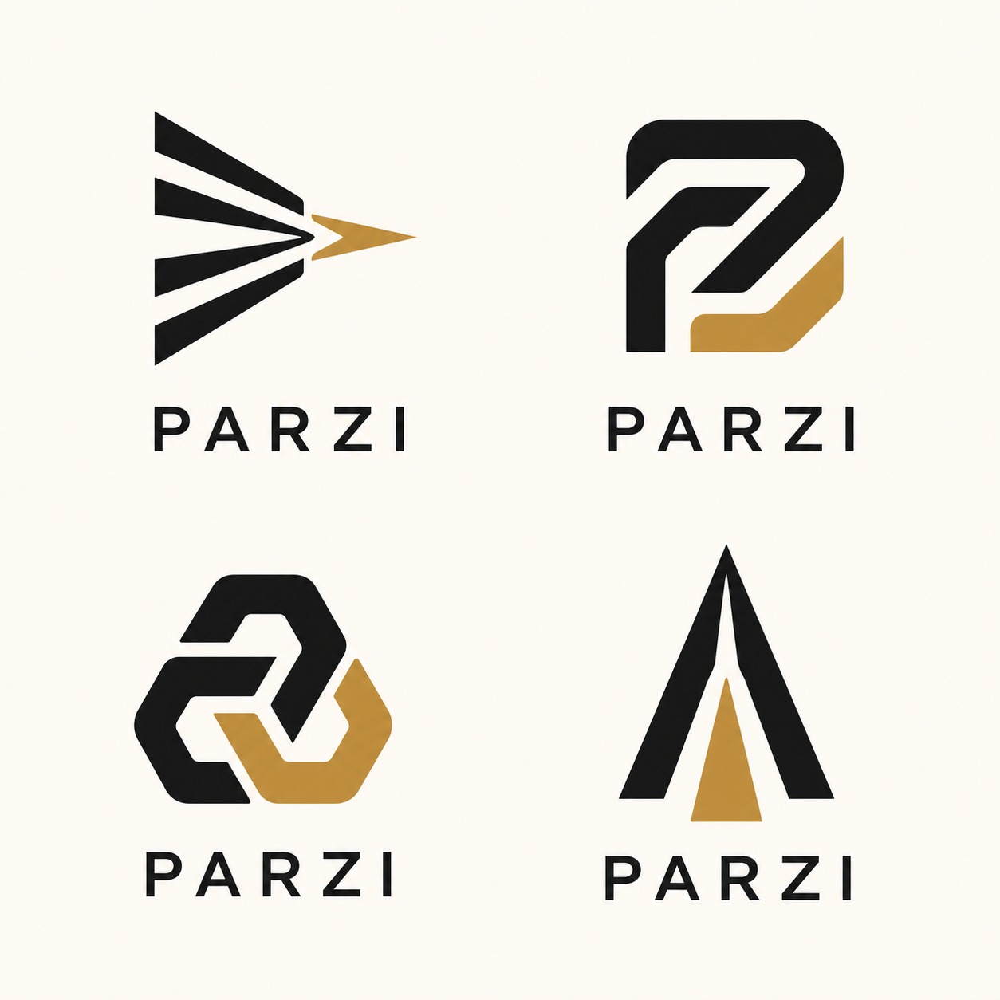

Constat :

- le prisme ressemble trop à une flèche ;
- le premier monogramme évoque un maillon ou une fintech ;
- le nœud peut rappeler recyclage ou crypto ;
- le repère de quête peut se lire comme une pointe ou une arme.

Aucune de ces formes n’est retenue en l’état.

### Planche 2 — Monogramme PZ

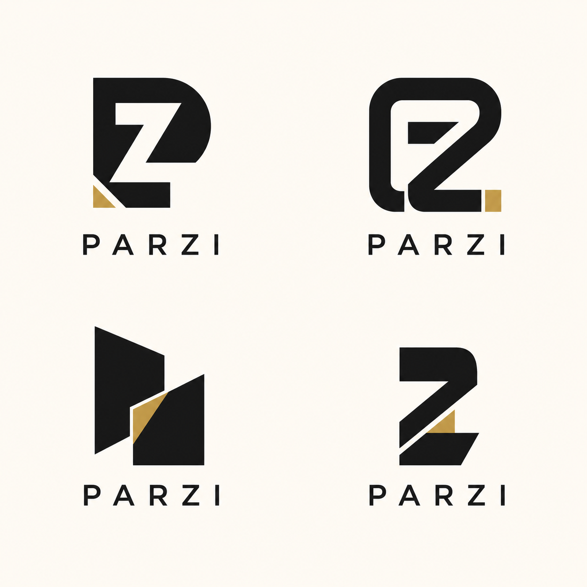

Constat :

- la direction supérieure gauche est la plus lisible et compacte ;
- la direction supérieure droite peut se lire `P2` ou maillon ;
- la direction inférieure gauche évoque davantage un portail ou un `M` qu’un `PZ` ;
- la direction inférieure droite rend le `Z` dominant et perd le `P`.

La direction supérieure gauche devient **piste de travail**, pas concept sélectionné. Elle doit encore être redessinée, comparée, testée à petite taille et soumise à une recherche de similarité.

## 16. Troisième exploration — Raffinement monochrome PZ

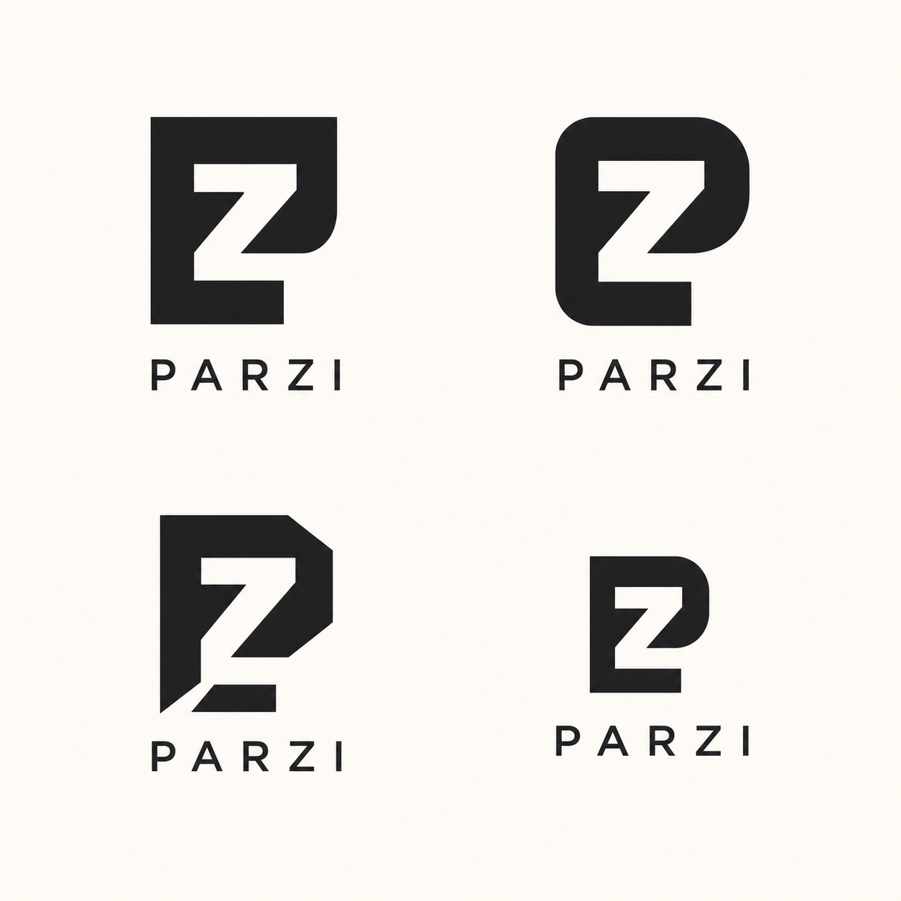

La troisième planche retire volontairement l'or afin d'évaluer la forme seule. Elle reprend uniquement la piste supérieure gauche de la deuxième planche et la décline en quatre variantes :

- **A — carrée, en haut à gauche** : construction la plus institutionnelle et meilleur équilibre entre `P` extérieur et `Z` négatif ;
- **B — arrondie, en haut à droite** : lisible, mais plus proche des codes technologiques ou fintech ;
- **C — architecturale, en bas à gauche** : plus énergique, mais la rupture inférieure fragilise la silhouette et peut évoquer une flèche ;
- **D — compacte, en bas à droite** : efficace comme exercice de favicon, mais trop générique et moins propriétaire comme symbole maître.

### Évaluation technique provisoire

L'originalité juridique potentielle n'est pas notée : aucune recherche de similarité ni revue juridique n'a encore été effectuée. Les sous-totaux sont donc exprimés sur 90 et ne constituent pas une validation sur 100.

| Critère | Maximum hors juridique | A — carrée | B — arrondie | C — architecturale | D — compacte |
|---|---:|---:|---:|---:|---:|
| Distinction et mémorisation | 20 | 16 | 13 | 14 | 11 |
| Lisibilité et force de silhouette | 15 | 14 | 14 | 10 | 13 |
| Fidélité à contexte–preuve–action | 15 | 10 | 9 | 10 | 8 |
| Capacité à endosser tout l'univers PARZI | 15 | 14 | 13 | 12 | 12 |
| Robustesse culturelle et absence de violence | 10 | 10 | 10 | 9 | 10 |
| Accessibilité et fonctionnement monochrome | 10 | 10 | 10 | 8 | 10 |
| Capacité à former un système de variantes | 5 | 4 | 4 | 3 | 4 |
| **Sous-total technique** | **90** | **78** | **73** | **66** | **68** |
| Originalité juridique potentielle | 10 | Non évaluée | Non évaluée | Non évaluée | Non évaluée |
| **Total validable** | **100** | **Non disponible** | **Non disponible** | **Non disponible** | **Non disponible** |

### Décision de l'itération

Aucun logo n'est sélectionné. La variante A est la seule base recommandée pour un **redessin vectoriel original**, parce qu'elle obtient le meilleur sous-total technique et reste lisible sans couleur. Cette recommandation autorise uniquement la poursuite de la recherche.

Avant toute sélection, la variante A doit être reconstruite sur une grille, testée réellement à 16, 24, 32 et 64 pixels, comparée aux marques existantes et évaluée juridiquement. La variante D peut servir de référence de simplification, mais pas de logo secondaire à ce stade.

## 17. Prototype vectoriel PZ A v0.1

La variante A a été redessinée manuellement sur un canevas de 96 unités. Il ne s'agit pas d'une vectorisation automatique de la planche raster.

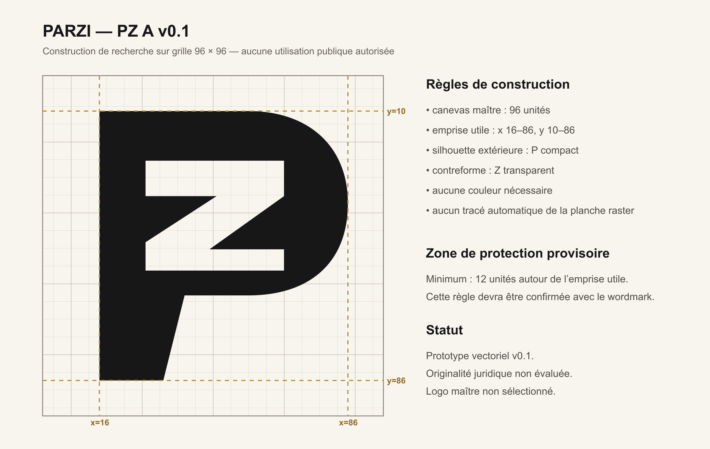

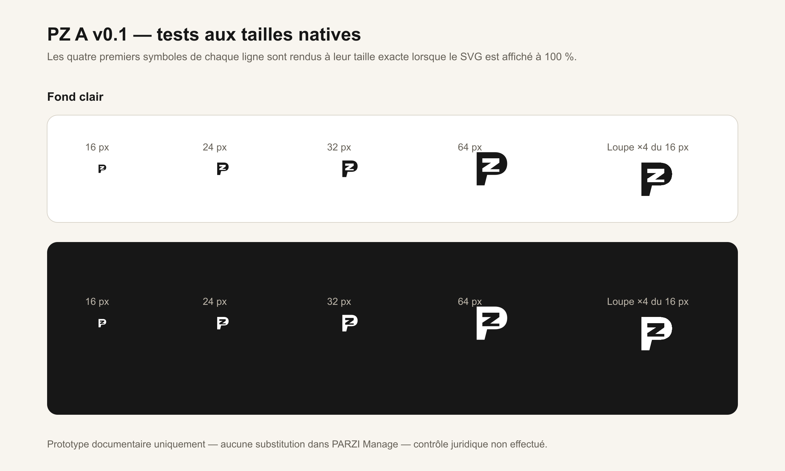

Les tests confirment :

- un fonctionnement monochrome sur fonds clair et sombre ;
- une lecture stable à 24, 32 et 64 pixels ;
- une lisibilité encore insuffisamment robuste du `Z` à 16 pixels ;
- la nécessité d'une correction optique avant tout test de favicon ;
- l'absence de sélection finale et de contrôle juridique.

La construction, les coordonnées et le verdict détaillé sont consignés dans `TOME_III_PROTOTYPE_VECTORIEL_PZ_A_V0.1.md`.

## 18. Correction PZ A v0.2 et wordmark v0.1

La v0.2 aligne les points critiques du symbole sur une grille correspondant à un pixel au rendu 16 pixels.

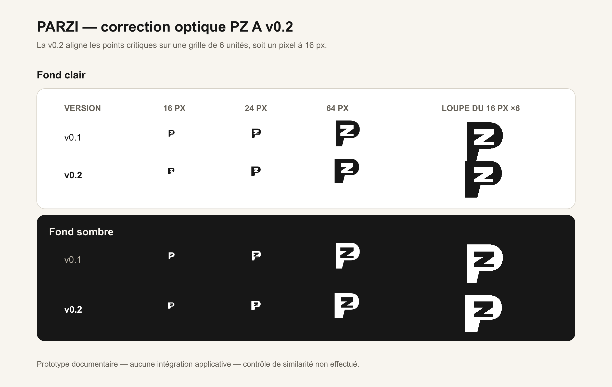

Le résultat comporte davantage de pixels majoritairement opaques et beaucoup moins de pixels partiellement couverts. La v0.2 devient donc la base technique du symbole, sous réserve de tests réels et sans sélection finale.

Un premier wordmark `PARZI` a également été construit avec des formes vectorielles autonomes, sans police externe.

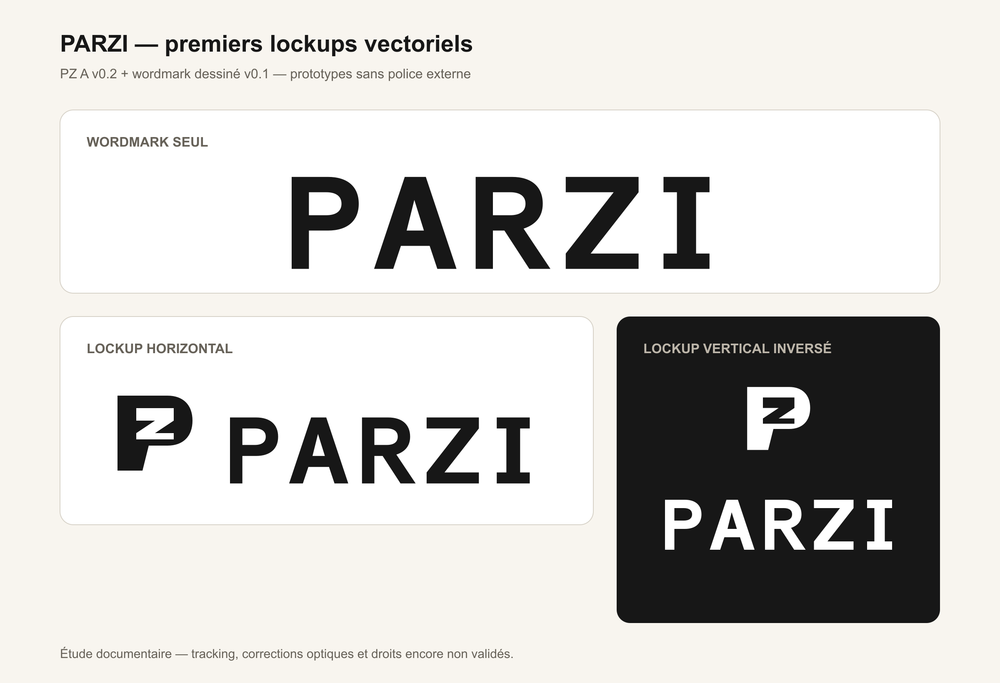

Le wordmark est lisible et compatible avec le symbole, mais encore trop générique pour porter seul l'ambition mondiale de PARZI. Il est conservé comme squelette de travail. La prochaine itération doit introduire une singularité typographique mesurée sans modifier le symbole v0.2.

Le dossier détaillé de cette itération est `TOME_III_PROTOTYPE_PZ_A_V0.2_ET_WORDMARK_V0.1.md`.

## 19. Wordmark PARZI v0.2

La v0.2 remplace les contreformes génériques de `P`, `A` et `R` par une famille de formes cohérentes. Une première sous-itération directionnelle a été rejetée afin d'éviter toute lecture en flèche.

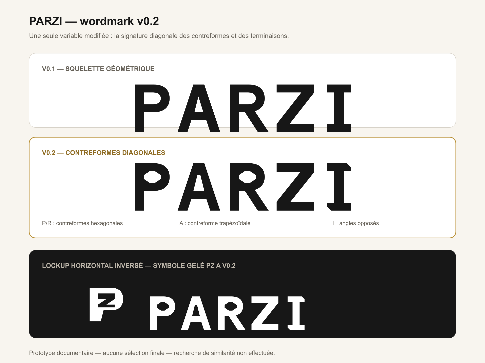

La version conservée utilise des contreformes symétriques dans `P` et `R`. Elle gagne en mémorisation sans rendre le mot ambigu.

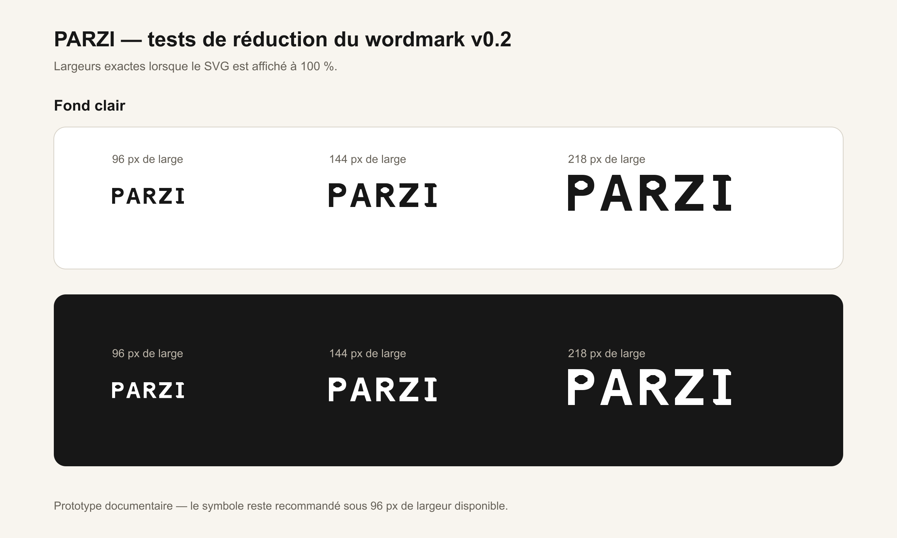

Le wordmark est lisible en positif et en négatif jusqu'à 96 pixels de largeur dans les tests documentaires. Sous ce seuil, le symbole seul reste recommandé.

La v0.2 devient la base typographique de recherche avec un sous-total technique de 78/90, contre 73/90 pour la v0.1. Le total sur 100 reste indisponible tant que l'originalité juridique n'est pas évaluée.

Le dossier détaillé est `TOME_III_WORDMARK_PARZI_V0.2.md`.

## 20. Endossement des produits

Le symbole PZ A v0.2 et le wordmark PARZI v0.2 ont été gelés puis testés avec les descripteurs `Manage` et `Academy`.

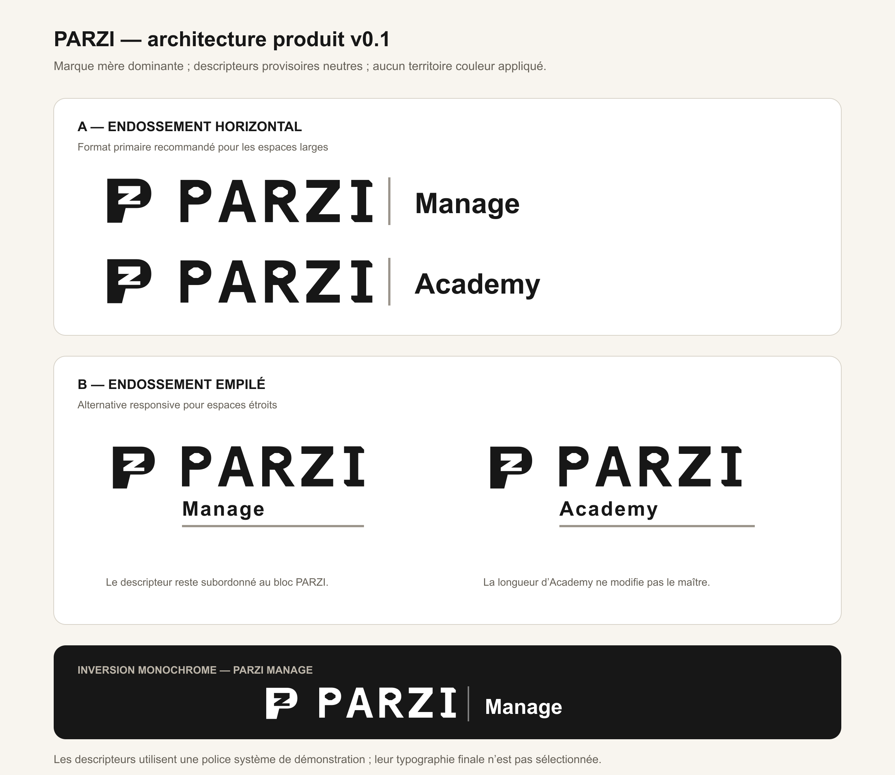

Deux compositions complémentaires sont conservées : l'endossement horizontal comme format principal et l'endossement empilé comme format pour les espaces étroits.

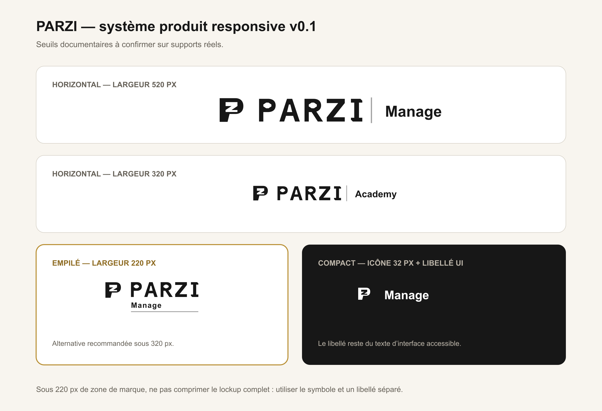

Le système documentaire recommande :

- horizontal à partir de 320 pixels de largeur disponible ;
- empilé entre 220 et 319 pixels ;
- symbole et libellé d'interface accessible sous 220 pixels.

Les seuils doivent être confirmés sur supports réels. La police des descripteurs, les couleurs produit et les zones de protection finales ne sont pas sélectionnées.

Le dossier détaillé est `TOME_III_ARCHITECTURE_MARQUE_PRODUITS_V0.1.md`.

## 21. Micro-charte des lockups v0.2

La pile système déjà utilisée par l'interface est retenue provisoirement pour les descripteurs produit. La graisse 600 offre le meilleur équilibre entre lisibilité et subordination à PARZI.

La construction utilise un module `X = 12` sur la planche de référence, des espacements horizontaux de `2X` et une zone de protection extérieure de `2X`.

Le format empilé abandonne le soulignement exploratoire de la v0.1. Le descripteur s'aligne désormais sur le wordmark, avec un écart vertical d'environ `1,3X`.

L'or visible sur la planche sert uniquement aux mesures. Les lockups restent monochromes et aucune couleur produit n'est validée.

Le dossier détaillé est `TOME_III_MICRO_CHARTE_LOCKUPS_V0.2.md`.

## 22. Tests des supports documentaires

Le système a été appliqué à trois contextes internes sans modifier les actifs maîtres : en-tête de note, carte institutionnelle et signature monochrome.

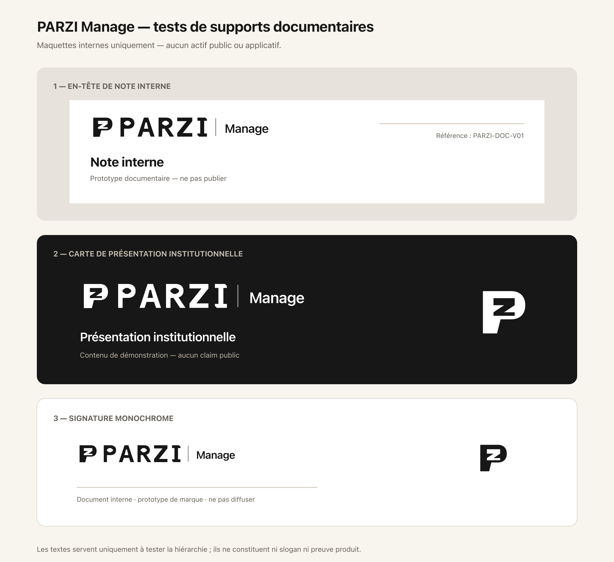

Les trois contextes passent le contrôle numérique. Ils portent des mentions de prototype et n'introduisent aucun claim public.

Une épreuve A4 vectorielle teste également le lockup complet à 60, 40 et 25 millimètres, ainsi que le symbole à 12, 8 et 6 millimètres.

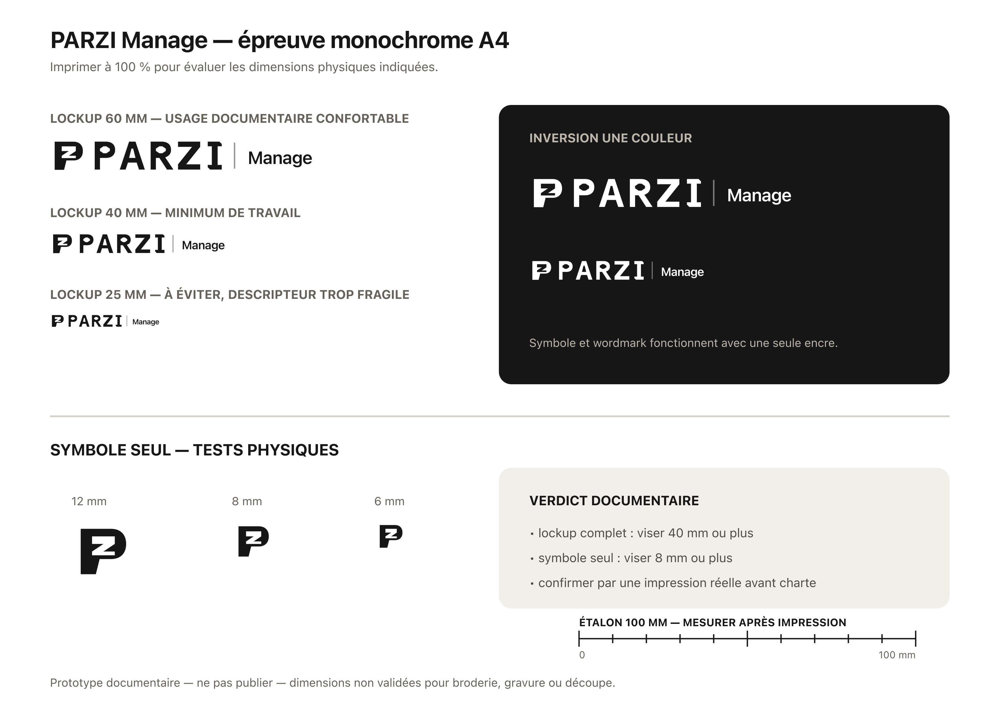

Les minimums de travail proposés sont 40 millimètres pour le lockup complet et 8 millimètres pour le symbole seul. Ces seuils restent provisoires tant qu'une impression physique à 100 % n'a pas été réalisée.

Le dossier détaillé est `TOME_III_TESTS_SUPPORTS_DOCUMENTAIRES_V0.1.md`.

## 23. Protocole de validation d'impression

L'épreuve A4 comporte désormais un étalon de 100 millimètres. Une impression n'est valide que si la mesure obtenue se situe entre 99,5 et 100,5 millimètres.

Une fiche A4 portrait consigne les conditions, les scores par spécimen, les distances d'observation et le verdict.

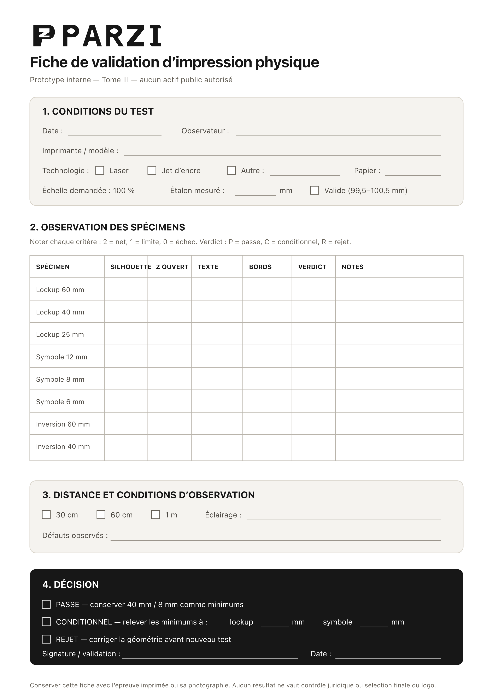

Les seuils candidats bloquants sont :

- lockup complet à 40 millimètres ;
- symbole seul à 8 millimètres ;
- inversion à 40 millimètres.

Les tailles 25 et 6 millimètres sont des stress tests non bloquants. Les seuils restent provisoires tant qu'une fiche réelle n'est pas remplie.

Le dossier détaillé est `TOME_III_PROTOCOLE_VALIDATION_IMPRESSION_V0.1.md`.
