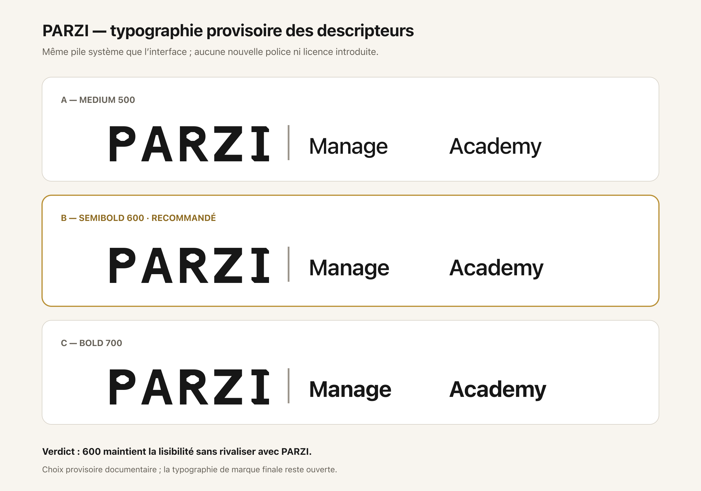
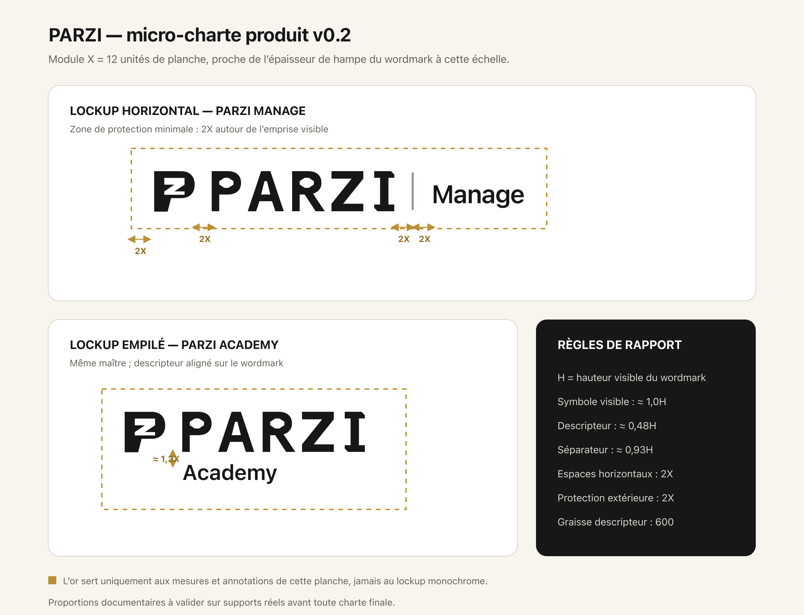

# Tome III — Micro-charte des lockups produits v0.2

## Cartouche

| Champ | Valeur |
|---|---|
| Version | 0.2 |
| Date | 23 juillet 2026 |
| Statut | Règles documentaires de recherche ; non déployées |
| Actifs maîtres | PZ A v0.2 et wordmark PARZI v0.2, inchangés |
| Produits testés | PARZI Manage et PARZI Academy |
| Typographie des descripteurs | Pile système, graisse 600, provisoire |
| Couleur | Lockups monochromes ; or réservé aux annotations de mesure |

## 1. Choix typographique provisoire

Le dépôt n'embarque pas de police de marque dédiée. L'interface générale utilise une pile système : `system-ui`, `-apple-system`, `Segoe UI`, `Roboto`, puis `sans-serif`.

Cette pile est retenue provisoirement pour les descripteurs parce qu'elle :

- n'introduit aucune dépendance ou licence nouvelle ;
- reste lisible sur les principaux systèmes ;
- sépare clairement le descripteur du wordmark dessiné ;
- correspond au langage typographique déjà présent dans le produit.

| Graisse | Avantage | Limite | Verdict |
|---:|---|---|---|
| 500 | légère et calme | trop faible face au wordmark | Rejetée |
| 600 | lisible sans rivaliser avec PARZI | encore générique | Retenue provisoirement |
| 700 | forte à petite taille | concurrence la marque mère | Rejetée |

La casse de travail reste `Manage` et `Academy`. La capitale initiale maintient la lecture du nom tout en laissant `PARZI` dominer en capitales dessinées.

## 2. Module de construction

Le module `X` vaut 12 unités sur la planche de référence. Il est proche de l'épaisseur de la hampe du wordmark à cette échelle.

`H` désigne la hauteur visible du wordmark PARZI.

| Rapport | Valeur documentaire |
|---|---:|
| Hauteur visible du symbole | environ `1,0H` |
| Hauteur visuelle du descripteur | environ `0,48H` |
| Hauteur du séparateur horizontal | environ `0,93H` |
| Espaces symbole–wordmark | `2X` |
| Espaces wordmark–séparateur | `2X` |
| Espaces séparateur–descripteur | `2X` |
| Protection extérieure minimale | `2X` |
| Écart vertical du format empilé | environ `1,3X` |

Ces valeurs règlent une maquette de référence. Elles doivent être converties proportionnellement et corrigées optiquement selon le support.

## 3. Planche de construction

L'or de la planche matérialise uniquement les mesures et la zone de protection. Il ne fait pas partie des lockups monochromes et ne fixe pas une couleur de marque ou de produit.

## 4. Format horizontal

- symbole, wordmark, séparateur et descripteur partagent un axe optique ;
- les trois espaces internes principaux valent `2X` ;
- le séparateur reste neutre et plus léger que les lettres ;
- le descripteur utilise la graisse 600 ;
- la zone de protection de `2X` ne peut contenir ni texte, ni bord, ni icône.

## 5. Format empilé

- le symbole et le wordmark conservent exactement le même rapport que dans le format horizontal ;
- le descripteur s'aligne sur le début du wordmark, pas sur le bord du symbole ;
- l'écart vertical vise environ `1,3X` ;
- aucun séparateur ou soulignement décoratif n'est conservé ;
- la zone extérieure minimale reste `2X`.

Le retrait du soulignement remplace la première exploration v0.1. La hiérarchie est désormais portée uniquement par les proportions, l'alignement et la graisse.

## 6. Mode compact

Sous la largeur utile du lockup empilé, le système n'essaie pas de fusionner le descripteur dans le symbole.

- afficher le symbole à une taille conforme aux tests ;
- afficher `Manage` ou `Academy` comme texte d'interface séparé ;
- conserver un nom accessible pour les lecteurs d'écran ;
- ne jamais transformer le symbole seul en preuve de disponibilité du produit.

## 7. Décision CTO

La micro-charte v0.2 est retenue comme règle de construction documentaire :

- pile système en graisse 600 pour les descripteurs ;
- module `X = 12` sur la planche ;
- espaces et protection de `2X` ;
- alignement du descripteur sur le wordmark en format empilé ;
- absence de soulignement décoratif ;
- actifs maîtres gelés.

Cette décision ne crée pas une charte finale. Elle n'autorise aucune modification des interfaces, aucune nouvelle police et aucun usage public.

## 8. Livrables

| Fichier | Fonction |
|---|---|
| `explorations/vector/parzi-descriptor-typography-v0.1.svg` | Comparaison vectorielle des graisses 500, 600 et 700 |
| `explorations/vector/parzi-descriptor-typography-v0.1.png` | Aperçu typographique vérifié |
| `explorations/vector/parzi-lockup-microcharter-v0.2.svg` | Planche vectorielle de proportions et protection |
| `explorations/vector/parzi-lockup-microcharter-v0.2.png` | Aperçu vérifié de la micro-charte |

## 9. Étape suivante

La prochaine étape doit tester le système sur des supports documentaires non applicatifs : en-tête de document, carte de présentation et signature monochrome. Les tests ne devront pas simuler une disponibilité publique d'Academy ni modifier les interfaces existantes.
